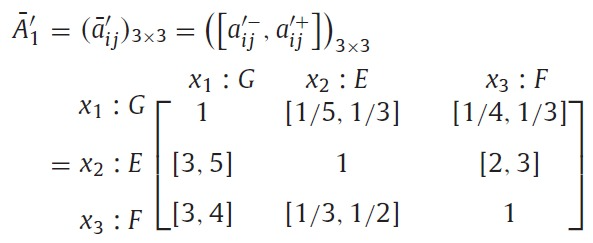
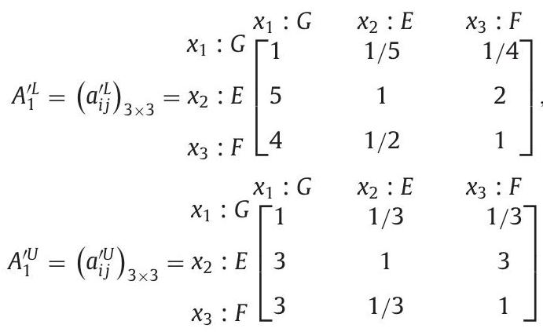

## Acceptability analysis and priority weight elicitation for interval multiplicative comparison matrices 

Kevin W. Li, Zhou-Jing Wang, Xiayu Tong
European Journal of Operational Research 250 (2016) 628–638

---

## 1. Introduction

### AHP

- 古典的な AHP では意思決定者は代替案の優先順位を求めるために一対比較を行う
  - この結果として得られる crisp な一対比較値は乗法的一対比較行列として表される (Saaty, 1980)

- 意思決定者の一対比較のあいまいさを表すために用いられる
  - 乗法的区間一対比較行列 (Saaty and Vargas, 1987)
  - 加法的区間一対比較行列 (Xu and Chen, 2008)

---

## 1. Introduction

### crisp PCM の整合性

- Consistency Index (CI)
  $\mathrm{CI}(A) = (\lambda_{\max}^A - n) / (n - 1)$
- Consistency Ratio (CR)
  $\mathrm{CR}(A) = \mathrm{CI}(A) / \mathrm{RI}(n)$
- Geometric consistency index (Aguaron and Moreno-Jimenez,2003)
  $\mathrm{GCI}(A) = \frac{2}{(n-1)(n-2)} \sum_{i < j} \left( \log \left( a_{ij} \frac{w_j}{w_i} \right) \right)^2$
    - $w_i$ は幾何平均法の重み

---

## 1. Introduction

### crisp PCM の整合性

- crisp PCM の整合性指標 (CI 等) に関する 5 つの公理 (Brunelli and Fedrizzi, 2014)
  1. (完全に) 整合している状態に対応する唯一の値がある
  2. 代替案の並びを変えても整合性指標の値は変わらない
  3. 逆数性を保存する操作を各成分に施した場合の単調性
    必要十分条件）
    $A$ を PCM とし, $b > 1$ とする. また, $A(b) = (a_{ij}^b)$ とする. $I$ を整合性指標とする.
    $$
    I(A(b)) \geq I(A), ~~ \forall b, A
    $$
  4. 一対比較に対する単調性
    例）
    このとき, $I(A^{\prime\prime}) > I(A^\prime) > I(A)$ である.
    $$
    \small
    A = \begin{pmatrix}
      1 & 2 & 4 \\
      1/2 & 1 & 2 \\
      1/4 & 1/2 & 1
    \end{pmatrix}, ~~ A^\prime = \begin{pmatrix}
      1 & 2 & 5 \\
      1/2 & 1 & 2 \\
      1/5 & 1/2 & 1
    \end{pmatrix}, ~~ A^{\prime\prime} = \begin{pmatrix}
      1 & 2 & 6 \\
      1/2 & 1 & 2 \\
      1/6 & 1/2 & 1
    \end{pmatrix}
    $$
  5. 連続性

---

## 1. Introduction

### 区間 PCM の整合性

- Wang and Elhag, 2007
  - 各成分が区間 PCM  $\bar{A} = ([\bar{a}_{ij}^\mathrm{L}, \bar{a}_{ij}^\mathrm{U}])$ に含まれる, 整合している crisp PCM $A = (a_{ij})$ が存在すれば区間 PCM  $\bar{A}$ は整合している
  $a_{ij} \in [\bar{a}_{ij}^\mathrm{L}, \bar{a}_{ij}^\mathrm{U}], ~~ i,j = 1,2,\dots,n$

- Wang, 2015a
  - 区間 PCM  $\bar{A} = (\bar{a}_{ij}) = ([\bar{a}_{ij}^\mathrm{L}, \bar{a}_{ij}^\mathrm{U}])$ が次の条件を満たすならば区間 PCM  $\bar{A}$ は整合している
  $\bar{a}_{ij} \otimes \bar{a}_{jk} \otimes \bar{a}_{ki} = \bar{a}_{ik} \otimes \bar{a}_{kj} \otimes \bar{a}_{ji}, ~~ i,j,k = 1,2,\dots,n$
  ($\otimes$ は区間の積)
  - 本論文はこの定義を用いて議論する

---

## 1. Introduction

### 区間 PCM の整合性

- Wang, Yang and Xu, 2005b
  - 区間 PCM $\bar{A} = ([\bar{a}_{ij}^\mathrm{L}, \bar{a}_{ij}^\mathrm{U}])$ に対して, 次の制約を満たす crisp な重みベクトル $w = (w_i)$ が存在するならば区間 PCM $\bar{A}$ は整合している
  $$
  \begin{align*}
      & \bar{a}_{ij}^\mathrm{L} \leq w_i / w_j \leq \bar{a}_{ij}^\mathrm{U}, && i, j = 1,2,\dots,n, \\
      & \sum_{i = 1,2,\dots,n} w_i = 1, \\
      & w_i > 0, && i = 1,2,\dots,n.
  \end{align*}
  $$
  - 必要十分条件
    $$
      \max_k \left( \bar{a}_{ik}^\mathrm{L}, \bar{a}_{kj}^\mathrm{L} \right) \leqslant \min_k \left( \bar{a}_{ik}^\mathrm{U}, \bar{a}_{kj}^\mathrm{U} \right),
      \text{ for all } i, j, k = 1, 2, \dots, n.
    $$

---

## 1. Introduction

### 区間 PCM の整合性

- Liu, 2009
  $\bar{A} = (\bar{a}_{ij}) = ([ \bar{a}^-_{ij}, \bar{a}^+_{ij}])$ を区間 PCM とする.
  $A^\mathrm{L} = (a_{ij}^\mathrm{L}), ~ A^\mathrm{U} = (a_{ij}^\mathrm{U})$ を次のように定める.
  $$
  a_{i j}^{L} = \left\{
    \begin{array}{ll}
    a_{i j}^{-} & i<j \\
    1 & i=j, \\
    a_{i j}^{+} & i>j
  \end{array} \quad a_{i j}^{U} = \begin{cases}
    a_{i j}^{+} & i<j \\
    1 & i=j \\
    a_{i j}^{-} & i>j
  \end{cases}\right.
  $$

  次を満たせば $\bar{A}$ は整合している.
  $$
  a_{i k}^\mathrm{L} = a_{i j}^\mathrm{L} a_{j k}^\mathrm{L}, ~~
  a_{i k}^\mathrm{U} = a_{i j}^\mathrm{U} a_{j k}^\mathrm{U}, \quad
  i, j, k = 1, 2, \dots, n
  $$

  <!-- $\mathrm{CR}(A^\mathrm{L}) \leq 0.1$ かつ $\mathrm{CR}(A^\mathrm{U}) \leq 0.1$ であれば $\bar{A}$ は許容可能な整合性をもち, そうでなければ $\bar{A}$ は許容できない. -->

---

## 1. Introduction

### 区間 PCM から重みを求める方法

- Wang, Yang and Xu, 2005a
    $\bar{A} = (\bar{a}_{ij}) = ([ \bar{a}^-_{ij}, \bar{a}^+_{ij}])$ を区間 PCM とする.
    crisp な重み $w = (w_i)$ を $w_i / w_j$ が $\bar{a}_{ij}$ に可能であれば含まれるように, そうでなければできるだけ近くなるように求める.
    $$
    \begin{align*}
    \mathrm{minimize} ~~ & ~~
    \frac{1}{2} \sum_{i=1}^n \sum_{j=1}^n (p_{ij} + q_{ij}) \\
    \text{subject to} ~~ & ~~
    \ln w_i - \ln w_j + p_{ij} \geq \ln \bar{a}_{ij}^-, \quad
    i, j = 1,2,\dots,n, \\ & ~~
    \ln w_i - \ln w_j - q_{ij} \leq \ln \bar{a}_{ij}^+, \quad
    i, j = 1,2,\dots,n, \\ & ~~
    \sum_{i=1}^n w_i = 1, \\ & ~~
    p_{ij}, q_{ij} \geq 0, ~~
    p_{ij} q_{ij} = 0, \quad
    i, j = 1,2,\dots,n.
    \end{align*}
    $$

---

## 1. Introduction

### 区間 PCM から重みを求める方法

- Wang and Elhag, 2007
    $W^\mathrm{L} = (w_i^\mathrm{L}), ~ W^\mathrm{U} = (w_i^\mathrm{U})$ とする.
    $\tilde{A} = ([w_i^\mathrm{L}/w_j^\mathrm{U}, ~ w_i^\mathrm{U}/w_j^\mathrm{L}]), ~ \tilde{A}^\mathrm{L} = (w_i^\mathrm{L}/w_j^\mathrm{U}), ~ \tilde{A}^\mathrm{U} = (w_i^\mathrm{U}/w_j^\mathrm{L})$ とする.
    $\tilde{A}$ は次を満たす.
    $$
    \tilde{A}^\mathrm{L} W^\mathrm{U} = W^\mathrm{U} + (n - 1) W^\mathrm{L}, \quad
    \tilde{A}^\mathrm{U} W^\mathrm{L} = W^\mathrm{L} + (n - 1) W^\mathrm{U}.
    $$
    しかし, 一般に意思決定者が与える区間 PCM $A = ([a_{ij}^\mathrm{L}, a_{ij}^\mathrm{U}])$ はこれを満たさない.
    そこで, 偏差ベクトル $\Epsilon = (\varepsilon_i), \Gamma = (\gamma_i)$ を次のように定める.
    $$
    \Epsilon = (A^\mathrm{L} - I) W^\mathrm{U} - (n - 1) W^\mathrm{L}, \quad
    \Gamma = (A^\mathrm{U} - I) W^\mathrm{L} - (n - 1) W^\mathrm{U}
    $$
    次のように定義される $J$ を最小化する.
    $$
    J = \sum_i (|\varepsilon_i| + |\gamma_i|)
    $$

---

## 1. Introduction

### 区間 PCM から重みを求める方法

- Liu, 2009
  $\bar{A} = (\bar{a}_{ij}) = ([ \bar{a}^-_{ij}, \bar{a}^+_{ij}])$ を区間 PCM とする.
  $A^\mathrm{L} = (a_{ij}^\mathrm{L}), ~ A^\mathrm{U} = (a_{ij}^\mathrm{U})$ を次のように定める.
  $$
  a_{i j}^{L} = \left\{
    \begin{array}{ll}
    a_{i j}^{-} & i<j \\
    1 & i=j, \\
    a_{i j}^{+} & i>j
  \end{array} \quad a_{i j}^{U} = \begin{cases}
    a_{i j}^{+} & i<j \\
    1 & i=j \\
    a_{i j}^{-} & i>j
  \end{cases}\right.
  $$

  $A^\mathrm{L}, A^\mathrm{U}$ それぞれから重み $w^\mathrm{L} = (w_i^\mathrm{L}), w^\mathrm{U} = (w_i^\mathrm{U})$ を求める.
  区間重み $\bar{W} = ([w_i^-, w_i^+])$ を次のように定める.
  $$
  w_i^- = \min (w_i^\mathrm{L}, w_i^\mathrm{U}), ~~
  w_i^+ = \max (w_i^\mathrm{L}, w_i^\mathrm{U}), \quad
  i = 1,2,\dots,n
  $$

---

## 1. Introduction

### 本論文で議論すること

- Wang（2015a）の区間 PCM の整合性定義を使用する
- 整合した区間 PCM の性質について調べる
- 許容可能な不確定性比率 (indeterminacy ratio) の閾値を導入
  - 整合していてもあいまいな場合は許容しない
- 区間 PCM の不確定性の指標を定める
- 許容可能な区間 PCM から重みを求める手法の提案
  - 二次計画問題
- 順序付けの方法の提案

---

## 2. Preliminaries

### crisp AHP

- $X = \left\{ x_1, x_2, \dots, x_n \right\}$: 代替案の集合
- $[1/S, ~ S]$: 一対比較のスケール
- $A = (a_{ij})$: 一対比較行列
  $$
    \frac{1}{S} \leq a_{ij} \leq S, ~~ a_{ij} = a_{ji}^{-1}, ~~ a_{ii} = 1, \quad i, j = 1,2,\dots,n.
  $$

- 次を満たす場合, $A$ は整合している
  $$
  a_{i k}=a_{i j} a_{j k}, \quad i, j, k=1,2, \ldots, n
  $$
  このとき, 次のような $\omega = (\omega_i)$ が存在する.
  $$
  \begin{align*}
  a_{ij} & = \omega_i / \omega_j, \quad i, j = 1,2,\dots,n, \\
  \sum_i \omega_i & = 1, \\
  \omega_i & > 0, \quad i = 1,2,\dots,n.
  \end{align*}
  $$

---

## 2. Preliminaries

### crisp AHP

- 不整合性の度合いを検証するために CI, CR が用いられる
  - Consistency Index (CI)
    $\mathrm{CI}(A) = (\lambda_{\max}^A - n) / (n - 1)$
  - Consistency Ratio (CR)
    $\mathrm{CR}(A) = \mathrm{CI}(A) / \mathrm{RI}(n)$
    - 0.1 以下であれば許容可能であるとする

---

## 2. Preliminaries

### 区間 AHP

- $\bar{A} = (\bar{a}_{ij}) = ([ \bar{a}^-_{ij}, \bar{a}^+_{ij}])$: 区間 PCM
  $$
  \frac{1}{S} \leq a_{ij}^- \leq a_{ij}^+ \leq S, ~~ a_{ij}^- = a_{ji}^+, ~~ a_{ii}^- = a_{ii}^+ = 1, \quad i,j = 1,2,\dots,n
  $$

---

## 2. Preliminaries

### 区間 AHP

- Addition
    - $\bar{a} + \bar{b}=\left[a^- + b^-, a^+ + b^+\right]$
- Subtraction
    - $\bar{a} - \bar{b}=\left[a^- - b^-, a^+ - b^+\right]$
- Multiplication
    - $\bar{a} \otimes \bar{b}=\left[a^- b^-, a^+ b^+\right]$, where $a^-, b^->0$
- Division
    - $\bar{a} /\bar{b}=\left[a^- / b^+, b^+ / b^-\right]$, where $a^-, b^->0$
- Scalar multiplication
    - $\lambda \bar{a}=\left[\lambda a^-, \lambda a^+\right] ; \lambda \geq 0$.

---

## 3. Analysis of existing acceptable consistency

既存の許容可能な整合性について数値例を用いて議論する.

### Definition 3.1. (Liu, 2009)

$\bar{A} = (\bar{a}_{ij}) = ([ \bar{a}^-_{ij}, \bar{a}^+_{ij}])$ を区間 PCM とする.
$A^\mathrm{L} = (a_{ij}^\mathrm{L}), ~ A^\mathrm{U} = (a_{ij}^\mathrm{U})$ を次のように定める.
$$
a_{i j}^{L} = \left\{
  \begin{array}{ll}
  a_{i j}^{-} & i<j \\
  1 & i=j, \\
  a_{i j}^{+} & i>j
\end{array} \quad a_{i j}^{U} = \begin{cases}
  a_{i j}^{+} & i<j \\
  1 & i=j \\
  a_{i j}^{-} & i>j
\end{cases}\right.
$$

次を満たせば $\bar{A}$ は整合している.
$$
a_{i k}^\mathrm{L} = a_{i j}^\mathrm{L} a_{j k}^\mathrm{L}, ~~
a_{i k}^\mathrm{U} = a_{i j}^\mathrm{U} a_{j k}^\mathrm{U}, \quad
i, j, k = 1, 2, \dots, n
$$

$\mathrm{CR}(A^\mathrm{L}) \leq 0.1$ かつ $\mathrm{CR}(A^\mathrm{U}) \leq 0.1$ であれば $\bar{A}$ は許容可能な整合性をもち, そうでなければ $\bar{A}$ は許容できない.

---

## 3. Analysis of existing acceptable consistency

### Example 1.

次の一対比較から, 代替案の並びが異なる二つの区間 PCM $\bar{A}_1, \bar{A}_1^\prime$ を考える.

| Pair of the three alternatives | Value          |
|--------------------------------|----------------|
| E vs. F                        | $[2,3]$        |
| E vs. G                        | $[3,5]$        |
| F vs. E                        | $[1/3,1/2]$    |
| F vs. G                        | $[3,4]$        |
| G vs. E                        | $[1/5,1/3]$    |
| G vs. F                        | $[1/4,1/3]$    |

---

## 3. Analysis of existing acceptable consistency

### Example 1.

   

$\mathrm{CR}\left(A_{1}^{L}\right) = 0.0516 < 0.1, ~ \mathrm{CR}\left(A_{1}^{U}\right) = 0.0825 < 0.1$ なので, $\bar{A}_1$ は Definition 3.1 の意味で許容可能な整合性をもつ.

---

## 3. Analysis of existing acceptable consistency

### Example 1.

   

$\mathrm{CR}\left(A_{1}^{\prime L}\right) = 0.0236 < 0.1, ~ \mathrm{CR}\left(A_{1}^{\prime U}\right) = 0.1279 > 0.1$ なので, $\bar{A}_1^\prime$ は Definition 3.1 の意味で許容できない.

一対比較が同じでも, 代替案の並びが異なると許容可能な整合性をもつかどうかが変わる.
Definition 3.1 にはこのような問題がある.

---

## 4.1. Acceptable consistency of IMCMs

### Definition 4.1

$\bar{A} = (\bar{a}_{ij}) = ([ a^-_{ij}, a^+_{ij}])$ を区間 PCM とする.
$\bar{A}$ が次の条件を満たすならば $\bar{A}$ は整合している.

$$
\bar{a}_{ij} \otimes \bar{a}_{jk} \otimes \bar{a}_{ki} = \bar{a}_{ik} \otimes \bar{a}_{kj} \otimes \bar{a}_{ji}, ~~ i,j,k = 1,2,\dots,n
$$

Definition 4.1 は明らかに $i, j, k$ の順序に依存せず, 代替案の並びに依存しない.
Example 1 の二つの区間 PCM $\bar{A}_1, \bar{A}_1^\prime$ はともに Definition 4.1 の意味で整合していない.

---

## 4.1. Acceptable consistency of IMCMs

### Theorem 4.1.

$\bar{A} = (\bar{a}_{ij}) = ([ a^-_{ij}, a^+_{ij}])$ を区間 PCM とする.
$\bar{A}$ が整合していることの必要十分条件は次の通り.

$$
a_{i k}^{-} a_{i k}^{+}=a_{i j}^{-} a_{i j}^{+} a_{j k}^{-} a_{j k}^{+}, i, j, k=1,2, \ldots, n
$$

**証明**

$$
\begin{align*}
& a_{i k}^{-} a_{i k}^{+} = a_{i j}^{-} a_{i j}^{+} a_{j k}^{-} a_{j k}^{+} \\
\Leftrightarrow ~~ & a_{i j}^{-} a_{j k}^{-} (a_{i k}^{+})^{-1} = a_{i k}^{-} (a_{i j}^{+} a_{j k}^{+})^{-1}
&& \text{ and } ~~ a_{i j}^{+} a_{j k}^{+} (a_{i k}^{-})^{-1} = a_{i k}^{+} (a_{i j}^{-} a_{j k}^{-})^{-1} \\
\Leftrightarrow ~~ & a_{i j}^{-} a_{j k}^{-} a_{k i}^{-} = a_{i k}^{-} a_{kj}^{-} a_{ji}^{-}
&& \text{ and } ~~ a_{i j}^{+} a_{j k}^{+} a_{k i}^{+} = a_{i k}^{+} a_{kj}^{+} a_{ji}^{+} ~~ \left(\because \text{逆数性}\right)\\
\Leftrightarrow ~~ & [\bar{a}_{ij}^- \bar{a}_{jk}^- \bar{a}_{ki}^-, \bar{a}_{ij}^+ \bar{a}_{jk}^+ \bar{a}_{ki}^+] = [\bar{a}_{ik}^- \bar{a}_{kj}^- \bar{a}_{ji}^-, \bar{a}_{ik}^+ \bar{a}_{kj}^+ \bar{a}_{ji}^+] \\
\Leftrightarrow ~~ & \bar{a}_{ij} \otimes \bar{a}_{jk} \otimes \bar{a}_{ki} = \bar{a}_{ik} \otimes \bar{a}_{kj} \otimes \bar{a}_{ji}
\end{align*}
$$

---

## 4.1. Acceptable consistency of IMCMs

### Theorem 4.2.

$\bar{A} = (\bar{a}_{ij}) = ([ a^-_{ij}, a^+_{ij}])$ を区間 PCM とする.
(i) は (ii) の必要十分条件である.

$$
\begin{align*}
\text{(i)} ~~ & a_{i k}^{-} a_{i k}^{+} = a_{i j}^{-} a_{i j}^{+} a_{j k}^{-} a_{j k}^{+},
&& i,j,k = 1,2,\dots,n. \\
\text{(ii)} ~~ & a_{i k}^{-} a_{i k}^{+} = a_{i j}^{-} a_{i j}^{+} a_{j k}^{-} a_{j k}^{+},
&& i,j,k = 1,2,\dots,n, ~~ i < j < k.
\end{align*}
$$

**証明**

(i) $\Rightarrow$ (ii) は明らかに成り立つので, (ii) $\Rightarrow$ (i) を示す.

$a_{i k}^{-} a_{i k}^{+} = a_{i j}^{-} a_{i j}^{+} a_{j k}^{-} a_{j k}^{+}$ を式 ($*$) とする.
(ii) から, $i < j < k$ 以外の $i, j, k$ の場合に式 ($*$) が成り立つことを示せばよい.

$i = j, j = k, k = i$ のいずれかが成り立つ場合, $\bar{a}_{ii} = 1, \bar{a}_{ij} = 1 / \bar{a}_{ji}$ から式 ($*$) が成り立つ.
$i = j$ の場合, $a_{i j}^{-} a_{i j}^{+} = 1, a_{i k}^{-} a_{i k}^{+} = a_{j k}^{-} a_{j k}^{+}$ となり, 式 ($*$) が成り立つ.
$j = k, k = i$ の場合も同様にして式 ($*$) が成り立つことが示せる.

---

$i \neq j \neq k$ かつ $i < j < k$ (($a$) とする) の場合を考える.

($b$) $i < k < j$ の場合

$$
\begin{align*}
a_{i k}^{-} a_{i k}^{+} & = a_{i j}^{-} a_{i j}^{+} a_{j k}^{-} a_{j k}^{+} \\
a_{i j}^{-} a_{i j}^{+} & = \frac{a_{i k}^{-} a_{i k}^{+}}{a_{j k}^{-} a_{j k}^{+}} \\
a_{i j}^{-} a_{i j}^{+} & = a_{i k}^{-} a_{i k}^{+} a_{kj}^{-} a_{kj}^{+}
&& (\because \text{逆数性})
\end{align*}
$$

($c$) $j < i < k$ の場合

$\bar{A} = (\bar{a}_{ij}) = ([ a^-_{ij}, a^+_{ij}])$ を区間 PCM とする.

$$
\begin{align*}
a_{i k}^{-} a_{i k}^{+} & = a_{i j}^{-} a_{i j}^{+} a_{j k}^{-} a_{j k}^{+} \\
a_{j k}^{-} a_{j k}^{+} & = \frac{a_{i k}^{-} a_{i k}^{+}}{a_{i j}^{-} a_{i j}^{+}} \\
a_{j k}^{-} a_{j k}^{+} & = a_{ji}^{-} a_{ji}^{+} a_{i k}^{-} a_{i k}^{+}
&& (\because \text{逆数性})
\end{align*}
$$

($d$) $j < k < i$ の場合: ($a$) から ($b$) への変形と同様にして ($c$) から ($d$) が示せる.
($e$) $k < i < j$ の場合: ($a$) から ($c$) への変形と同様にして ($b$) から ($e$) が示せる.
($f$) $k < j < i$ の場合: ($a$) から ($b$) への変形と同様にして ($e$) から ($f$) が示せる.

---

## 4.1. Acceptable consistency of IMCMs

Theorem 4.1, 4.2 から直ちに次が得られる.

### Corollary 4.1.

$\bar{A} = (\bar{a}_{ij}) = ([ a^-_{ij}, a^+_{ij}])$ を区間 PCM とする.
$\bar{A}$ が整合していることの必要十分条件は次の通り.

$$
a_{i k}^{-} a_{i k}^{+}=a_{i j}^{-} a_{i j}^{+} a_{j k}^{-} a_{j k}^{+},
\quad i, j, k=1,2, \ldots, n, ~~ i < j < k.
$$

---

## 4.1. Acceptable consistency of IMCMs

$\bar{A} = (\bar{a}_{ij}) = ([ a^-_{ij}, a^+_{ij}])$ を区間 PCM とする.

$$
\begin{align*}
p_{ij}^\mathrm{L} & = \begin{cases}
  1 + \log_{a_{ij}^+} a_{ij}^- & \text{if} ~~~ a_{ij}^- > 1, \\
  1 + \log_{a_{ij}^-} a_{ij}^+ & \text{if} ~~~ a_{ij}^+ < 1, \\
  1 & \text{otherwise}.
\end{cases} \\
p_{ij}^\mathrm{U} & = \begin{cases}
  1 + \log_{a_{ij}^-} a_{ij}^+ & \text{if} ~~~ a_{ij}^- > 1, \\
  1 + \log_{a_{ij}^+} a_{ij}^- & \text{if} ~~~ a_{ij}^+ < 1, \\
  + \infty & \text{otherwise}.
\end{cases}
\end{align*}
$$

$$
p^\mathrm{L} = \max_{i, j = 1,2,\dots,n} p_{ij}^\mathrm{L}, \quad
p^\mathrm{U} = \min_{i, j = 1,2,\dots,n} p_{ij}^\mathrm{U}
$$

すべての $i, j$ について $1 \leq p_{ij}^\mathrm{L} \leq 2 \leq p_{ij}^\mathrm{U}$ なので, $1 \leq p^\mathrm{L} \leq 2 \leq p^\mathrm{U}$ が成り立つ.

$p^\mathrm{L} \leq p \leq \mathrm{U}$ とする. $A(p) = (a_{ij}(p))$ を次のように定める.

$$
a_{ij}(p) = \sqrt[p]{a_{ij}^- a_{ij}^+}, \quad i, j = 1,2,\dots,n
$$

---

## 4.1. Acceptable consistency of IMCMs

$A(p)$ は crisp PCM の性質を満たす.

$$
a_{ii}(p) = \sqrt[p]{a_{ii}^- a_{ii}^+} = \sqrt[p]{1 \cdot 1} = 1, \quad i = 1,2,\dots,n
$$

$$
a_{ij}(p) a_{ji}(p)
= \sqrt[p]{a_{ij}^- a_{ij}^+} \sqrt[p]{a_{ji}^- a_{ji}^+}
= \sqrt[p]{(a_{ij}^- a_{ji}^+) (a_{ij}^+ a_{ji}^-)}
= \sqrt[p]{1 \cdot 1}
= 1, \quad i, j = 1,2,\dots,n
$$

$a_{ij}(p) \in \bar{a}_{ij}, ~ \forall i, j$ となるように $p$ の範囲 $[p^\mathrm{L}, p^\mathrm{U}]$ を定めている.

$$
\begin{align*}
& p_{ij}^\mathrm{L} \leq p^\mathrm{L} \leq p \leq p^\mathrm{U} \leq p_{ij}^\mathrm{U},
&& \forall i, j = 1,2,\dots,n \\
\Rightarrow ~~ & p_{ij}^\mathrm{L} \leq p \leq p_{ij}^\mathrm{U},
&& \forall i, j = 1,2,\dots,n \\
\Rightarrow ~~ & (p-1) \ln a_{ij}^- \leq \ln a_{ij}^+
~~ \text{and} ~~ \ln a_{ij}^- \leq (p-1) \ln a_{ij}^+,
&& \forall i, j = 1,2,\dots,n
&& (*) \\
\Rightarrow ~~ & (a_{ij}^-)^{p-1} \leq a_{ij}^+
~~ \text{and} ~~ a_{ij}^- \leq (a_{ij}^+)^{p-1},
&& \forall i, j = 1,2,\dots,n \\
\Rightarrow ~~ & (a_{ij}^-)^p \leq a_{ij}^- a_{ij}^+ \leq (a_{ij}^+)^p,
&& \forall i, j = 1,2,\dots,n \\
\Rightarrow ~~ & a_{ij}^- \leq \sqrt[p]{a_{ij}^- a_{ij}^+} = a_{ij}(p) \leq a_{ij}^+,
&& \forall i, j = 1,2,\dots,n
\end{align*}
$$

---

$(*) ~~ p_{ij}^\mathrm{L} \leq p \leq p_{ij}^\mathrm{U} \Rightarrow (p-1) \ln a_{ij}^- \leq \ln a_{ij}^+ ~~ \text{and} ~~ \ln a_{ij}^- \leq (p-1) \ln a_{ij}^+$ の証明

( i ) $a_{ij}^+ \geq a_{ij}^- > 1$ の場合

$$
\begin{align*}
a_{ij}^+ \geq a_{ij}^- > 1
& \Rightarrow 1 + \log_{a_{ij}^+} a_{ij}^- \leq p \leq 1 + \log_{a_{ij}^-} a_{ij}^+
&& (\because p_{ij}^\mathrm{L}, p_{ij}^\mathrm{U} ~ \text{の定義}) \\
& \Rightarrow p \leq 1 + \frac{\ln a_{ij}^+}{\ln a_{ij}^-}
~~ \text{and} ~~
1 + \frac{\ln a_{ij}^-}{\ln a_{ij}^+} \leq p \\
& \Rightarrow (p-1) \ln a_{ij}^- \leq \ln a_{ij}^+
~~ \text{and} ~~
\ln a_{ij}^- \leq (p-1) \ln a_{ij}^+
\end{align*}
$$

$p_{ij}^-, p_{ij}^+$ の定義から, $1 + \log_{a_{ij}^+} a_{ij}^- \leq p \leq 1 + \log_{a_{ij}^-} a_{ij}^+, i, j =1,2,\dots,n$ となる. 

( ii ) $a_{ij}^+ \geq a_{ij}^- = 1$ の場合

$$
a_{ij}^+ \geq 1 
~~ \Rightarrow ~~
\ln a_{ij}^+ \geq 0 = \ln a_{ij}^- = (p-1) \ln a_{ij}^- \\
$$

$$
\begin{align*}
a_{ij}^+ \geq 1 & \Rightarrow \ln a_{ij}^+ \geq 0 \\
& \Rightarrow (p-1) \ln a_{ij}^+ \geq 0 = \ln a_{ij}^-
&& (\because p \geq p^\mathrm{L} \geq 1) \\
\end{align*}
$$

---

( iii ) $1 = a_{ij}^+ \geq a_{ij}^-$ の場合

$$
\begin{align*}
a_{ij}^- \leq 1 & \Rightarrow \ln a_{ij}^- \leq 0 \\
& \Rightarrow (p-1) \ln a_{ij}^- \leq 0 = \ln a_{ij}^+
&& (\because p \geq p^\mathrm{L} \geq 1) \\
\end{align*}
$$

$$
a_{ij}^- \leq 1
~~ \Rightarrow ~~
\ln a_{ij}^- \leq 0 = \ln a_{ij}^+ = (p-1) \ln a_{ij}^+
$$

( iv ) $1 > a_{ij}^+ \geq a_{ij}^-$ の場合

$$
\begin{align*}
1 > a_{ij}^+ \geq a_{ij}^-
& \Rightarrow
1 + \log_{a_{ij}^-} a_{ij}^+ \leq p \leq 1 + \log_{a_{ij}^+} a_{ij}^-
&& (\because p_{ij}^\mathrm{L}, p_{ij}^\mathrm{U} ~ \text{の定義}) \\
& \Rightarrow
1 + \frac{\ln a_{ij}^+}{\ln a_{ij}^-} \leq p
~~ \text{and} ~~
p \leq 1 + \frac{\ln a_{ij}^-}{\ln a_{ij}^+} \\
& \Rightarrow
(p-1) \ln a_{ij}^- \leq \ln a_{ij}^+
~~ \text{and} ~~
\ln a_{ij}^- \leq (p-1) \ln a_{ij}^+
&& (\because \ln a_{ij}^-, \ln a_{ij}^+ < 0) \\
\end{align*}
$$

---

## 4.1. Acceptable consistency of IMCMs

### Corollary 4.2.

$\bar{A} = (\bar{a}_{ij}) = ([ a^-_{ij}, a^+_{ij}])$ を区間 PCM とする.
$\bar{A}$ が整合していることの必要十分条件は $A(p), ~ p \in [p^\mathrm{L}, p^\mathrm{U}]$ が整合していることである.

**証明**

$$
\begin{align*}
& \bar{A} \text{ is consistent} \\
\Leftrightarrow & ~~~
a_{i k}^{-} a_{i k}^{+} = a_{i j}^{-} a_{i j}^{+} a_{j k}^{-} a_{j k}^{+},
&& \forall i, j, k = 1,2,\dots,n
&& (\because \text{Theorem } 4.1) \\
\Leftrightarrow & ~~~
(a_{i k}^{-} a_{i k}^{+})^\frac{1}{p} = (a_{i j}^{-} a_{i j}^{+} a_{j k}^{-} a_{j k}^{+})^\frac{1}{p},
&& \forall i, j, k = 1,2,\dots,n \\
\Leftrightarrow & ~~~
(a_{i k}^{-} a_{i k}^{+})^\frac{1}{p} = (a_{i j}^{-} a_{i j}^{+})^\frac{1}{p} (a_{j k}^{-} a_{j k}^{+})^\frac{1}{p},
&& \forall i, j, k = 1,2,\dots,n \\
\Leftrightarrow & ~~~
a_{i k}(p) = a_{i j}(p) a_{j k}(p),
&& \forall i, j, k = 1,2,\dots,n \\
\Leftrightarrow & ~~~
A(p) \text{ is consistent}
\end{align*}
$$

---

## 4.1. Acceptable consistency of IMCMs

### Corollary 4.3.

$\bar{A} = (\bar{a}_{ij}) = ([ a^-_{ij}, a^+_{ij}])$ を区間 PCM とする.
$\bar{A}$ が整合していることの必要十分条件は $A^\mathrm{gm} = \left( \sqrt{a_{ij}^- a_{ij}^+} \right)$ が整合していることである.

**証明**

Corollary 4.2 において $p = 2$ とした場合である.
$\bar{A}$ によらず $p^\mathrm{U} \leq 2 \leq p^\mathrm{U}$ である. 

---

## 4.1. Acceptable consistency of IMCMs

### Definition 4.2.

$\bar{A} = (\bar{a}_{ij}) = ([ a^-_{ij}, a^+_{ij}])$ を $1/S \leq a_{ij}^- \leq a_{ij}^+ \leq S$ を満たす区間 PCM とする.
$A^\mathrm{gm} = \left( \sqrt{a_{ij}^- a_{ij}^+} \right)$ が許容可能な整合性をもつとき, $\bar{A}$ は許容可能な整合性をもつ.

ここでは, $\mathrm{CR}(A^\mathrm{gm}) \leq 0.1$ であれば $A^\mathrm{gm}$ は許容可能な整合性をもつとする.

---

## 4.2. Indeterminacy measurement and acceptability of IMCMS

意思決定者がすべての一対比較値が $[1/S, S]$ である区間 PCM を与えた場合, Definition 4.1 の意味で整合している.
しかし, これは意思決定者が比較について全く確信していないことを意味し, この区間 PCM から良い意思決定結果を得ることはできない.
このような場合,区間 PCM の大きすぎる不確定性のために受け入れられないとする必要がある.

---

## 4.2. Indeterminacy measurement and acceptability of IMCMS

### Definition 4.3.

$\bar{a} = [a^-, a^+]$ を $[1/S, S]$ のスケールの区間一対比較値とする.
$\bar{a}$ の不確定性比率 (indeterminacy ratio) $\mathrm{IR}(\bar{a})$ を次のように定める.

$$
\mathrm{IR}(\bar{a}) = \frac{a^+}{a^-}
$$

**性質**

- $1 \leq \mathrm{IR}(\bar{a}) \leq S^2$
- $\mathrm{IR}(\bar{a}) = 1$ ならば $\bar{a}$ は点
- $\mathrm{IR}(\bar{a})$ が大きいほど不確定性が大きい
- $\mathrm{IR}(1/\bar{a}) = \mathrm{IR}(\bar{a})$

---

## 4.2. Indeterminacy measurement and acceptability of IMCMS

### Definition 4.4.

$\bar{A} = (\bar{a}_{ij}) = ([ a^-_{ij}, a^+_{ij}])$ を区間 PCM とし, $A^\mathrm{gm} = \left( \sqrt{a_{ij}^- a_{ij}^+} \right)$ とする.
$t_\mathrm{ur} ( \geq 1)$ を区間 PCM の許容可能な不確定性比率 (IR) のしきい値とする.
次の条件を満たすならば, $\bar{A}$ は許容可能である.

$$
\mathrm{IR}(\bar{a}_{ij}) \leq t_\mathrm{ur}, ~ \forall i, j = 1,2,\dots,n
\quad \text{and} \quad
\mathrm{CR}(A^\mathrm{gm}) \leq 0.1
$$

---

## 4.2. Indeterminacy measurement and acceptability of IMCMS

### Definition 4.5.

$\bar{A} = (\bar{a}_{ij}) = ([ a^-_{ij}, a^+_{ij}])$ を区間 PCM とし, $A^\mathrm{gm} = \left( \sqrt{a_{ij}^- a_{ij}^+} \right)$ とする.
幾何平均による不確定性指数 (geometric-mean-based indeterminacy index) を次のように定める.

$$
\mathrm{II}(\bar{A})
= \left( \prod_{i \neq j} \mathrm{IR} (\bar{a}_{ij}) \right)^\frac{1}{n(n-1)}
= \left( \prod_{i \neq j} \frac{a^+_{ij}}{a^-_{ij}} \right)^\frac{1}{n(n-1)}
= \left( \prod_{i < j} \frac{a^+_{ij}}{a^-_{ij}} \right)^\frac{2}{n(n-1)}
$$

**性質**

- $\mathrm{II}(\bar{A}) \geq 1$
- $\mathrm{II}(\bar{A}) = 1$ ならば, $\bar{A}$ は crisp PCM
- $\mathrm{II}(\bar{A})$ が大きいほど不確定性が大きい
- $\bar{A}$ が許容可能ならば $\mathrm{II}(\bar{A}) \leq t_\mathrm{ur}$

---

## 4.2. Indeterminacy measurement and acceptability of IMCMS

### Definition 4.6.

$\bar{A} = (\bar{a}_{ij}) = ([ a^-_{ij}, a^+_{ij}]), ~ \bar{B} = (\bar{b}_{ij}) = ([ b^-_{ij}, b^+_{ij}])$ を区間 PCM とする.
$\bar{A}$ と $\bar{B}$ の difference ratio (DR) を次のように定める.

$$
\mathrm{DR}(\bar{A}, \bar{B})
= \prod_{i \neq j} \left( \frac{\max(a_{ij}^-, b_{ij}^-)}{\min(a_{ij}^-, b_{ij}^-)} \frac{\max(a_{ij}^+, b_{ij}^+)}{\min(a_{ij}^+, b_{ij}^+)} \right)^\frac{1}{2n(n-1)}
= \prod_{i < j} \left( \frac{\max(a_{ij}^-, b_{ij}^-)}{\min(a_{ij}^-, b_{ij}^-)} \frac{\max(a_{ij}^+, b_{ij}^+)}{\min(a_{ij}^+, b_{ij}^+)} \right)^\frac{1}{2n(n-1)}
$$

$$
\ln \mathrm{DR}(\bar{A}, \bar{B}) = \frac{1}{2n(n-1)} \sum_{i < j} \left(
  | \ln a_{ij}^- - \ln b_{ij}^- | + | \ln a_{ij}^+ - \ln b_{ij}^+ |
\right)
$$

**性質**

- $\mathrm{DR}(\bar{A}, \bar{B}) \geq 1$
- $\mathrm{DR}(\bar{A}, \bar{B}) = \mathrm{DR}(\bar{B}, \bar{A})$
- $\mathrm{DR}(\bar{A}, \bar{B})$ が小さいほど $\bar{A}$ と $\bar{B}$ は近い
- $\mathrm{DR}(\bar{A}, \bar{B}) = 1$ ならば $\bar{A} = \bar{B}$

---

## 4.2. Indeterminacy measurement and acceptability of IMCMS

### 複数の個人の区間 PCM の結合

$\bar{A}^{(l)} = \left( \bar{a}_{ij}^{(l)} \right) = \left( \left[ a_{ij}^{-(l)}, a_{ij}^{+(l)} \right] \right), ~ (l = 1,2,\dots,m)$ を $m$ 人の意思決定者が与えた区間 PCM とする.
$\alpha_l \geq 0, l = 1,2,\dots,m$ を意思決定者の重みとし, $\sum_{l=1}^m \alpha_l = 1$ とする.
$\bar{A}^{(l)}, l = 1,2,\dots,m$ を次のように結合して, グループの区間 PCM $\bar{A}^\mathrm{G} = \left( \bar{a}_{ij}^\mathrm{G} \right) = \left( \left[ a_{ij}^{-\mathrm{G}}, a_{ij}^{+\mathrm{G}} \right] \right)$ を得る.

$$
\bar{a}_{ij}^\mathrm{G}
= \left[ \prod_{l = 1}^m \left( a_{ij}^{-(l)} \right)^{\alpha_l} , \prod_{l = 1}^m \left( a_{ij}^{+(l)} \right)^{\alpha_l} \right]
$$

---

## 4.2. Indeterminacy measurement and acceptability of IMCMS

### Lemma 4.1. (Collatz–Wielandt の公式)

$T = (t_{ij})$ を成分が正の正方行列とし, $\lambda_{\max}^T$ を $T$ の最大固有値とする.
$R_n^+ = \left\{ Y = (y_i) ~~ | ~~ y_i > 0, ~ i = 1,2,\dots,n \right\}$ とする.
このとき, 次が成り立つ.

$$
\lambda_{\max}^T = \min_{Y \in R_n^+} \max_{i = 1,2,\dots,n} \sum_{j = 1}^n t_{ij} \frac{y_j}{y_i}
$$

---

**証明**

$f(Y) = \max_{i = 1,2,\dots,n} \sum_{j = 1}^n t_{ij} \frac{y_j}{y_i}$ とする.

$TY$ の第 $i$ 成分を $s_i$ とすると, $s_i = \sum_{j = 1}^n t_{ij} y_j$.
$f(Y)Y$ の第 $i$ 成分は $y_i \max_{k} \sum_{j = 1}^n t_{kj} \frac{y_j}{y_k}$ である.

$$
y_i \max_{k} \sum_{j = 1}^n t_{kj} \frac{y_j}{y_k}
= \max_{k} \frac{y_i}{y_k} \sum_{j = 1}^n t_{kj} y_j
= \max_{k} \frac{y_i}{y_k} s_k
$$

$$
\begin{align*}
f(Y) Y \geq T Y
& \Leftrightarrow
\max_{k} \frac{y_i}{y_k} s_k \geq s_i \\
& \Leftrightarrow
\max_{k} \frac{s_k}{y_k} \geq \frac{s_i}{y_i}
&& (\because y_i > 0) \\
\end{align*}
$$

$\max_{k} \frac{s_k}{y_k} \geq \frac{s_i}{y_i}$ は明らかに成り立つ. よって, $f(Y) Y \geq T Y$ が成り立つ.
Perron–Frobenius の定理から, $\lambda_{\max}^T$ に対する左側固有ベクトル $p$ が存在し, $p > 0$ である.

$$
f(Y) Y \geq T Y
\Rightarrow f(Y) p^T Y \geq p^T T Y = \lambda_{\max}^T p^T Y
\Rightarrow f(Y) \geq \lambda_{\max}^T \\
\Rightarrow \lambda_{\max}^T = \min_{Y \in R_n^+} f(Y) = \min_{Y \in R_n^+} \max_{i = 1,2,\dots,n} \sum_{j = 1}^n t_{ij} \frac{y_j}{y_i}
$$

--- 

## 4.2. Indeterminacy measurement and acceptability of IMCMS

### Theorem 4.3.

$t_\mathrm{ur} \geq 1$ を許容可能な不確定性比率 (IR) のしきい値とする.
$\bar{A}^{(l)} = \left( \bar{a}_{ij}^{(l)} \right) = \left( \left[ a_{ij}^{-(l)}, a_{ij}^{+(l)} \right] \right), ~ (l = 1,2,\dots,m)$ を $m$ 人の意思決定者が与えた区間 PCM とし, $\bar{A}^\mathrm{G} = \left( \bar{a}_{ij}^\mathrm{G} \right) = \left( \left[ a_{ij}^{-\mathrm{G}}, a_{ij}^{+\mathrm{G}} \right] \right) = \left( \left[ \prod_{l = 1}^m \left( a_{ij}^{-(l)} \right)^{\alpha_l} , \prod_{l = 1}^m \left( a_{ij}^{+(l)} \right)^{\alpha_l} \right] \right)$ をグループの区間 PCM とする.
$\alpha_l \geq 0, l = 1,2,\dots,m$ を意思決定者の重みとし, $\sum_{l=1}^m \alpha_l = 1$ とする.

このとき, すべての $\bar{A}^{(l)}, l = 1,2,\dots,m$ が許容可能ならば, $\bar{A}^\mathrm{G}$ も許容可能である.

---

**証明**

$$
\begin{align*}
& \bar{A}^{(l)} \text{ is acceptable for all } l = 1,2,\dots,m \\
\Rightarrow & ~~~
\frac{a_{ij}^{+(l)}}{a_{ij}^{-(l)}} \leq t_\mathrm{ur},
\quad \forall i, j = 1,2,\dots,n, ~ l = 1,2,\dots,m \\
\Rightarrow & ~~~
\left( \frac{a_{ij}^{+(l)}}{a_{ij}^{-(l)}}  \right)^{\alpha_l} \leq t_\mathrm{ur}^{\alpha_l},
\quad \forall i, j = 1,2,\dots,n, ~ l = 1,2,\dots,m \\
\Rightarrow & ~~~
\prod_{l = 1}^m \left( \frac{a_{ij}^{+(l)}}{a_{ij}^{-(l)}}  \right)^{\alpha_l} \leq \prod_{l = 1}^m t_\mathrm{ur}^{\alpha_l} = t_\mathrm{ur},
\quad \forall i, j = 1,2,\dots,n \\
\Rightarrow & ~~~
\frac{\prod_{l = 1}^m \left( a_{ij}^{+(l)} \right)^{\alpha_l}}{\prod_{l = 1}^m \left( a_{ij}^{-(l)} \right)^{\alpha_l}} \leq t_\mathrm{ur},
\quad \forall i, j = 1,2,\dots,n \\
\Rightarrow & ~~~
\frac{a_{ij}^{+\mathrm{G}}}{a_{ij}^{-\mathrm{G}}} \leq t_\mathrm{ur},
\quad \forall i, j = 1,2,\dots,n \\
\end{align*}
$$

---

$A^{(l)\mathrm{gm}} = (a_{ij}^{(l)\mathrm{gm}}) = \left( \sqrt{a_{ij}^{-(l)} a_{ij}^{+(l)}} \right), ~ l = 1,2,\dots,m$ とし, $A^{(l)\mathrm{gm}}$ の最大固有値を $\lambda_{\max}^{(l)\mathrm{gm}}$ とする.

$$
\begin{align*}
& \bar{A}^{(l)} \text{ is acceptable for all } l = 1,2,\dots,m \\
\Rightarrow & ~~~
\mathrm{CR}(A^{(l)\mathrm{gm}}) \leq 0.1,
\quad \forall l = 1,2,\dots,m \\
\Rightarrow & ~~~
\frac{\lambda_{\max}^{(l)\mathrm{gm}} - n}{(n-1)\mathrm{RI}(n)} \leq 0.1,
\quad \forall l = 1,2,\dots,m \\
\Rightarrow & ~~~
\frac{\sum_{l=1}^m \alpha_l \lambda_{\max}^{(l)\mathrm{gm}} - n}{(n-1)\mathrm{RI}(n)} \leq 0.1
\end{align*}
$$

$\omega^{(l)}$ を $\lambda_{\max}^{(l)\mathrm{gm}}$ に対応する正規化された固有ベクトルとし, $d_{ij}^{(l)} = a_{ij}^{(l)\mathrm{gm}} \frac{\omega_j^{(l)}}{\omega_i^{(l)}}$ とする.
$A^{(l)\mathrm{gm}} \omega^{(l)} = \lambda_{\max}^{(l)\mathrm{gm}} \omega^{(l)}$ から, $i = 1,2,\dots,n$ に対して次が成り立つ.

$$
\lambda_{\max}^{(l)\mathrm{gm}} = \sum_{j = 1}^n a_{ij}^{(l)\mathrm{gm}} \frac{\omega_j^{(l)}}{\omega_i^{(l)}} = \sum_{j = 1}^n d_{ij}^{(l)}
$$

---

$A^\mathrm{G\mathrm{gm}} = (a_{ij}^\mathrm{G\mathrm{gm}}) = \left( \sqrt{a_{ij}^{-\mathrm{G}} a_{ij}^{+\mathrm{G}}} \right)$ とし, $A^\mathrm{G\mathrm{gm}}$ の最大固有値を $\lambda_{\max}^\mathrm{G\mathrm{gm}}$ とする.

$$
a_{ij}^\mathrm{G\mathrm{gm}}
= \sqrt{a_{ij}^{-\mathrm{G}} a_{ij}^{+\mathrm{G}}}
= \prod_{l = 1}^m \left( \sqrt{ a_{ij}^{-(l)} a_{ij}^{+(l)} } \right)^{\alpha_l}
= \prod_{l = 1}^m \left( a_{ij}^{(l)\mathrm{gm}} \right)^{\alpha_l}
$$

$A^\mathrm{G\mathrm{gm}}$ について Lemma 4.1 を適用する.

$$
\begin{align*}
\lambda_{\max}^\mathrm{G\mathrm{gm}}
& = \min_{Y \in R_n^+} \max_{i = 1,2,\dots,n} \sum_{j = 1}^n a_{ij}^\mathrm{G\mathrm{gm}} \frac{y_j}{y_i} \\
& = \min_{Y \in R_n^+} \max_{i = 1,2,\dots,n} \sum_{j = 1}^n \frac{y_j}{y_i} \prod_{l = 1}^m \left( a_{ij}^{(l)\mathrm{gm}} \right)^{\alpha_l}
&& \left( \because a_{ij}^\mathrm{G\mathrm{gm}} = \prod_{l = 1}^m \left( a_{ij}^{(l)\mathrm{gm}} \right)^{\alpha_l} \right) \\
& = \min_{Y \in R_n^+} \max_{i = 1,2,\dots,n} \sum_{j = 1}^n \frac{y_j}{y_i} \prod_{l = 1}^m \left( d_{ij}^{(l)} \frac{\omega_i^{(l)}}{\omega_j^{(l)}}\right)^{\alpha_l}
&& \left( \because d_{ij}^{(l)} = a_{ij}^{(l)\mathrm{gm}} \frac{\omega_j^{(l)}}{\omega_i^{(l)}} \right) \\
& \leq \max_{i = 1,2,\dots,n} \sum_{j = 1}^n \frac{\prod_{l=1}^m \left(\omega_j^{(l)}\right)^{\alpha_l}}{\prod_{l=1}^m \left(\omega_i^{(l)}\right)^{\alpha_l}} \prod_{l = 1}^m \left( d_{ij}^{(l)} \frac{\omega_i^{(l)}}{\omega_j^{(l)}}\right)^{\alpha_l}
&& \left( \because  \left(\prod_{l=1}^m\underset{> ~ 0}{\underline{\left( \omega_i^{(l)} \right)}}^{\alpha_l}\right) \in R_n^+ \right) \\
\end{align*}
$$

---

$$
\begin{align*}
\lambda_{\max}^\mathrm{G\mathrm{gm}} & \leq \max_{i = 1,2,\dots,n} \sum_{j = 1}^n \frac{\prod_{l=1}^m \left(\omega_j^{(l)}\right)^{\alpha_l}}{\prod_{l=1}^m \left(\omega_i^{(l)}\right)^{\alpha_l}} \prod_{l = 1}^m \left( d_{ij}^{(l)} \frac{\omega_i^{(l)}}{\omega_j^{(l)}}\right)^{\alpha_l} \\
& = \max_{i = 1,2,\dots,n} \sum_{j = 1}^n \prod_{l = 1}^m \left( d_{ij}^{(l)} \right)^{\alpha_l} \\
& \leq \max_{i = 1,2,\dots,n} \sum_{j = 1}^n \sum_{l = 1}^m \alpha_l d_{ij}^{(l)}
&& \left( \because \text{加重 AM-GM 不等式} \right) \\
& = \sum_{l = 1}^m \alpha_l \max_{i = 1,2,\dots,n} \sum_{j = 1}^n d_{ij}^{(l)} \\
& = \sum_{l = 1}^m \alpha_l \lambda_{\max}^{(l)\mathrm{gm}}
\end{align*}
$$

よって, 次の関係が成り立つ.

$$
\mathrm{CR}(A^\mathrm{G\mathrm{gm}})
= \frac{\lambda_{\max}^\mathrm{G\mathrm{gm}} - n}{(n-1)\mathrm{RI}(n)}
\leq \frac{\sum_{l=1}^m \alpha_l \lambda_{\max}^{(l)\mathrm{gm}} - n}{(n-1)\mathrm{RI}(n)}
\leq 0.1
$$

---

## 5. Elicitation and ranking of interval multiplicative weights

### Definition 5.1.

$\bar{w} = (\bar{w}_i) = ([ w_i^-, w_i^+])$ を区間重みとする.
$\bar{w}$ が次を満たす場合, $\bar{w}$ は正規化されているという.

$$
w_i^+ \prod_{j \neq i} w_j^- \leq 1, ~~
w_i^- \prod_{j \neq i} w_j^+ \geq 1,
\quad i = 1,2,\dots,n
$$

次のようにも書ける.

$$
\ln w_i^+ + \sum_{j \neq i} \ln w_j^- \leq 0, ~~
\ln w_i^- + \sum_{j \neq i} \ln w_j^+ \geq 0, \quad
i = 1,2,\dots,n
$$

---

## 5. Elicitation and ranking of interval multiplicative weights

### Definition 5.2.

$t_\mathrm{ur} \geq 1$ を許容可能な不確定性比率 (IR) のしきい値とする.
$\bar{w} = (\bar{w}_i) = ([ w_i^-, w_i^+])$ を正規化区間重みとする.
$\bar{w}$ が次を満たす場合, $\bar{w}$ は許容可能である.

$$
\frac{w_i^+ w_j^+}{w_i^- w_j^-} \leq t_\mathrm{ur},
\quad i, j = 1,2,\dots,n, ~ i \neq j
$$

次のようにも書ける.

$$
\ln w_i^+ + \ln w_j^+ - \ln w_i^- - \ln w_j^- \leq \ln t_\mathrm{ur},
\quad i, j = 1,2,\dots,n, ~ i \neq j
$$

---

## 5. Elicitation and ranking of interval multiplicative weights

$\bar{A} = (\bar{a}_{ij}) = ([ a^-_{ij}, a^+_{ij}])$ を整合している区間 PCM とする.
このとき, $\bar{A}$ に対して次を満たす**許容可能な**正規化区間重み $\bar{w} = (\bar{w}_i) = ([ w_i^-, w_i^+])$ が存在するとする.

$$
a_{ij}^- = \frac{w_i^-}{w_j^+}, ~~
a_{ij}^+ = \frac{w_i^+}{w_j^-}, \quad
i, j = 1,2,\dots,n, ~ i \neq j
$$

$\bar{A}$ の各成分の不確定性比率 (IR) は次のように計算できる.

$$
\mathrm{IR}(\bar{a}_{ij})
= \frac{a_{ij}^+}{a_{ij}^-}
= \frac{w_i^+ w_j^+}{w_i^- w_j^-}
$$

$\bar{w}$ が許容可能であることから, $\mathrm{IR}(\bar{a}_{ij}) \leq t_\mathrm{ur}$ が成り立つ.

$A^\mathrm{gm} = ( a_{ij}^\mathrm{gm} ) = \left( \sqrt{a_{ij}^- a_{ij}^+} \right) = \left( \sqrt{ \frac{w_i^- w_i^+}{w_j^- w_j^+} } \right)$ とする.

$$
a_{ij}^\mathrm{gm} a_{jk}^\mathrm{gm}
= \sqrt{ \frac{w_i^- w_i^+}{w_j^- w_j^+} \frac{w_j^- w_j^+}{w_k^- w_k^+} }
= \sqrt{ \frac{w_i^- w_i^+}{w_k^- w_k^+} }
= a_{ik}^\mathrm{gm}
$$

このように, $A^\mathrm{gm}$ は整合しており, $\bar{A}$ もまた整合している.
このとき, $\bar{A}$ は許容可能で整合している.

---

## 5. Elicitation and ranking of interval multiplicative weights

$a_{ij}^- = w_i^-/w_j^+, ~a_{ij}^+ = w_i^+/w_j^-, ~~ i, j = 1,2,\dots,n, ~ i \neq j$ とすると次の関係が得られる.

$$
a_{ij}^\mathrm{gm} = \sqrt{a_{ij}^- a_{ij}^+} = \sqrt{ \frac{w_i^- w_i^+}{w_j^- w_j^+} }, ~~
\mathrm{IR}(\bar{a}_{ij}) = \frac{a_{ij}^+}{a_{ij}^-} = \frac{w_i^+ w_j^+}{w_i^- w_j^-}, ~~
i, j = 1,2,\dots,n, ~ i \neq j
$$

次のように書き換えられる.

$$
\begin{align*}
\ln a_{ij}^- + \ln a_{ij}^+ & = \ln w_i^- + \ln w_i^+ - \ln w_j^- - \ln w_j^+,
&& i, j = 1,2,\dots,n, ~ i \neq j \\
\ln a_{ij}^+ - \ln a_{ij}^- & = \ln w_i^+ + \ln w_j^+ - \ln w_i^- - \ln w_j^-,
&& i, j = 1,2,\dots,n, ~ i \neq j
\end{align*}
$$

この関係は, 許容可能で整合している区間 PCM に対して成り立つ.

---

## 5. Elicitation and ranking of interval multiplicative weights

偏差を許容することで, 許容可能な整合性をもつ区間 PCM に対応する.
二乗偏差が小さいほど, 整合している区間 PCM に近い.

この偏差を用いて, 許容可能な区間 PCM $\bar{A} = (\bar{a}_{ij}) = ([ a^-_{ij}, a^+_{ij}])$ から区間重みを求める.

$$
\begin{align*}
\mathrm{minimize} ~~ & ~~
J_1 = \sum_{i = 1}^n \sum_{j = 1, ~ j \neq i}^n \left( \ln a_{ij}^- + \ln a_{ij}^+ - \ln w_i^- - \ln w_i^+ + \ln w_j^- + \ln w_j^+ \right)^2,
&& (5.9) \\
\mathrm{minimize} ~~ & ~~
J_2 = \sum_{i = 1}^n \sum_{j = 1, ~ j \neq i}^n \left( \ln a_{ij}^+ - \ln a_{ij}^- - \ln w_i^+ - \ln w_j^+ + \ln w_i^- + \ln w_j^- \right)^2,
&& (5.10) \\
\text{subject to} ~~ & ~~
\ln w_i^+ + \sum_{j \neq i} \ln w_j^- \leq 0, ~~
\ln w_i^- + \sum_{j \neq i} \ln w_j^+ \geq 0, \quad
i = 1,2,\dots,n, \\ & ~~
\ln w_i^+ + \ln w_j^+ - \ln w_i^- - \ln w_j^- \leq \ln t_\mathrm{ur}, \quad
i, j = 1,2,\dots,n, ~ i \neq j, \\ & ~~
\ln w_i^+ \geq \ln w_i^-, \quad
i = 1,2,\dots,n.
\end{align*}
$$

$t_\mathrm{ur} \geq 1$ は許容可能な不確定性比率 (IR) のしきい値である.

---

## 5. Elicitation and ranking of interval multiplicative weights

### Theorem 5.1.

$\tilde{\bar{w}} = (\tilde{\bar{w}}_i) = ([ \tilde{w}_i^-, \tilde{w}_i^+])$ を式 (5.9), (5.10), (5.11) の最適解とする.
このとき, $\gamma \tilde{\bar{w}}$ が最適解となるような $\gamma > 0$ が存在する.
すなわち, $\tilde{\bar{w}}$ に対して次を満たすような $\gamma > 0$ が存在する.

$$
\gamma^n \tilde{w}_i^+ \prod_{j \neq i} \tilde{w}_j^- \leq 1, ~~
\gamma^n \tilde{w}_i^- \prod_{j \neq i} \tilde{w}_j^+ \geq 1, \quad
i = 1,2,\dots,n
$$

---

## 5. Elicitation and ranking of interval multiplicative weights

式 (5.9), (5.10), (5.11) の解は非唯一なので, (5.11) に $\prod_{i=1}^n \sqrt{w_i^- w_i^+} = 1$ という制約を加える.
$\ln w_i^\mathrm{gm} = \frac{1}{2} \left( \ln w_i^- + \ln w_i^+ \right)$ とする.

$$
\begin{align*}
& \begin{aligned}
  \mathrm{minimize} ~~ & ~~
  J_1 = 4 \sum_{i = 1}^n \sum_{j = 1, ~ j \neq i}^n \left( \ln \sqrt{ a_{ij}^- a_{ij}^+ } - \ln w_i^\mathrm{gm} - \ln w_j^\mathrm{gm} \right)^2, \\
  \text{subject to} ~~ & ~~
  \prod_{i=1}^n w_i^\mathrm{gm} = 1, \\ & ~~
  w_i^\mathrm{gm} \geq \epsilon, \quad
  i = 1,2,\dots,n.
\end{aligned}
&& (5.15)
\\
& \begin{aligned}
  \mathrm{minimize} ~~ & ~~
  J_2 = \sum_{i = 1}^n \sum_{j = 1, ~ j \neq i}^n \left( \ln a_{ij}^+ - \ln a_{ij}^- - \ln w_i^+ - \ln w_j^+ + \ln w_i^- + \ln w_j^- \right)^2, \\
  \text{subject to} ~~ & ~~
  \ln w_i^+ + \sum_{j \neq i} \ln w_j^- \leq 0, ~~
  \ln w_i^- + \sum_{j \neq i} \ln w_j^+ \geq 0, \quad
  i = 1,2,\dots,n, \\ & ~~
  \ln w_i^+ + \ln w_j^+ - \ln w_i^- - \ln w_j^- \leq \ln t_\mathrm{ur}, \quad
  i, j = 1,2,\dots,n, ~ i \neq j, \\ & ~~
  \ln w_i^- + \ln w_i^+ = 2 \ln w_i^\mathrm{gm}, \quad
  i = 1,2,\dots,n, \\ & ~~
  \ln w_i^+ \geq \ln w_i^-, \quad
  i = 1,2,\dots,n.
\end{aligned}
&& (5.16)
\end{align*}
$$

---

## 5. Elicitation and ranking of interval multiplicative weights

- 式 (5.9) の $J_1$ において上三角成分のみに注目
- 式 (5.15) の最適化は $A^\mathrm{gm} = \left(\sqrt{ a_{ij}^- a_{ij}^+ }\right)$ に対応する重みを求める操作に等しい
  - 式 (5.16) の $w_i^\mathrm{gm}$ を幾何平均法の重み $\left( \prod_{k=1}^n \sqrt{ a_{ik}^- a_{ik}^+ } \right)^\frac{1}{n}$ とする

$$
\begin{aligned}
  \mathrm{minimize} ~~ & ~~
  J = \sum_{i = 1}^n \sum_{j = i + 1}^n \left( \ln a_{ij}^+ - \ln a_{ij}^- - \ln w_i^+ - \ln w_j^+ + \ln w_i^- + \ln w_j^- \right)^2, \\
  \text{subject to} ~~ & ~~
  \ln w_i^+ + \sum_{j \neq i} \ln w_j^- \leq 0, ~~
  \ln w_i^- + \sum_{j \neq i} \ln w_j^+ \geq 0, \quad
  i = 1,2,\dots,n, \\ & ~~
  \ln w_i^+ + \ln w_j^+ - \ln w_i^- - \ln w_j^- \leq \ln t_\mathrm{ur}, \quad
  i, j = 1,2,\dots,n, ~ i \neq j, \\ & ~~
  \ln w_i^- + \ln w_i^+ = \frac{1}{n} \sum_{k=1}^n \left( \ln a_{ik}^- + \ln a_{ik}^+ \right), \quad
  i = 1,2,\dots,n, \\ & ~~
  \ln w_i^+ \geq \ln w_i^-, \quad
  i = 1,2,\dots,n.
\end{aligned} \qquad (5.18)
$$

---

## 5. Elicitation and ranking of interval multiplicative weights

幾何平均ベースの possibility degree $P_{M}$ を定めて, 区間重み $\bar{w} = (\bar{w}_i) = ([ w_i^-, w_i^+])$ を比較する.

$$
P_{M}\left(\bar{w}_{i} \geq \bar{w}_{j}\right)=\frac{\max \left\{0, \ln w_{i}^{+}-\ln w_{j}^{-}\right\}-\max \left\{0, \ln w_{i}^{-}-\ln w_{j}^{+}\right\}}{\ln w_{i}^{+}-\ln w_{i}^{-}+\ln w_{j}^{+}-\ln w_{j}^{-}} \qquad (5.20)
$$

$$
\max \left\{ 0, \ln \frac{w_i^+}{w_j^-} \right\} - \max \left\{ 0, \ln \frac{w_i^-}{w_j^+} \right\}
= \begin{dcases}
\ln w_{i}^{+}-\ln w_{i}^{-}+\ln w_{j}^{+}-\ln w_{j}^{-}
& \text{if} ~~ w_i^- \geq w_j^+, \\
\ln w_i^+ - \ln w_j^-
& \text{if} ~~ w_i^+ > w_j^- ~ \text{and} ~ w_i^- < w_j^+, \\
0 & \text{if} ~~ w_i^+ \leq w_j^-.
\end{dcases}
$$

**性質**

($a$) $0 \leq P_{M}\left(\bar{w}_{i} \geq \bar{w}_{j}\right) \leq 1$
($b$) $P_{M}\left(\bar{w}_{i} \geq \bar{w}_{j}\right) + P_{M}\left(\bar{w}_{j} \geq \bar{w}_{i}\right) = 1$
($c$) $P_{M}\left(\bar{w}_{i} \geq \bar{w}_{j}\right) = 1 \Leftrightarrow w_i^- \geq w_j^+$
($d$) $P_{M}\left(\bar{w}_{i} \geq \bar{w}_{j}\right) = 0 \Leftrightarrow w_i^+ \leq w_j^-$
($e$) $P_{M}\left(\bar{w}_{i} \geq \bar{w}_{j}\right) \geq 0.5 \Leftrightarrow \sqrt{w_i^- w_i^+} \geq \sqrt{w_j^- w_j^+}$
($f$) $P_{M}\left(\bar{w}_{i} \geq \bar{w}_{j}\right) \geq 0.5 ~ \text{and} ~ P_{M}\left(\bar{w}_{j} \geq \bar{w}_{k}\right) \geq 0.5 \Rightarrow P_{M}\left(\bar{w}_{i} \geq \bar{w}_{k}\right) \geq 0.5$

---

**証明**

($b$) $P_{M}\left(\bar{w}_{i} \geq \bar{w}_{j}\right) + P_{M}\left(\bar{w}_{j} \geq \bar{w}_{i}\right) = 1$

$$
\begin{align*}
P_{M}\left(\bar{w}_{i} \geq \bar{w}_{j}\right) + P_{M}\left(\bar{w}_{j} \geq \bar{w}_{i}\right) & = 1 \\
\max \left\{ 0, \ln \frac{w_i^+}{w_j^-} \right\} - \max \left\{ 0, \ln \frac{w_i^-}{w_j^+} \right\} + \max \left\{ 0, \ln \frac{w_j^+}{w_i^-} \right\} - \max \left\{ 0, \ln \frac{w_j^-}{w_i^+} \right\} & = \ln w_{i}^{+}-\ln w_{i}^{-}+\ln w_{j}^{+}-\ln w_{j}^{-} \\
\ln w_{i}^{+}-\ln w_{i}^{-}+\ln w_{j}^{+}-\ln w_{j}^{-} - \max \left\{ 0, \ln \frac{w_j^+}{w_i^-} \right\} + \max \left\{ 0, \ln \frac{w_j^-}{w_i^+} \right\}
& = \max \left\{ 0, \ln \frac{w_i^+}{w_j^-} \right\} - \max \left\{ 0, \ln \frac{w_i^-}{w_j^+} \right\}
\end{align*}
$$

$$
\begin{align*}
\max \left\{ 0, \ln \frac{w_j^+}{w_i^-} \right\} - \max \left\{ 0, \ln \frac{w_j^-}{w_i^+} \right\}
& = \begin{dcases}
  \ln w_{j}^{+}-\ln w_{j}^{-}+\ln w_{i}^{+}-\ln w_{i}^{-}
  & \text{if} ~~ w_j^- \geq w_i^+, \\
  \ln w_j^+ - \ln w_i^-
  & \text{if} ~~ w_j^+ > w_j^- ~ \text{and} ~ w_j^- < w_i^+, \\
  0 & \text{if} ~~ w_j^+ \leq w_i^-.
\end{dcases} \\
\ln w_{i}^{+}-\ln w_{i}^{-}+\ln w_{j}^{+}-\ln w_{j}^{-} - \max \left\{ 0, \ln \frac{w_j^+}{w_i^-} \right\} + \max \left\{ 0, \ln \frac{w_j^-}{w_i^+} \right\}
& = \begin{dcases}
  0 & \text{if} ~~ w_j^- \geq w_i^+ \\
  \ln w_i^+ - \ln w_j^-,
  & \text{if} ~~ w_j^+ > w_j^- ~ \text{and} ~ w_j^- < w_i^+, \\
  \ln w_{i}^{+}-\ln w_{i}^{-}+\ln w_{j}^{+}-\ln w_{j}^{-}
  & \text{if} ~~ w_j^+ \leq w_i^-.
\end{dcases} \\
& = \max \left\{ 0, \ln \frac{w_i^+}{w_j^-} \right\} - \max \left\{ 0, \ln \frac{w_i^-}{w_j^+} \right\}
\end{align*}
$$

---

($e$) $P_{M}\left(\bar{w}_{i} \geq \bar{w}_{j}\right) \geq 0.5 \Leftrightarrow \sqrt{w_i^- w_i^+} \geq \sqrt{w_j^- w_j^+}$

$$
\begin{align*}
& P_{M}\left(\bar{w}_{i} \geq \bar{w}_{j}\right) = \frac{\max \left\{0, \ln w_{i}^{+}-\ln w_{j}^{-}\right\}-\max \left\{0, \ln w_{i}^{-}-\ln w_{j}^{+}\right\}}{\ln w_{i}^{+}-\ln w_{i}^{-}+\ln w_{j}^{+}-\ln w_{j}^{-}} \geq 0.5 \\
\Leftrightarrow & ~~
0.5 \left( \ln w_{i}^{+}-\ln w_{i}^{-}+\ln w_{j}^{+}-\ln w_{j}^{-} \right) \leq \begin{dcases}
\ln w_{i}^{+}-\ln w_{i}^{-}+\ln w_{j}^{+}-\ln w_{j}^{-}
& \text{if} ~~ w_i^- \geq w_j^+, \\
\ln w_i^+ - \ln w_j^-
& \text{if} ~~ w_i^+ > w_j^- ~ \text{and} ~ w_i^- < w_j^+, \\
0 & \text{if} ~~ w_i^+ \leq w_j^-.
\end{dcases} \\
\Leftrightarrow & ~~
w_i^- \geq w_j^+ ~~ \text{or} ~~
\left( w_i^+ \geq w_j^- ~~ \text{and} ~~ 0.5 (\ln w_j^- + \ln w_j^+) \leq 0.5 (\ln w_i^- + \ln w_i^+) \right) \\
\Leftrightarrow & ~~
w_i^- \geq w_j^+ ~~ \text{or} ~~
\left( w_i^+ \geq w_j^- ~~ \text{and} ~~ \sqrt{w_i^- w_i^+} \geq \sqrt{w_j^- w_j^+} \right) \\
\Leftrightarrow & ~~
\sqrt{w_i^- w_i^+} \geq \sqrt{w_j^- w_j^+} ~~ \text{or} ~~
\left( w_i^+ \geq w_j^- ~~ \text{and} ~~ \sqrt{w_i^- w_i^+} \geq \sqrt{w_j^- w_j^+} \right) \quad
\left( \because w_i^+ \geq w_i^-, ~ w_j^- \leq w_j^+ \right) \\
\Leftrightarrow & ~~
\sqrt{w_i^- w_i^+} \geq \sqrt{w_j^- w_j^+}
\end{align*}
$$

<!-- ---

($f$) $P_{M}\left(\bar{w}_{i} \geq \bar{w}_{j}\right) \geq 0.5 ~ \text{and} ~ P_{M}\left(\bar{w}_{j} \geq \bar{w}_{k}\right) \geq 0.5 \Rightarrow P_{M}\left(\bar{w}_{i} \geq \bar{w}_{k}\right) \geq 0.5$

$$
\begin{align*}
& P_{M}\left(\bar{w}_{i} \geq \bar{w}_{j}\right) \geq 0.5
~ \text{and} ~
P_{M}\left(\bar{w}_{j} \geq \bar{w}_{k}\right) \geq 0.5 \\
\Rightarrow & ~~~
\sqrt{w_i^- w_i^+} \geq \sqrt{w_j^- w_j^+}
~ \text{and} ~
\sqrt{w_j^- w_j^+} \geq \sqrt{w_k^- w_k^+} \\
\Rightarrow & ~~~
\sqrt{w_i^- w_i^+} \geq \sqrt{w_k^- w_k^+} \\
\Rightarrow & ~~~
P_{M}\left(\bar{w}_{i} \geq \bar{w}_{k}\right) \geq 0.5
\end{align*}
$$ -->

---

## 5. Elicitation and ranking of interval multiplicative weights

次のように, 順序付けを行うことができる.

1. 区間 PCM $\bar{A}$ から式 (5.18) によって求めた区間重み $\bar{w}$ を求める
2. $\bar{w}$ に対して式 (5.20) によって, possibility degree matrix $P = (p_{ij}) = (P_{M}(\bar{w}_i \geq \bar{w}_j))$ を定める
3. $\xi_i = \sum_{j = 1}^n p_{ij}$ とする
4. $x_i$ が $x_j$ よりも優れていることを $\xi_i \stackrel{P_{M}\left(\bar{\omega}_{i}^{*} \geq \bar{\omega}_{j}^{*}\right)}{\succeq} \xi_j$ と書く

---

## 6. Numerical examples

### Example 2.

次の区間 PCM $\bar{A}_{2}$ を考える.

$$
\begin{aligned}
\bar{A}_{2} & =\left(\bar{a}_{i j}\right)_{4 \times 4}=\left(\left[a_{i j}^{-}, a_{i j}^{+}\right]\right)_{4 \times 4} \\
& =\left[\begin{array}{cccc}
1 & {[2,5]} & {[2,4]} & {[1,3]} \\
{[1 / 5,1 / 2]} & 1 & {[1,3]} & {[1,2]} \\
{[1 / 4,1 / 2]} & {[1 / 3,1]} & 1 & {[1 / 2,1]} \\
{[1 / 3,1]} & {[1 / 2,1]} & {[1,2]} & 1
\end{array}\right]
\end{aligned}
$$

不確定性比率 (IR) のしきい値を $t_\mathrm{ur} = 3$ とする.

$\mathrm{IR}(\bar{a}_{i j})\leq t_{ur}$ で, $\mathrm{CR} \left(A_{2}^\mathrm{gm} \right) = 0.0981 < 0.1$ であることから, $\bar{A}_{2}$ は許容可能である.

式 (5.18) で区間重み $\bar{w}^{*}$ を求める.

$$
\bar{w}^{*} = \left( \bar{w}_i^* \right)
=([1.5540,2.5329],[0.7348,1.1977],[0.5105,0.7442],[0.7219,1.0525])
$$

---

式 (5.20) から, possibility degree matrix $P$ を計算する.

$$
P=\left[\begin{array}{cccc}0.5 & 1 & 1 & 1 \\ 0 & 0.5 & 0.9853 & 0.5849 \\ 0 & 0.0147 & 0.5 & 0.0404 \\ 0 & 0.4151 & 0.9596 & 0.5\end{array}\right]
$$

$P$ から, $\xi_{1}=3.5, \xi_{2}=2.0702, \xi_{3}=0.5551, \xi_{4}= 1.8747$ が得られる.
順序付けは $\bar{w}_{1}^{*} \stackrel{1}{\succ} \bar{w}_{2}^{*} \stackrel{0.5849}{\succ} \bar{w}_{4}^{*} \stackrel{0.9596}{\succ}  \bar{w}_{3}^{*}$ となる.

これは Lui (2009) や Wang et al. (2005a) と同じ結果である.

---

$\bar{A}_2$ の不確定性指数 ($\mathrm{II}(*)$) は, $\mathrm{II}(\bar{A}_2) = 2.3762$ である.

$\bar{A}_2^* = (\bar{w}_i^* / \bar{w}_j^*)$ とする.
この行列の不確定性指数 ($\mathrm{II}(*)$) と元の行列 $\bar{A}_2$ との類似度 ($\mathrm{DR}(\bar{A}_2, *)$) を計算する.

$$
\mathrm{II}(\bar{A}_2^*) = 2.3763, ~~
\mathrm{DR}(\bar{A}_2, \bar{A}_2^*) = 1.2291
$$

Lui (2009) や Wang et al. (2005a) の方法で得られる重みから同様に構成した行列 $\bar{A}^\mathrm{Liu}, \bar{A}^\mathrm{Wang}$ についても, $\mathrm{II}$ と $\mathrm{DR}(\bar{A}_2, *)$ を計算する.

$$
\mathrm{II}(\bar{A}^\mathrm{Liu}) = 2.2671, ~~
\mathrm{DR}(\bar{A}_2, \bar{A}^\mathrm{Liu}) = 1.3307
$$

$$
\mathrm{II}(\bar{A}^\mathrm{Wang}) = 2.2809, ~~
\mathrm{DR}(\bar{A}_2, \bar{A}^\mathrm{Wang}) = 1.2535
$$

不確定性指数 ($\mathrm{II}(*)$) は, $\bar{A}_2^*$ が最も小さい値をとる. これは, $\bar{A}_2^*$ が最も区間の幅が小さい, 明確な結果を与えることを意味する.

また, $\mathrm{DR}(\bar{A}_2, *)$ は, $\bar{A}_2^*$ が最も小さい値をとる. これは, $\bar{A}_2^*$ が最も $\bar{A}_2$ に近いことを意味する.

この例では, $\bar{A}_2^*$ が最もよく意思決定者の不確定な判断を捉えていると考えられる.

---

## 6. Numerical examples

### Example 3.

3 人のエキスパートがそれぞれ区間 PCM を与える.
エキスパートの重みは $\alpha = (\alpha_i) = (0.25, 0.35, 0.40)$ である.

$$
\tilde{A}^{(1)} = 
\left[
\begin{array}{ccc}
1 & [5/3, 2] & [4/3, 3] & [5/6, 3/2] \\
\left[1/2, 3/5\right] & 1 & [1/3, 4/7] & [1, 3] \\
\left[1/3, 3/4\right] & [1/3, 1] & 1 & [3/2, 2] \\
\left[2/3, 6/5\right] & [1/2, 2/3] & [1, 1] & 1 \\
\end{array}
\right]
$$

$$
\tilde{A}^{(2)} = 
\left[
\begin{array}{ccc}
1 & [1/3, 4/5] & [4/3, 8/3] & [3/2, 7/2] \\
\left[5/4, 3\right] & 1 & [7/3, 4] & [4, 6] \\
\left[3/8, 3/4\right] & [1/4, 3/7] & 1 & [1, 2] \\
\left[2/7, 2/3\right] & [1/6, 1/4] & [1/2, 1] & 1 \\
\end{array}
\right]
$$

$$
\tilde{A}^{(3)} = 
\left[
\begin{array}{ccc}
1 & [2, 3] & [3/2, 5/2] & [3, 5] \\
\left[1/3, 1/2\right] & 1 & [3/2, 7/2] & [2, 3] \\
\left[2/5, 2/3\right] & [2/7, 2/3] & 1 & [3/2, 2] \\
\left[1/5, 1/3\right] & [1/3, 1/2] & [1/2, 2/3] & 1 \\
\end{array}
\right]
$$

---

不確定性比率 (IR) のしきい値を $t_\mathrm{ur} = 3$ とする.
$\mathrm{IR}(a_{ij}^{(l)}) \leq t_\mathrm{ur}, ~ i,j = 1,2,3,4, ~ l = 1,2,3$ であり, $\mathrm{CR} \left(A^{(1)\mathrm{gm}}\right) = 0.0858,$ $\mathrm{CR} \left(A^{(2)\mathrm{gm}}\right) = 0.0018,$ $\mathrm{CR} \left(A^{(3)\mathrm{gm}}\right) = 0.0521$ であることから, $\tilde{A}^{(1)}, \tilde{A}^{(2)}, \tilde{A}^{(3)}$ は許容可能である.

$\tilde{A}^{(1)}, \tilde{A}^{(2)}, \tilde{A}^{(3)}$ を結合したグループの区間 PCM $\bar{A}^\mathrm{G}$ は次のようになる.

$$
\bar{A}^{G}=\left[\begin{array}{cccc}
1 & {[1.0206,1.7068]} & {[1.3976,2.6764]} & {[1.7088,4.4132]} \\
{[0.5859,0.9798]} & 1 & {[1.8196,3.5288]} & {[2.1435,3.8237]} \\
{[0.3736,0.7155]} & {[0.2834,0.6463]} & 1 & {[1.3015,2.0000]} \\
{[0.3074,0.5852]} & {[0.2615,0.4665]} & {[0.5000,0.7683]} & 1
\end{array}\right]
$$

$\bar{A}^{G}$ からは式 (5.18) によって区間重み $\bar{w}^{*} = ( [1.3151,2.0132], [1.3532,1.7325], [0.6855,0.8716], [0.4625,0.6551] )$ が得られる.

$\bar{w}^{*}$ から式 (5.20) によって次の possibility degree matrix $P$ が得られる.

$P=\left[\begin{array}{cccc}0.5 & 0.5904 & 1 & 1 \\ 0.4096 & 0.5 & 1 & 1 \\ 0 & 0 & 0.5 & 1 \\ 0 & 0 & 0 & 0.5\end{array}\right]$

$\xi_{1}=3.0904, \xi_{2}=2.9096, \xi_{3}=1.5, \xi_{4}=0.5$ なので, 順序付けは $c_1 \stackrel{0.5904}{\succ} c_2 \stackrel{1}{\succ} c_3 \stackrel{1}{\succ} c_4$ となる.

---

## 7. Conclusions

- Liu (2009) で提案された区間 PCM の許容可能な整合性の定義が代替案の置換に影響されることを示した
- 区間の推移性に基づく整合性を定義した
-区間 PCM の整合性と不確定性指数を用いて, 許容可能な区間 PCM を定義した
- 許容可能な区間 PCM から区間重みを求める方法を提案した
- 区間重みを用いて,区間 PCM の順序付けを行う方法を提案した
  - 幾何平均に基づく possibility degree を用いた

- 課題
  - 不完全な区間 PCM への対応
  - グループ意思決定における合意形成のプロセスに対応する拡張
