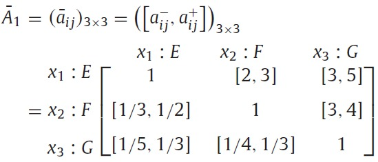
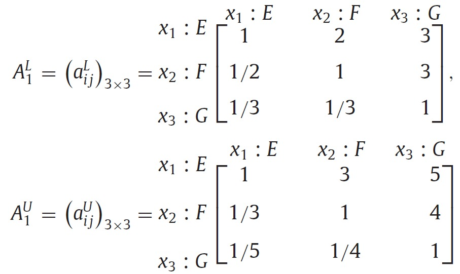
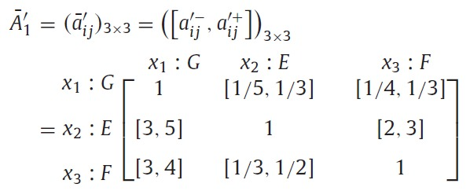
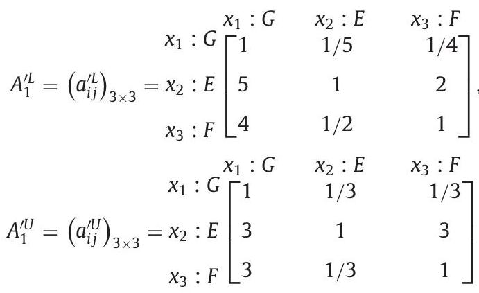

# 区間乗法比較行列に対する許容性解析および優先重みの抽出

## 著者

Kevin W. Li ${ }^{\text {a,b}}$, Zhou-Jing Wang ${ }^{\text {c,*}}$, Xiayu Tong ${ }^{\mathrm{d}}$

${ }^{\mathrm{a}}$ College of Economics and Management, Fuzhou University, Fuzhou, Fujian 350116, China

${ }^{\mathrm{b}}$ Odette School of Business, University of Windsor, Windsor, Ontario N9B 3P4, Canada

${ }^{\mathrm{c}}$ School of Information, Zhejiang University of Finance E Economics, Hangzhou, Zhejiang 310018, China

${ }^{\mathrm{d}}$ School of Management, Zhejiang University of Finance E' Economics, Hangzhou, Zhejiang 310018, China

## キーワード

決定分析

区間乗法比較行列

整合性

許容可能性

対数最小二乗

## 要約

従来の対の区間比較行列の許容性に関する研究は、不整合度を一定の閾値内に制御することで許容可能な整合性に焦点を当てています。しかし、完全な整合性を持つが高度に不確定な区間比較行列は、（時にはまったく）有用な意思決定情報を含まないため、許容できないものになる場合があります。本論文では、区間乗法比較行列（IMCM）の許容性の現在の定義を分析し、その技術上の欠陥を示します。その後、IMCMにおける不整合性と不確定性のレベルを考慮した、許容可能なIMCMの新たな概念を示します。IMCMの不確定性比率を測定するための幾何平均ベースの指標を提案し、整合性を持つIMCMと許容可能なIMCMの有用な特性を導出します。次に、正規化された許容可能な区間乗法重みを整合性を持つ許容可能なIMCMに変換するための、不確定性比率と幾何平均に基づく変換式を提案します。補助条件を導入することで、許容可能なIMCMから区間乗法重みを生成するための対数最小二乗モデルを確立します。幾何平均に基づく可能性度の計算式を設計し、正規化された区間乗法重みを比較およびランク付けするための方法を説明するために、2つの数値例を示します。

## 1. 序論

古典的な階層分析法（AHP）では、意思決定者（DM）は意思決定の代替案に対する自分の優先順位を求めるために対の比較を行います。その結果得られる明確な優先比は、乗法比較行列として表されます（Saaty、1980年）。現実の意思決定問題は複雑で不確定なことが多いため、対の比較で正確な比率を割り当てることはしばしば困難です（Ahn＆Park、2014年; Dubois、2011年; Scholten、Schuwirth、Reichert＆Lienert、2015年; Zhu＆Xu、2014年）。そのため、DMの対の比較に曖昧さと不確定性を持たせるために、区間乗法比較行列（IMCM）（Saaty＆Vargas、1987年）や区間加法比較行列（Wang＆Li、2015年; Xu＆Chen、2008年）など、異なる種類の比較行列が提案されています。多基準意思決定分析における不確定性モデリングは、過去数十年にわたって増加し続けています（Borgonovo＆Marinacci、2015年; Dede、Kamalakis、＆Sphicopoulo、2015年; Durbach、Lahdelma、＆Salminen、2014年; Merigó、Casanovas、＆Yang、2014年; Rezaei＆Ortt、2013年; Song、Ming、＆Xu、2013年; Yan＆Ma、2015年）。

比較行列の整合性は、意思決定の代替案の最終順位に直接影響します。整合性は、DMの一対比較におけるある推移性の性質を指し、DMの判断がある意味で整合していることを保証します。整合性を特徴づけるためには、さまざまな推移性の性質が提案されており（Brunelli、Canal、およびFedrizzi、2013）、これらの性質は代替ラベリングに対して不変であることが期待されています。BrunelliとFedrizzi（2014）によると、一対比較行列の整合性の測定において、この不整合性の不変性は公理的な性質とされています。DMの比較は主観的であり、代替案はさまざまな文脈で他のものと比較されるため、その結果として得られる比較行列にはしばしば整合性のない要素が含まれています。整合性の低い比較行列は、低品質の意思決定入力を表し、誤った意思決定結果に必ずしもつながることになります（Brunelli＆Fedrizzi、2015年；Dong、Xu、Li、およびDai、2008年；Siraj、Mikhailov、およびKeane、2012a、2012b）。Saaty（1980）は、明確な乗法的比較行列の整合性レベルを測定するために、整合性指数（CI）と整合性比（CR）を提案しました。AguaronとMoreno-Jimenez（2003）によって幾何学的な整合性指数とそれに対応する閾値も提案されました。Dong、Zhang、Hong、およびXu（2010）は、行幾何平均優先化法に基づくグループ合意モデルを提案しました。最近の研究では、乗法的比較行列の整合性の不整合性を、IMCM（Entani＆Tanaka、2007年；Guo＆Tanaka、2010年；Sugihara、Ishii＆Tanaka、2004年；Wang、2015b年）の構築によってある種の不確定性として扱い、不確実性のレベルをエントロピー、区間幅、無知の考えを用いて区間確率や重みで測定するというのがあります（Entani＆Sugihara、2012）。

IMCMの整合性に関する現在の研究は、大まかに2つのグループに分類できます。最初のグループは、実現可能領域の考え方を採用し、元の区間判断内に整合的な明確な比較行列が存在する場合にIMCMの整合性を主張します（Wang＆Elhag、2007年；Wang、Yang、およびXu、2005a年）。もう一つのカテゴリは、いくつかの数学的な制約に基づいて整合性を定義しています（Liu、2009年；Wang、2015a年；Wu、Li、Li、およびDuan、2009年；Xu、2010年）。たとえば、Wang et al.（2005a）は、凸実現可能領域を用いて整合的なIMCMを定義しました。Wang、Yang、およびXu（2005b）は、IMCMの整合性をテストする方法を提案しました。Liu（2009）は、2つの変換された明確な乗法的比較行列に基づいてIMCMの整合性と許容可能な整合性を導入しました。Liu（2009）の整合性モデルは、Xu（2010年）で等価の数学的制約として再定式化されました。

IMCMの区間重み推定法は、多数開発されています。Wang et al.（2005a）は、正規化された明確な乗法的重みの実現可能領域に基づいて、IMCMから区間乗法的重みを導出するための2段階の対数目標プログラムを開発しました。同様に、Wang and Elhag（2007）は、整合的および非整合的なIMCMから区間加法的重みを得るための目標プログラムを確立しました。Liu（2009）は、許容可能なIMCMから区間乗法的重みを導く方法を提案しました。GuoとWang（2012）は、区間一対比較を外部方向と内部方向から得られた区間確率の比として近似し、IMCMから区間確率を誘導するための2つの線形プログラムを開発しました。

上述の研究から、比較行列から優先重みを導く際には、整合性と許容可能性制約が常に使用されていることが明らかとなります。したがって、これらの制約が合理的かつ論理的であることを確保することが重要です。Wang et al.（2005a）およびWang and Elhag（2007）の整合性定義は、3つ以上の比較における推移性を考慮せずに凸実現可能領域の概念に基づいて構築されています。これは、この整合性制約が緩くなりがちであり、非常に不確定な比較がしばしば整合的と判断される傾向があることを意味します。一方、Liu（2009）による許容可能な整合性定義は、IMCMの元の比較データを使用していますが、セクション3のさらなる分析では、代替ラベリングに対する感度のために本質的に不完全であることが示されています。

上記の欠点を克服するために、我々は Wang（2015a）のIMCMsの整合性定義を使用して、区間演算に基づく推移方程式を採用します。整合したIMCMsの特性を調査し、許容可能な不確定性比率の閾値を導入することで、許容可能なIMCMsを定義し、その基本的な特性を導出します。この許容可能なIMCM概念の主要な革新点は、一致性や不整合性のレベルを区間判断に考慮することです。有用な決定情報がほとんどない、またはまったくない高度に不確定なIMCMは、整合性があるか不整合性のレベルが低い場合でも許容できないと見なされます。IMCMの不確定性指標を定義し、任意の2つのIMCM間の差異比率を測るための幾何平均ベースの式を提供します。その後、正規化された区間乗法的重みを定義し、正規化された許容可能な区間乗法的重みベクトルの概念を導入します。不確定性比率と幾何平均に基づく変換方程式を提供し、正規化された許容可能な区間乗法的重みベクトルを整合性のあるIMCMに変換します。変換方程式に基づいて、区間乗法的重みを生成するための対数最小二乗（LLS）多目的モデルを提案します。補助制約を導入し、変換方程式の両側の対数の二乗偏差を最小化することにより、正規化された許容可能な区間乗法的重みベクトルを許容できるIMCMから生成するLLSモデルを確立します。最後に、正規化された区間乗法的重みを比較してランク付けするための新しい可能性度の式を提示します。

本文の構成は以下の通りです。セクション2では、Saatyの一貫性のある乗法的比較行列とIMCMに関する予備知識を説明します。セクション3では、既存の許容可能性のあるIMCMの整合性定義の技術的な不備を指摘します。セクション4では、適応された整合性定義と新しい許容性概念が提案され、整合性のあるIMCMと許容可能なIMCMの有用な特性が示されます。セクション5では、許容可能なIMCMから区間乗法的重みを引き出すためのLLSモデルが開発されます。セクション6では、提案されたフレームワークを示すための2つの実例と比較研究が提供されます。セクション7では、将来の機会についての簡単なコメントを交えて、論文を締めくくります。

## 2.予備知識

$X=\left\{x_{1}, x_{2}, \ldots, x_{n}\right\}$を有限集合とし、中立値が1である比率に基づく2極的尺度$[1 / S, S]$を持つ場合、集合$X$上の乗法的比較行列$A$は$A=\left(a_{i j}\right)_{n \times n}$と表され、$a_{i j}$は$x_{i}$から$x_{j}$への比較比率を示します。

$$
1 / S \leq a_{i j} \leq S, a_{i j} a_{j i}=1, a_{i i}=1, \quad i, j=1,2, \ldots, n
$$

あるクリスプ比率 $a_{i j}$ は、$x_{i}$ が $x_{j}$ よりも $a_{i j}$ 倍好まれることを示します。 $a_{i j}$ が大きいほど、代替案 $x_{i}$ が $x_{j}$ よりも好まれます。 $a_{i j}=1$ は、$x_{i}$ と $x_{j}$ の間に無関心を示します。

Saaty（1980）は、乗法的比較行列に対する整合性の定義を提案しました。

**定義2.1**（Saaty、1980）。乗法的比較行列 $A=\left(a_{i j}\right)_{n \times n}$ は、乗法的に整合している場合、以下を満たします。

$$
\begin{aligned}
& a_{i k}=a_{i j} a_{j k}, \quad i, j, k=1,2, \ldots, n \\
& \quad \text { As } a_{i j} a_{j i}=1 \text { for all } i, j=1,2, \ldots, n,(2.2) \text { yields } \\
& a_{i j} a_{j k} a_{k i}=a_{i k} a_{k j} a_{j i}, \quad i, j, k=1,2, \ldots, n
\end{aligned}
$$

サーティ（1980）は、行列 $A=\left(a_{i j}\right)_{n \times n}$ が乗法的に整合している場合、およびその場合に限り、正規化された明確な重みベクトルが存在することを確認しました。

$$
\begin{aligned}
& \omega=\left(\omega_{1}, \omega_{2}, \ldots, \omega_{n}\right)^{T} \text{ such that} \\
& a_{i j}=\omega_{i} / \omega_{j}, \quad i, j=1,2, \ldots, n \\
& \text{where } \sum_{i=1}^{n} \omega_{i}=1 \text{ and } \omega_{i}>0 \forall i=1,2, \ldots, n
\end{aligned}
$$

Saaty（1980）は、1-9スケール、つまり$S=9$を導入し、乗法的比較行列から優先度の重みを得るための固有ベクトル法を開発しました。また、DMの判断の不整合度を測定するために、以下の$\mathrm{CI}$と$\mathrm{CR}$を提示しました。

$$
\mathrm{CI}(A)=\frac{\lambda_{\max }^{A}-n}{n-1}, \quad
\mathrm{CR}(A)=\frac{\mathrm{CI}(A)}{\mathrm{RI}(n)}
$$

ここで、$\lambda_{\max}^{A}$は固有値問題$A \omega=\lambda \omega$の最大固有値であり、$n$は$A$の次元です。$\mathrm{RI}(n)$は、大量の乗法的比較行列からランダムに導出されたCIの平均値です。

Saaty（1980）は0.1の許容可能な閾値を提案しました: もし$\mathrm{CR}(A) \leq 0.1$ならば、乗法的比較行列$A$は許容できる整合性を持つと言います。この場合、代替案$x_{i} (i=1$, $2, \ldots, n)$の選好度は、固有ベクトル法から得られた優先重み$\omega_{i}$によって適切に捉えられます。もし$\mathrm{CR}(A)>0.1$ならば、$A$の整合性は許容できず、判断行列$A$を意思決定者が整合性を向上させるために修正する必要があります。

多くの意思決定状況では、一対比較は不確定性と曖昧さを伴って行われます。SaatyとVargas（1987）は、区間乗法的比較行列（IMCMs）の概念を導入し、この不確定性を特徴付けました。

**定義2.2**（Saaty＆Vargas、1987）。$X$上のIMCM $\bar{A}$は、区間判断行列$\bar{A}=\left(\bar{a}_{i j}\right)_{n \times n}$によって特徴付けられます。

$$
\bar{a}_{i j}=\left[a_{i j}^{-}, a_{i j}^{+}\right], 1 / S \leq a_{i j}^{-} \leq a_{i j}^{+} \leq S, a_{i j}^{-} a_{j i}^{+}=1, a_{i i}^{-}=a_{i i}^{+}=1,
$$

$i, j=1,2, \ldots, n$

ここで$\bar{a}_{i j}$ は区間優先率を示し、$x_{i}$ が $a_{i j}^{-}$ と $a_{i j}^{+}$ の間で $x_{j}$ よりも $a_{i j}^{-}$ 倍から $a_{i j}^{+}$ 倍好まれていることを示します。

$\bar{a}=\left[a^{-}, a^{+}\right]$ と $\bar{b}=\left[b^{-}, b^{+}\right]$ の2つの区間数がなるほど、区間演算の法則は以下のように記述されます:

(1) 加算: $\bar{a} \oplus \bar{b}=\left[a^{-}+b^{-}, a^{+}+b^{+}\right]$ ;

(2) 減算: $\bar{a}-\bar{b}=\left[a^{-}-b^{+}, a^{+}-b^{-}\right]$ ;

(3) 乗算: $\bar{a} \otimes \bar{b}=\left[a^{-} b^{-}, a^{+} b^{+}\right]$, ここで $a^{-}, b^{-} \geq 0$;

(4) 除算: $\frac{\bar{a}}{\bar{b}}=\left[\frac{a^{-}}{b^{+}}, \frac{a^{+}}{b^{-}}\right]$, ここで $a^{-}, b^{-}>0$;

(5) スカラー倍: $\lambda \bar{a}=\left[\lambda a^{-}, \lambda a^{+}\right]$, ただし $\lambda \geq 0$。特に、$\lambda=$0の場合、$\lambda \bar{a}=[0,0]$ です。

区間演算に基づいて、(2.6) は以下のように書き換えられます:

$$
\bar{a}_{i j}=\left[a_{i j}^{-}, a_{i j}^{+}\right] \subseteq[1 / S, S], \bar{a}_{i j}=\frac{1}{\bar{a}_{j i}},\left[a_{i i}^{-}, a_{i i}^{+}\right]=1, \quad i, j=1,2, \ldots, n
$$

IMCM（$\bar{A}=$ $\left(\bar{a}_{i j}\right)_{n \times n}$）に対して、しばしば$\bar{a}_{i j} \otimes \bar{a}_{j i} \neq 1$となることがあるが、$\bar{A}$は$\bar{a}_{i j}=\frac{1}{\bar{a}_{j i}}, \forall i, j=1,2, \ldots, n$の相互性を満たす必要があることに注意されたい。

## 3. 既存の許容可能な整合性の分析

本節では、許容可能な整合性の既存の概念を分析します。数値例を示して、その技術的な不足を明らかにします。

Liu（2009）は、2つの式（p. 2690の式（6））を導入し、2つの乗法的比較行列を構築しました。これらは、IMCMの整合性を定義するために使用されます（p. 2691のDefinition 3）。この定義は、この論文の表記を用いて以下のように書き直されます。

**Definition 3.1** (Liu, 2009). $\bar{A}=\left(\bar{a}_{i j}\right)_{n \times n}=\left(\left[a_{i j}^{-}, a_{i j}^{+}\right]\right)_{n \times n}$をIMCMとし、$\bar{A}$が整合しているとは、2つの構築された乗法的比較行列$A^{L}=\left(a_{i j}^{L}\right)_{n \times n}$と$A^{U}=\left(a_{i j}^{U}\right)_{n \times n}$がSaatyの乗法的整合性を持つとされる。ここで、$a_{i j}^{L}$および$a_{i j}^{U}$は次のように決定される：

$$
a_{i j}^{L} = \left\{
  \begin{array}{ll}
  a_{i j}^{-} & i<j \\
  1 & i=j, \\
  a_{i j}^{+} & i>j
\end{array} \quad a_{i j}^{U} = \begin{cases}
  a_{i j}^{+} & i<j \\
  1 & i=j \\
  a_{i j}^{-} & i>j
\end{cases}\right.
$$

Liu（2009）は$A^{L}$と$A^{U}$を使用してIMCMの許容可能な整合性を確認しました。もし$A^{L}$と$A^{U}$がどちらも許容可能な整合性を持っている場合、$\bar{A}$は許容可能な整合性を持つと言われます。そうでなければ、$\bar{A}$は許容できないとされます。

次に、Liu（2009）が提供した数値例を用いて、許容可能な整合性が同じ判断行列に対して再ラベル付けが行われた場合に矛盾した結果をもたらすことを示します。これにより、その技術的な不足が明らかになります。

**例1.** 3つの代替案$E, F$および$G$を持つ意思決定問題を考えます。意思決定者は3つの代替案のそれぞれのペアを比較し、結果を表1に示すように提供します。

表1の区間比較は、3つの代替案の異なるラベル付けによってシャッフルされ、6つの等価なIMCMを生成することができます。もし代替案$E, F$および$G$がそれぞれ$x_{1}, x_{2}$および$x_{3}$としてラベル付けされる場合、意思決定者の比較は以下のIMCMとして表されます:

| Pair of the three alternatives | Value          |
|--------------------------------|----------------|
| E vs. F                        | $[2,3]$        |
| E vs. G                        | $[3,5]$        |
| F vs. E                        | $[1/3,1/2]$    |
| F vs. G                        | $[3,4]$        |
| G vs. E                        | $[1/5,1/3]$    |
| G vs. F                        | $[1/4,1/3]$    |

（3.1）により、構築された乗法比較行列$A_{1}^{L}=\left(a_{i j}^{L}\right)_{3\times 3}$と$A_{1}^{U}=\left(a_{i j}^{U}\right)_{3\times 3}$は次のように決定されます：

$a_{13}^{L} \neq a_{12}^{L} a_{23}^{L}$および$a_{13}^{U} \neq a_{12}^{U} a_{23}^{U}$のため、$A_{1}^{L}$および$A_{1}^{U}$は不整合と見なされます。Definition 3.1により、$\bar{A}_{1}$は不整合なIMCMとなります。一方、(2.5)により、$\mathrm{CR}\left(A_{1}^{L}\right)=0.0516$および$\mathrm{CR}\left(A_{1}^{U}\right)=0.0825$となります。明らかに、$A_{1}^{L}$および$A_{1}^{U}$のCRは許容可能なしきい値0.1以内です。したがって、$A_{1}^{L}$および$A_{1}^{U}$の両方は許容可能な整合性を持っています。したがって、$\bar{A}_{1}$はLiu (2009)によれば許容されうる整合性を持つIMCMと見なされます。

同じ判断情報を用いて、$G$を$x_{1}$、$E$を$x_{2}$、$F$を$x_{3}$として再ラベル付けすることができます。この場合、表1の判断は次のIMCMとして表現されます。

（3.1）により、構築された乗法比較行列$A_{1}^{\prime L}=\left(a_{i j}^{\prime L}\right)_{3\times 3}$と$A_{1}^{\prime U}=\left(a_{i j}^{\prime U}\right)_{3\times 3}$は次のように決定されます：

（2.5）により、$\operatorname{CR}\left(A_{1}^{\prime L}\right)=0.0236$および$\operatorname{CR}\left(A_{1}^{\prime U}\right)=0.1279$が確認されます。$\operatorname{CR}\left(A_{1}^{\prime U}\right)>0.1$のため、$A_{1}^{\prime U}$の整合性は許容できません。Liu (2009)によれば、$\bar{A}_{1}^{\prime}$は許容されないIMCMとなります。これは、ラベル付けのみが異なる3つの代替案で同じペア比較結果を表す$\bar{A}_{1}$および$\bar{A}_{1}^{\prime}$の両方が自己矛盾し、非合理的であることを明らかにします。

$\sigma$を$\{1,2,3\}$の順列とし、$\sigma(1)=3$、$\sigma(2)=1$、$\sigma(3)=2$とします。すると、$\bar{A}_{1}^{\prime}=\left(\left[a_{\sigma(i)\sigma(j)}^{-}, a_{\sigma(i)\sigma(j)}^{+}\right]\right)_{3\times 3}$、つまり、IMCM $\bar{A}_{1}^{\prime}$は$\bar{A}_{1}$の順列です。上記の例は、許容される整合性（Liu (2009)）の技術的な不足を明らかにするものです：IMCMの許容される整合性の判断は、代替案のラベル付け方法に依存し、同じIMCMであっても新しい順列は矛盾した結果になる可能性があります。

この分析から、既存の整合性と許容可能性の定義は、DMのペア比較における推移性と不確定性をモデル化する際に問題があることが示されます。次に、IMCMの新しい整合性と許容可能性の定義を紹介します。

## 4. IMCMの新しい整合性と許容可能性

このセクションでは、IMCMの整合性を定義するための区間演算に基づいた推移性の方程式を紹介します。それにより、IMCMの許容される整合性とIMCMの不確定性比率の定義を提案し、IMCMの許容可能なIMCMと不確定性指数の幾何平均に関する概念を導入します。次に、整合性のあるIMCMと許容されるIMCMに対して有用な性質を導出します。

### 4.1. IMCMの許容される整合性

**定義4.1.** IMCM $\bar{A}=\left(\bar{a}_{i j}\right)_{n\times n}=\left(\left[a_{i j}^{-}, a_{i j}^{+}\right]\right)_{n\times n}$が次の条件を満たす場合：

$$
\bar{a}_{i j}\otimes\bar{a}_{j k}\otimes\bar{a}_{k i}=\bar{a}_{i k}\otimes\bar{a}_{k j}\otimes\bar{a}_{j i}, \quad i, j, k=1,2,...,n
$$

その場合、$\bar{A}$は整合的と呼ばれます。

区間演算により、$\bar{A}$内のすべての区間比較$\bar{a}_{i j}(i, j=1,2,...,n)$が比率に基づくクリスプな値に縮小される場合、つまり、$a_{i j}^{-}=a_{i j}^{+}, \forall i, j=1,2,...,n$である場合、IMCM $\bar{A}$は乗法的比較行列$A=\left(a_{i j}\right)_{n\times n}$に等しくなります。ここで$a_{i j}=a_{i j}^{-}=a_{i j}^{+}$はすべての$i, j=1,2,...,n$に対して成り立ちます。この場合、(4.1)は(2.3)に縮小され、これはSaaty (1980)によって与えられた乗法的推移性条件(2.2)と同等です。したがって、整合性(4.1)はSaatyの初期の乗法的整合性の自然な一般化です。

明らかに、(4.1)は$i, j, k$の順序に依存せず、したがって、Definition 4.1は代替ラベルが順列された場合にも堅牢です。Definition 4.1により、Example 1の$\bar{A}_{1}$と$\bar{A}_{1}^{\prime}$は2つの不整合なIMCMです。以降、IMCMが整合していると言われる場合、それは常にDefinition 4.1に基づいているものとします。同様に、乗法的比較行列が整合していると言われる場合、それは常にDefinition 2.1で与えられる整合性の意味であります。

**定理4.1.** IMCM $\bar{A}=\left(\bar{a}_{i j}\right)_{n\times n}=\left(\left[a_{i j}^{-}, a_{i j}^{+}\right]\right)_{n\times n}$が整合しているための必要十分条件は、

$$
a_{i k}^{-} a_{i k}^{+}=a_{i j}^{-} a_{i j}^{+} a_{j k}^{-} a_{j k}^{+}, i, j, k=1,2, \ldots, n
$$

証明。充分性: IMCMsの乗法的相互逆性により、すべての$i, j = 1,2, \ldots, n$に対して$a_{i j}^{-} a_{j i}^{+}=1$となります。これは(4.2)から、$a_{i j}^{-} a_{j k}^{-} a_{k i}^{-}=a_{i k}^{-} a_{k j}^{-} a_{j i}^{-}$および$a_{i j}^{+} a_{j k}^{+} a_{k i}^{+}=a_{i k}^{+} a_{k j}^{+} a_{j i}^{+}$となります。セクション2で説明されている区間演算により、次の結果が得られます。

$$
\begin{aligned}
\bar{a}_{i j} \otimes \bar{a}_{j k} \otimes \bar{a}_{k i} & =\left[a_{i j}^{-} a_{j k}^{-} a_{k i}^{-}, a_{i j}^{+} a_{j k}^{+} a_{k i}^{+}\right]=\left[a_{i k}^{-} a_{k j}^{-} a_{j i}^{-}, a_{i k}^{+} a_{k j}^{+} a_{j i}^{+}\right] \\
& =\bar{a}_{i k} \otimes \bar{a}_{k j} \otimes \bar{a}_{j i} .
\end{aligned}
$$

定義4.1によると、$\bar{A}$は整合性を持っています。
必要性：$\bar{A}$が整合性を持つので、定義4.1により、$i, j, k=1,2, \ldots, n$について$\bar{a}_{i j} \otimes \bar{a}_{j k} \otimes$ $\bar{a}_{k i}=\bar{a}_{i k} \otimes \bar{a}_{k j} \otimes \bar{a}_{j i}$が成り立ちます。十分性の証明を逆にすると、$i, j, k=1,2, \ldots, n$について$a_{i k}^{-} a_{i k}^{+}=a_{i j}^{-} a_{i j}^{+} a_{j k}^{-} a_{j k}^{+}$が得られます。$\square$

定理4.1は、推移性の制約(4.1)をクリスプな算術式(4.2)として等価に公式化できることを意味しており、定義4.1はWang（2015a）による整合性と同等であることを示しています。次の定理はさらに、(4.2)を整合性のために上三角要素のみをチェックすることで簡略化できることを示しています。

**定理4.2.** 任意のIMCMである$\bar{A}=\left(\bar{a}_{i j}\right)_{n \times n}=\left(\left[a_{i j}^{-}, a_{i j}^{+}\right]\right)_{n \times n}$に対して、次の2つの文は同値です：

(i) $a_{i k}^{-} a_{i k}^{+}=a_{i j}^{-} a_{i j}^{+} a_{j k}^{-} a_{j k}^{+}, i, j, k=1,2, \ldots, n$.

(ii) $a_{i k}^{-} a_{i k}^{+}=a_{i j}^{-} a_{i j}^{+} a_{j k}^{-} a_{j k}^{+}, \quad \forall i<j<k$.

証明. (i) $\Rightarrow$ (ii)は明らかです。

(ii) $\Rightarrow$ (i)。$a_{i i}^{-}=a_{i i}^{+}=1$および$a_{i j}^{-} a_{j i}^{+}=1$が全ての$i, j=1,2, \ldots, n,(\mathrm{i})$に対して成り立つため、指数$i, j, k$のうち3つまたはいずれか2つが等しい場合、常に(i)は成り立ちます。次に、$i \neq j \neq k$の場合を考えます。異なる指数の順序に対して6つの副ケースが発生する可能性があります：

(a) $i<j<k$。この場合、(i)は(ii)と同じです。したがって、(i)は成り立ちます。

(b) $i<k<j$。(ii)により、$a_{i j}^{-} a_{i j}^{+}=a_{i k}^{-} a_{i k}^{+} a_{k j}^{-} a_{k j}^{+}$が得られます。両辺を$a_{k j}^{-} a_{k j}^{+}$で除算し、$a_{k j}^{-} a_{j k}^{+}=1, \forall j, k=$ $1,2, \ldots, n$の相互関係を適用すると、$a_{i k}^{-} a_{i k}^{+}=a_{i j}^{-} a_{i j}^{+} a_{j k}^{-} a_{j k}^{+}$が得られます。

(c) $j<i<k$。(ii)により、$a_{j k}^{-} a_{j k}^{+}=a_{j i}^{-} a_{j i}^{+} a_{i k}^{-} a_{i k}^{+} \Rightarrow a_{j k}^{-} a_{j k}^{+}=$ $\frac{1}{a_{i j}^{+}} \frac{1}{a_{i j}^{-}} a_{i k}^{-} a_{i k}^{+} \Rightarrow a_{i k}^{-} a_{i k}^{+}=a_{i j}^{-} a_{i j}^{+} a_{j k}^{-} a_{j k}^{+}$が得られます。

同様に、残りの副ケースについても(i)が成り立つことを示せます：(d) $j<k<i$、(e) $k<j<i$、および(f) $k<i<j$。

定理4.1と定理4.2に基づいて、次の結果を直接的に導くことができます。

**系4.1.** IMCM $\bar{A}=\left(\bar{a}_{i j}\right)_{n \times n}=\left(\left[a_{i j}^{-}, a_{i j}^{+}\right]\right)_{n \times n}$が整合性を持つための必要十分条件は、以下の式を満たすことです：

$$
a_{i k}^{-} a_{i k}^{+}=a_{i j}^{-} a_{i j}^{+} a_{j k}^{-} a_{j k}^{+}, \forall i<j<k
$$

Let 

あるとすると、

$$
\begin{align*}
& p_{i j}^{L}= \begin{cases}1+\log _{a_{i j}^{+}} a_{i j}^{-} & a_{i j}^{-}>1 \\ 1+\log _{a_{i j}^{-}} a_{i j}^{+} & a_{i j}^{-}<1, a_{i j}^{+}<1, \\ 1 & \text { otherwise }\end{cases} \\
& p_{i j}^{U}= \begin{cases}1+\log _{a_{i j}^{-}} a_{i j}^{+} & a_{i j}^{-}>1 \\ 1+\log _{a_{i j}^{+}} a_{i j}^{-} & a_{i j}^{-}<1, a_{i j}^{+}<1 \\ +\infty & \text { otherwise }\end{cases} \\
& p^{L}=\max _{i, j=1,2, \ldots, n}\left\{p_{i j}^{L}\right\}, \quad p^{U}=\min _{i, j=1,2, \ldots, n}\left\{p_{i j}^{U}\right\}
\end{align*}
$$

明らかに全ての$i, j=1,2, \ldots, n$に対して、$1 \leq p_{i j}^{L} \leq 2$ かつ $p_{i j}^{U} \geq 2$ です。(4.5)により、$1 \leq p^{L} \leq 2$ かつ $p^{U} \geq 2$ となります。したがって、$p^{L}$ と $p^{U}$ は、2 を含む実数の区間 $\left[p^{L}, p^{U}\right]$ を構成します。

以下のようになります。

$$
A(p)=\left(a_{i j}(p)\right)_{n \times n}=\left(\sqrt[p]{a_{i j}^{-} a_{i j}^{+}}\right)_{n \times n}
$$

$p^{L} \leq p \leq p^{U}$ である。定理4.1に基づいて、以下の系が成り立つ。

**系4.2** IMCM $\bar{A}=\left(\bar{a}_{i j}\right)_{n \times n}=\left(\left[a_{i j}^{-}, a_{i j}^{+}\right]\right)_{n \times n}$ は、任意の $p \in\left[p^{L}, p^{U}\right]$ に対して、(4.6) によって定義される乗法的比較行列 $A(p)$ が整合的である場合に限り整合的である。

証明． (4.4) と (4.5) により、$p \in\left[p^{L}, p^{U}\right]$ に対して、次のようになる。

$$
\begin{aligned}
p_{i j}^{L} & \leq \max _{i, j=1,2, \ldots, n}\left\{p_{i j}^{L}\right\}=p^{L} \leq p \leq p^{U}=\min _{i, j=1,2, \ldots, n}\left\{p_{i j}^{U}\right\} \leq p_{i j}^{U}, \forall i, j=1,2, \ldots, n \\
\Rightarrow & p_{i j}^{L}-1 \leq p-1 \leq p_{i j}^{U}-1, \forall i, j=1,2, \ldots, n \\
\Rightarrow & (p-1) \ln a_{i j}^{-} \leq \ln a_{i j}^{+}, \ln a_{i j}^{-} \leq(p-1) \ln a_{i j}^{+}, \forall i, j=1,2, \ldots, n \\
\Rightarrow & \left(a_{i j}^{-}\right)^{p-1} \leq a_{i j}^{+}, a_{i j}^{-} \leq\left(a_{i j}^{+}\right)^{p-1}, \forall i, j=1,2, \ldots, n \\
\Rightarrow & \left(a_{i j}^{-}\right)^{p} \leq a_{i j}^{-} a_{i j}^{+} \leq\left(a_{i j}^{+}\right)^{p}, \forall i, j=1,2, \ldots, n \\
\Rightarrow & a_{i j}^{-} \leq \sqrt[p]{a_{i j}^{-} a_{i j}^{+}}=a_{i j}(p) \leq a_{i j}^{+}, \forall i, j=1,2, \ldots, n .
\end{aligned}
$$

$1 / S \leq a_{i j}(p) \leq S$ for all $i, j=1,2, \ldots, n$.

Thus, the constraints on the elements $a_{i j}(p)$ are as follows:

- The lower bound is $\frac{1}{S}$.
- The upper bound is $S$.

Additionally, we know that $a_{i i}(p)=1$ for all $i$.

The reciprocity of $a_{i j}^{-} a_{j i}^{+}=1$ implies that $a_{i j}(p) a_{j i}(p)=\sqrt[p]{a_{i j}^{-} a_{i j}^{+}} \sqrt[p]{a_{j i}^{-} a_{j i}^{+}}=\sqrt[p]{a_{i j}^{-} a_{j i}^{+}} \sqrt[p]{a_{j i}^{-} a_{i j}^{+}}=1$.

From equation (2.1), we can conclude that $A(p)$ is a multiplicative comparison matrix for any $p \in\left[p^{L}, p^{U}\right]$.

Furthermore, for each $p \in\left[p^{L}, p^{U}\right]$, we have:

$$
\begin{aligned}
& a_{i k}^{-} a_{i k}^{+}=a_{i j}^{-} a_{i j}^{+} a_{j k}^{-} a_{j k}^{+} \Leftrightarrow\left(a_{i k}^{-} a_{i k}^{+}\right)^{1 / p}=\left(a_{i j}^{-} a_{i j}^{+} a_{j k}^{-} a_{j k}^{+}\right)^{1 / p} \\
& \Leftrightarrow\left(a_{i k}^{-} a_{i k}^{+}\right)^{1 / p}=\left(a_{i j}^{-} a_{i j}^{+}\right)^{1 / p}\left(a_{j k}^{-} a_{j k}^{+}\right)^{1 / p} \\
& \Leftrightarrow a_{i k}(p)=a_{i j}(p) a_{j k}(p), \quad \forall i, j, k=1,2, \ldots, n
\end{aligned}
$$

したがって、定理4.1により、系4.2の証明は完了しました。 $\square$

系4.2は、一貫性のあるIMCMには通常、多数のSaatyの一貫性のある比較行列が存在することを示しています。次のように定義される乗法的な比較行列$A^{g m}=\left(a_{i j}^{g m}\right)_{n \times n}=\left(\sqrt{a_{i j}^{-} a_{i j}^{+}}\right)_{n \times n}$を考えます。

明らかに、$A^{g m}=A(2)$です。系4.2から、次の結果が直接得られます。

**系4.3.** IMCM $\bar{A}=\left(\bar{a}_{i j}\right)_{n \times n}=\left(\left[a_{i j}^{-}, a_{i j}^{+}\right]\right)_{n \times n}$が一貫している場合、(4.7)によって定義される乗法的比較行列$A^{g m}$も一貫しています。

系4.3は、一貫したIMCM内の特定の明確な比較行列を特定しています：明確な比較行列の各要素は、対応する区間判断の上限と下限の幾何平均で与えられます。

現実の意思決定の状況では、意思決定者はしばしば主観的な評価に基づいてIMCMとして代替案の選好を提供し、推移性のプロパティが常に尊重されるわけではありません。系4.3によれば、IMCM $\bar{A}$の一貫性は、(4.7)によって定義された関連する明確な幾何平均行列$A^{g m}$の一貫性で特徴付けられます。次に、IMCMの許容可能な一貫性を次のように紹介します。

**定義4.2.** $\bar{A}=\left(\bar{a}_{i j}\right)_{n \times n}=\left(\left[a_{i j}^{-}, a_{i j}^{+}\right]\right)_{n \times n}$をIMCMとします。$1 / S \leq a_{i j}^{-}, a_{i j}^{+} \leq S$の場合、$\bar{A}$は許容可能に一貫しているとします。ただし、(4.7)によって定義される明確な判断行列$A^{g m}$は許容可能に一貫しているとします。

定義4.2では故意に許容可能な一貫性の概念を一般的なままにしています。いくつかの一貫性指標、例えばSaatyのCI、幾何学的一貫性指数（Crawford＆Williams、1985）、および調和一貫性指数（Stein＆Mizzi、2007）が、明確な判断行列の一貫性を測定するために考案されています。許容可能な一貫性をチェックするためには、異なる閾値が提案されています（Aguaron＆Moreno-Jimenez、2003）。SaatyのCRは順序保存の条件に対して合理的でない一貫性の結果をもたらすと批判されているにもかかわらず（Bana e Costa＆Vansnick、2008; Kułakowski、2015）、文献中で最も広く使用されている許容可能な一貫性です（Ishizaka＆Labib、2011）。この考慮に基づいて、乗法的比較行列$A^{g m}$の許容可能な一貫性を検証するためにSaatyのCRを使用します、つまり $\mathrm{CR}\left(A^{g m}\right) \leq 0.1$。ただし、我々の一般的な許容可能な一貫性フレームワークは、前述の幾何学的および調和一貫性指数などの他の概念に簡単に拡張することができると強調しておきます。

場合によっては、意思決定者は中立要素が1である$[1 / S, S]$スケールの両極端な区間判断、例えば$[1 / S, S]$を与える場合があります。これは、意思決定者が比較についての確信を全く持っていないことを示しています。例えば、全ての非対角要素が$[1 / S, S]$であるIMCMを提供する場合、そのような判断行列は技術的には一貫していますが、意思決定者の選好について何も開示せず、信頼性のある意思決定結果の導出には全く役立ちません（Dubois＆Prade、2012; Durbach＆Stewart、2012; Scholten et al.、2015; Wang＆Li、2015）。この場合、IMCMが一貫しているか許容可能に一貫している場合でも、その高い不確定性のために受け入れがたいと見なす必要があります。したがって、IMCMの受け入れ可能性を決定する際には、不確定性と一貫性のレベルの両方を考慮する必要があります。IMCMがあまりにも不確定性が高い場合やあまりにも一貫性がない場合は、受け入れがたいと判断し、意思決定者に修正を依頼するべきです。この包括的な視点は、IMCMの受け入れ可能性の評価に関する既存の研究と異なります：現在の文献では、Saatyの受け入れ可能な一貫性に一貫性のレベルだけを考慮する傾向があり、不確定性のレベルを検討していません。区間判断には固有の不確定性があるため、これはIMCMには適切ではありません。

### 4.2. 不確定性の測定とIMCMの受容性

不確定性のレベルを測定するためにしばしば区間幅が使用されます（Entani＆Sugihara、2012; Guo＆Tanaka 2010; Guo＆Wang 2012）。しかし、区間幅は、特に要素が優先比率で表される場合には、区間判断の不確定性レベルを適切に捉えることができないことがあります。例えば、$[1 / 9,9]$スケール上の2つの区間比較比$\bar{a}=[2,3]$と$\bar{b}=[1 / 6,1 / 2]$を考えます。$\bar{a}$の幅が$\bar{b}$の幅よりも大きいことは明らかですが、比率の観点から見ると、$\bar{a}$の不確定性レベルは$\bar{b}$のそれよりも小さいです。IMCMの受け入れ可能性をモデル化するためには、DMの区間比較データの不確定性をどのように測定するかを考慮する必要があります。

**定義4.3.** $ \bar {a} = [a^{-}, a^{+}] $が有界スケール $[1/S,S]$上の区間比較判断である場合、その不確定性比率を $ \mathrm{IR}(\bar{a}) $と表す。つまり、$ a^{+} / a^{-} $と定義される。

$$
\mathrm{IR}(\bar{a})=\frac{a^{+}}{a^{-}}
$$

明らかに、$1 \leq \mathrm{IR}(\bar{a}) \leq S^{2}$。もし$a^{-}=a^{+}$ならば、$\mathrm{IR}(\bar{a})=1$となり、$\bar{a}$は不確定性を持たない明確な値であることを意味します。$\mathrm{IR}(\bar{a})$が大きいほど、判断$\bar{a}$の不確定性はより大きくなります。また、$\mathrm{IR}\left(\bar{a}^{c}\right)=\mathrm{IR}(\bar{a})$であり、ここで$\bar{a}^{c}$は$\bar{a}=\left[a^{-}, a^{+}\right]$の逆数、つまり$\bar{a}^{c}=\frac{1}{\bar{a}}=\left[1 / a^{+}, 1 / a^{-}\right]$です。

(4.8)から、$\mathrm{IR}(\bar{a})=a^{+} / a^{-}=\left(a^{+}-a^{-}\right) / a^{-}+1$となります。明らかに$\left(a^{+}-a^{-}\right) / a^{-}$は区間判断の下限に相対的な成長率と見なすことができます。したがって、IMCMに対して許容可能な不確定性比率の閾値を決定することは比較的容易です。

**定義4.4.** $\bar{A}=\left(\bar{a}_{i j}\right)_{n \times n}=\left(\left[a_{i j}^{-}, a_{i j}^{+}\right]\right)_{n \times n}$をIMCMとし、$t_{u r}\left(t_{u r} \geq 1\right)$を許容可能な不確定性比率の閾値とすると、$\mathrm{IR}\left(\bar{a}_{i j}\right) \leq t_{u r}$ for all $i, j=1,2, \ldots, n$が成り立ち、また$\bar{A}$が定義4.2の下で許容可能である場合、$\bar{A}$は許容可能と呼ばれます。そうでなければ、$\bar{A}$は許容不可です。

定義4.4は、IMCMが許容可能になるためには、許容可能な不確定性レベルと許容可能な整合性レベルの両方を持つ必要があることを定めています。許容不可なIMCM $\bar{A}$は極端に整合性に欠けた情報または極めて不確定な情報を含む場合があります。この場合、IMCM $\bar{A}$はDMに戻され、更新が行われる必要があります。

IMCMの許容性のホリスティックな視点に基づいて、整合性があるIMCMでも、高い不確定性のために不許容と見なされる場合があります。例えば、$t_{u r}=5$とすると、すべての非対角要素が$[1 / 9,9]$であるIMCMは整合性があるが、すべての$i \neq j$に対して$\mathrm{IR}\left(\bar{a}_{i j}\right)=81>$ $5=t_{u r}$であるため、許容不可です。本質的に、この許容性の概念は、意思決定者の決定入力IMCMの品質を2つの側面、つまり整合性と不確定性の両方で制御するための重要な手段を提供します。整合性だけで十分ではありません。不確定性も許容可能な閾値内に制御する必要があります。この新しい品質管理メカニズムは、意思決定者がより意味のある入力を引き出し、より良い意思決定を行うのに役立つでしょう。

**定義4.5.** $\bar{A}=\left(\bar{a}_{i j}\right)_{n \times n}$をIMCMとし、$\bar{a}_{i j}=\left[a_{i j}^{-}, a_{i j}^{+}\right]$とすると、$\bar{A}$の幾何平均を用いた不確定性指数は以下のように定義されます。

$$
II(\bar{A})=\left(\prod_{i \neq j} \operatorname{IR}\left(\bar{a}_{i j}\right)\right)^{\frac{1}{n^{2}-n}}=\left(\prod_{i \neq j}\left(\frac{a_{i j}^{+}}{a_{i j}^{-}}\right)\right)^{\frac{1}{n^{2}-n}}
$$

$II(\bar{A})=\left(\prod_{i<j}\left(\frac{\max \left\{a_{i j}^{+}, b_{i j}^{+}\right\}}{\min \left\{a_{i j}^{-}, b_{i j}^{-}\right\}}\right)\right)^{\frac{1}{2\left(n^{2}-n\right)}}$

$$
\mathrm{DR}(\bar{A}, \bar{B})=\left(\prod_{i<j}\left(\frac{\max \left\{a_{i j}^{-}, b_{i j}^{-}\right\}}{\min \left\{a_{i j}^{-}, b_{i j}^{-}\right\}}\right)\left(\frac{\max \left\{a_{i j}^{+}, b_{i j}^{+}\right\}}{\min \left\{a_{i j}^{+}, b_{i j}^{+}\right\}}\right)\right)^{\frac{1}{\left(n^{2}-n\right)}}
$$

$\bar {A}^{(l)} = \left(\bar {a}_{ij}^{(l)}\right)_{n \times n} = \left(\left[a_{ij}^{-(l)}, a_{ij}^{+(l)}\right]\right)_{n \times n}(l=1,2, \ldots, m)$が$m$個のIMCMを示しているとします。ここで、個別のIMCMをグループの判断に集約するために、幾何学的平均を基にした式を導入します。

$$
\begin{aligned}
\bar{A}^{G} & =\left(\bar{a}_{i j}^{G}\right)_{n \times n}=\left(\left[a_{i j}^{-G}, a_{i j}^{+G}\right]\right)_{n \times n} \\
& =\left(\left[\prod_{l=1}^{m}\left(a_{i j}^{-(l)}\right)^{\alpha_{l}}, \prod_{l=1}^{m}\left(a_{i j}^{+(l)}\right)^{\alpha_{l}}\right]\right)_{n \times n}
\end{aligned}
$$

$\sum_{l=1}^{m} \alpha_l = 1$であり、$l=1,2,\ldots,m$のすべての$l$に対して$\alpha_l \geq 0$が成り立つ。

集約された行列$\bar{A}^G$がIMCMであることは、容易に証明できる。将来の議論を容易にするために、以下の補題が与えられている。

**補題 4.1.** (Horn & Johnson, 1985) 正の行列$T=\left(t_{ij}\right)_{n\times n}$の最大固有値を$\lambda_{\max}^T$とすると、

$$
\lambda_{\max }^{T}=\min _{Y \in R_{n}^{+}}\left\{\max _{1 \leq i \leq n}\left\{\sum_{j=1}^{n} t_{i j} \frac{y_{j}}{y_{i}}\right\}\right\}
$$

$R_{n}^{+}=\left\{Y=\left(y_{1}, y_{2}, \ldots, y_{n}\right)^{T} \mid y_{i}>0, i=1,2, \ldots, n\right\}$ とする。

Lemma 4.1とDefinition 4.4に基づいて、以下の結果が得られる。

**Theorem 4.3.** $t_{u r}\left(t_{u r} \geq 1\right)$を許容可能性不確定性比閾値とし、$\bar{A}^{(l)}=\left(\bar{a}_{i j}^{(l)}\right)_{n \times n}=\left(\left[a_{i j}^{-(l)}, a_{i j}^{+(l)}\right]\right)_{n \times n}(l=1,2, \ldots, m)$をmつのIMCM（間接行列的比較行列）とする。ただし、$1 / 9 \leq a_{i j}^{-(l)} \leq a_{i j}^{+(l)} \leq 9$である。このとき、すべての$\bar{A}^{(l)}(l=1,2, \ldots, m)$が許容可能であれば、集約されたIMCM $\bar{A}^{G}$（式(4.13)で定義）も許容可能である。

**Proof.** $\bar{A}^{(l)}$が許容可能であるため、$l=$ $1,2, \ldots, m$および$i, j=1,2, \ldots, n$に対して $1 \leq \frac{a_{i j}^{+(l)}}{a_{i j}^{-(l)}} \leq t_{u r}$が成り立つ。したがって、

"""

$$
\begin{aligned}
\left(\frac{a_{i j}^{+(l)}}{a_{i j}^{-(l)}}\right)^{\alpha_{l}} & \leq\left(t_{u r}\right)^{\alpha_{l}} \Rightarrow \prod_{l=1}^{m}\left(\frac{a_{i j}^{+(l)}}{a_{i j}^{-(l)}}\right)^{\alpha_{l}} \leq \prod_{l=1}^{m}\left(t_{u r}\right)^{\alpha_{l}} \\
& =t_{u r} \Rightarrow \frac{\prod_{l=1}^{m}\left(a_{i j}^{+(l)}\right)^{\alpha_{l}}}{\prod_{l=1}^{m}\left(a_{i j}^{-(l)}\right)^{\alpha_{l}}} \leq t_{u r} \Rightarrow \frac{a_{i j}^{+G}}{a_{i j}^{-G}} \leq t_{u r}
\end{aligned}
$$

すべての $i, j=1,2, \ldots, n$ について。

一方で、定義4.4によれば、$\operatorname{CR}\left(A^{(l) g m}\right) \leq$ $0.1(l=1,2, \ldots, m)$ であり、ここで $A^{(l) g m}$ は (4.7) によって定義されるものであり、すなわち、$A^{(l) g m}=$ $\left(a_{i j}^{(l) g m}\right)_{n \times n}=\left(\sqrt{a_{i j}^{-(l)} a_{i j}^{+(l)}}\right)_{n \times n}$ である。そして (2.5) より、すべての $l=1,2, \ldots, m$ について $\frac{\lambda_{\max }^{(l) g m}-n}{(n-1) \operatorname{RI}(n)} \leq$ 0.1 が成り立つ。ここで $\sum_{l=1}^{m} \alpha_{l}=1$ かつ $\alpha_{l} \geq 0$ なので、以下の不等式が得られる。

$\frac{\sum_{l=1}^{m} \alpha_{l} \lambda_{\max }^{A^{(l) g m}}-n}{(n-1) \operatorname{RI}(n)} \leq 0.1$

さて、$\omega^{(l)}=\left(\omega_{1}^{(l)}, \omega_{2}^{(l)}, \ldots, \omega_{n}^{(l)}\right)^{T} \quad(l=1,2, \ldots, m)$ を、$A^{(l) g m} \omega=\lambda \omega$ の最大固有値 $\lambda_{\max }^{A^{(l) g m}}$ に対応する正規化された固有ベクトルとし、$d_{i j}^{(l)}=a_{i j}^{(l) g m} \frac{\omega_{j}^{(l)}}{\omega_{i}^{(l)}}$ をすべての $i, j=1,2, \ldots, n$ および $l=$ $1,2, \ldots, m$ についてのものとすると、$\lambda_{\max }^{A^{(l) g m}}=\sum_{j=1}^{n} d_{i j}^{(l)}$ および $a_{i j}^{(l) g m}=d_{i j}^{(l)} \frac{\omega_{i}^{(l)}}{\omega_{j}^{(l)}}$ が得られる。

(4.7) および (4.13) によれば、明らかに以下が成り立つ。

$$
\begin{aligned}
A^{\mathrm{Ggm}} & =\left(a_{i j}^{\mathrm{Ggm}}\right)_{n \times n}=\left(\sqrt{a_{i j}^{-G} a_{i j}^{+G}}\right)_{n \times n} \\
& =\left(\prod_{l=1}^{m}\left(\sqrt{a_{i j}^{-(l)} a_{i j}^{+(l)}}\right)^{\alpha_{l}}\right)_{n \times n}=\left(\prod_{l=1}^{m}\left(a_{i j}^{(l) g m}\right)^{\alpha_{l}}\right)_{n \times n} .
\end{aligned}
$$

補題4.1から明らかです。

$$
\begin{aligned}
\lambda_{\max }^{A^{\mathrm{Ggm}}} & =\min _{Y \in R_{n}^{+}}\left\{\max _{1 \leq i \leq n}\left\{\sum_{j=1}^{n} a_{i j}^{\mathrm{Ggm}} \frac{y_{j}}{y_{i}}\right\}\right\} \\
& =\min _{Y \in R_{n}^{+}}\left\{\max _{1 \leq i \leq n}\left\{\sum_{j=1}^{n}\left(\prod_{l=1}^{m}\left(a_{i j}^{(l) g m}\right)^{\alpha_{l}}\right) \frac{y_{j}}{y_{i}}\right\}\right\} \\
& =\min _{Y \in R_{n}^{+}}\left\{\max _{1 \leq i \leq n}\left\{\sum_{j=1}^{n}\left(\prod_{l=1}^{m}\left(d_{i j}^{(l)} \frac{\omega_{i}^{(l)}}{\omega_{j}^{(l)}}\right)^{\alpha_{l}}\right) \frac{y_{j}}{y_{i}}\right\}\right\}
\end{aligned}
$$

これは、$i=1,2, \ldots, n$ のすべての場合において、$\prod_{l=1}^{m}\left(\omega_{i}^{(l)}\right)^{\alpha_{l}}>0$ となることを意味します。したがって、

$$
Y^{\omega}=\left(\prod_{l=1}^{m}\left(\omega_{1}^{(l)}\right)^{\alpha_{l}}, \prod_{l=1}^{m}\left(\omega_{2}^{(l)}\right)^{\alpha_{l}}, \ldots, \prod_{l=1}^{m}\left(\omega_{n}^{(l)}\right)^{\alpha_{l}}\right)^{T} \in R_{n}^{+}
$$

結果として、

$$
\begin{aligned}
\lambda_{\max }^{A^{\mathrm{Ggm}}} & =\min _{Y \in R_{n}^{+}}\left\{\max _{1 \leq i \leq n}\left\{\sum_{j=1}^{n}\left(\prod_{l=1}^{m}\left(d_{i j}^{(l)} \frac{\omega_{i}^{(l)}}{\omega_{j}^{(l)}}\right)^{\alpha_{l}}\right) \frac{y_{j}}{y_{i}}\right\}\right\} \\
& \leq \max _{1 \leq i \leq n}\left\{\sum_{j=1}^{n}\left\{\left(\prod_{l=1}^{m}\left(d_{i j}^{(l)} \frac{\omega_{i}^{(l)}}{\omega_{j}^{(l)}}\right)^{\alpha_{l}}\right) \frac{\prod_{l=1}^{m}\left(\omega_{j}^{(l)}\right)^{\alpha_{l}}}{\prod_{l=1}^{m}\left(\omega_{i}^{(l)}\right)^{\alpha_{l}}}\right)\right\} \\
& =\max _{1 \leq i \leq n}\left\{\sum_{j=1}^{n}\left(\prod_{l=1}^{m}\left(d_{i j}^{(l)}\right)^{\alpha_{l}}\right)\right\} \leq \max _{1 \leq i \leq n}\left\{\sum_{j=1}^{n}\left(\sum_{l=1}^{m} \alpha_{l} d_{i j}^{(l)}\right)\right\} \\
& =\max _{1 \leq i \leq n}\left\{\sum_{l=1}^{m} \alpha_{l}\left(\sum_{j=1}^{n} d_{i j}^{(l)}\right)\right\}=\sum_{l=1}^{m} \alpha_{l} \lambda_{\max }^{A^{(l) g m}}
\end{aligned}
$$

最後の不等式は、重み付け幾何平均は常に対応する重み付け算術平均以下であるため、確認されます。

(4.15)および(4.16)によると、

$\mathrm{CR}\left(A^{\mathrm{Ggm}}\right)=\frac{\lambda_{\max }^{\mathrm{Ggm}^{\mathrm{Gg}}}-n}{(n-1) \operatorname{RI}(n)} \leq \frac{\sum_{l=1}^{m} \alpha_{l} \lambda_{\max }^{A^{(l) g m}}-n}{(n-1) \operatorname{RI}(n)} \leq 0.1$。

したがって、$A^{G g m}$は許容可能な整合性を持っています。定義4.4によれば、IMCM$\bar{A}^{G}$は許容可能です。

定理4.3は、$m$個の許容可能なIMCMの集約手法(4.13)は常に許容可能な集団IMCMを結果とすることを示しています。これは、集団意思決定において個別の許容可能なIMCMを(4.13)を用いて集約することが合理的であることを意味します。

## 5. 区間乗法的な重みの引き出しと順位付け

この章では、まず正規化された許容可能な区間乗法的重みの概念を定義し、次に許容可能なIMCMから正規化された区間乗法的重みベクトルを引き出すためのLLSモデルを確立します。その後、区間乗法的な重みの順位付けのための幾何平均ベースの手法が開発されます。

区間加法的重みベクトルを正規化する方法と同様に (Wang & Elhag, 2006)、正規化された区間乗法的重みの概念を導入します。

**定義5.1.** $\bar{w}=\left(\bar{w}_{1}, \ldots, \bar{w}_{n}\right)^{T}$を$\bar{w}_{i}=\left[w_{i}^{-}, w_{i}^{+}\right]$とし、$0<w_{i}^{-} \leq w_{i}^{+}(i= 1, \ldots, n)$を満たす区間乗法的重みベクトルとすると、$\bar{w}$は正規化された区間乗法的重みベクトルと呼ばれます。

$$
w_{i}^{+} \cdot \prod_{j \neq i} w_{j}^{-} \leq 1, w_{i}^{-} \cdot \prod_{j \neq i} w_{j}^{+} \geq 1, \quad i=1,2, \ldots, n
$$

**定義5.2.** $t_{u r}（$̄$t_{u r} \geq 1$）が許容可否率の閾値であるとし、正規化された区間乗法的重みベクトル$̄\bar{w}$が以下を満たす場合、許容可能である。

$$
\frac{w_{i}^{+} w_{j}^{+}}{w_{i}^{-} w_{j}^{-}} \leq t_{u r}, \quad i \neq j=1,2, \ldots, n
$$

(5.1)と(5.2)の不等式は、以下のように同等に再定式化することができます。

$$
\ln w_{i}^{+}+\sum_{\substack{j=1 \\ j \neq i}}^{n} \ln w_{j}^{-} \leq 0, \ln w_{i}^{-}+\sum_{\substack{j=1 \\ j \neq i}}^{n} \ln w_{j}^{+} \geq 0, \quad i=1,2, \ldots, n
$$

$$
\ln w_{i}^{+}+\ln w_{j}^{+}-\ln w_{i}^{-}-\ln w_{j}^{-} \leq \ln t_{u r}, \quad i \neq j=1,2, \ldots, n
$$

IMCM（間隔多目的決定法）のために、もし許容可能な正規化された区間乗法的重みベクトル$\bar{w}$が存在する場合、
$\bar{A}=\left(\bar{a}_{i j}\right)_{n \times n}=\left(\left[a_{i j}^{-}, a_{i j}^{+}\right]\right)_{n \times n}$

$$
a_{i j}^{-}=\frac{w_{i}^{-}}{w_{j}^{+}}, \quad a_{i j}^{+}=\frac{w_{i}^{+}}{w_{j}^{-}}, \quad i \neq j
$$

次に、(4.7) で定義された $A^{g m}$ が整合性を持つ鮮明な判断行列であることは簡単に証明できます。定理 4.3 によれば、IMCM $\bar{A}$ は整合しています。(4.8) により、$\mathrm{IR}\left(\bar{a}_{i i}\right)=\frac{a_{i i}^{+}}{a_{i i}^{-}}=1, i=1,2, \ldots, n$ および $\mathrm{IR}\left(\bar{a}_{i j}\right)=$ $\frac{a_{i j}^{+}}{a_{i j}^{-}}=\frac{w_{i}^{+} w_{j}^{+}}{w_{i}^{-} w_{j}^{-}}, i \neq j$ です。また、(5.2) と $t_{u r} \geq 1$ から、すべての $i, j=1,2, \ldots, n$ に対して $\mathrm{IR}\left(\bar{a}_{i j}\right) \leq t_{u r}$ です。定義 4.4 によれば、$\bar{A}$ は許容可能な整合した IMCM です。

式 (5.5) は以下の不確定性比および幾何平均ベースの式と同等です。

$$
\sqrt{a_{i j}^{-} a_{i j}^{+}}=\sqrt{\frac{w_{i}^{-} w_{i}^{+}}{w_{j}^{-} w_{j}^{+}}}, \quad \frac{a_{i j}^{+}}{a_{i j}^{-}}=\frac{w_{i}^{+} w_{j}^{+}}{w_{i}^{-} w_{j}^{-}}, \quad i \neq j
$$

(5.6)式は以下のように等価に書き換えることができます。

$$
\ln a_{i j}^{-}+\ln a_{i j}^{+}=\ln w_{i}^{-}+\ln w_{i}^{+}-\ln w_{j}^{-}-\ln w_{j}^{+}, \quad i \neq j
$$

$$
\ln a_{i j}^{+}-\ln a_{i j}^{-}=\ln w_{i}^{+}+\ln w_{j}^{+}-\ln w_{i}^{-}-\ln w_{j}^{-}, \quad i \neq j
$$

Eqs. (5.7) and (5.8)は整合性のあるIMCMに対してのみ成立します。許容可能な整合性を持つ不整合なIMCMでは、(5.7)と(5.8)の式は偏差を許容することによって緩和されます。二乗偏差が小さいほど、IMCM $\bar{A}$は整合性に近いです。このモデリングの概念に従い、次の複数目的のLLSモデルが開発され、許容可能なIMCM $\bar{A}=\left(\bar{a}_{i j}\right)_{n \times n}=\left(\left[a_{i j}^{-}, a_{i j}^{+}\right]\right)_{n \times n}$から区間乗法的重みが生成されます。

$$
\begin{aligned}
\min J_{1} = & \sum_{i=1}^{n} \sum_{j \neq i, j=1}^{n}\left(\ln a_{i j}^{-}+\ln a_{i j}^{+}-\ln w_{i}^{-}\right. \\
& \left.-\ln w_{i}^{+}+\ln w_{j}^{-}+\ln w_{j}^{+}\right)^{2}
\end{aligned}
$$

$$
\begin{aligned}
\min J_{2} = & \sum_{i=1}^{n} \sum_{j \neq i, j=1}^{n}\left(\ln a_{i j}^{+}-\ln a_{i j}^{-}-\ln w_{i}^{+}\right. \\
& \left.-\ln w_{j}^{+}+\ln w_{i}^{-}+\ln w_{j}^{-}\right)^{2}
\end{aligned}
$$

$$
\text { s.t. } \begin{cases}\ln w_{i}^{+}+\sum_{\substack{j=1 \\ j \neq i}}^{n} \ln w_{j}^{-} \leq 0, & i=1,2, \ldots, n \\ \ln w_{i}^{-}+\sum_{\substack{j=1 \\ j \neq i}}^{n} \ln w_{j}^{+} \geq 0, & i=1,2, \ldots, n \\ 0<w_{i}^{-}, \quad \ln w_{i}^{-} \leq \ln w_{i}^{+}, & i=1,2, \ldots, n \\ \ln w_{i}^{+}+\ln w_{j}^{+}-\ln w_{i}^{-}-\ln w_{j}^{-} \leq \ln t_{u r} . & i, j=1,2, \ldots, n, i \neq j\end{cases}
$$

$t_{u r}$が許容不確定性の比率のしきい値であり、不等式の最初の3行は区間乗法的重みの正規化制約の対数であり、制約の最後の行は(5.4)によって導かれた区間乗法的重みが許容可能であることを保証しています。

明らかに、$\quad \hat{\bar{w}}=\left(\left[\hat{w}_{1}^{-}, \hat{w}_{1}^{+}\right],\left[\hat{w}_{2}^{-}, \hat{w}_{2}^{+}\right], \ldots,\left[\hat{w}_{n}^{-}, \hat{w}_{n}^{+}\right]\right)^{T}$であり、$0<$ $\hat{w}_{i}^{-}=\hat{w}_{i}^{+}, i=1,2, \ldots, n$かつ$\prod_{i=1}^{n} \hat{w}_{i}^{-}=1$を満たすことは(5.11)を満たすため、任意の$t_{u r} \geq$ 1に対して(5.9)と(5.10)の可行解です。さらに、次の結果は容易に証明できます。

**定理5.1.** $\tilde{\bar{w}}=\left(\left[\tilde{w}_{1}^{-}, \tilde{w}_{1}^{+}\right],\left[\tilde{w}_{2}^{-}, \tilde{w}_{2}^{+}\right], \ldots,\left[\tilde{w}_{n}^{-}, \tilde{w}_{n}^{+}\right]\right)^{T}$が(5.9)と(5.10)の最適解である場合、$\tilde{\bar{w}}^{\prime}=\left(\gamma\left[\tilde{w}_{1}^{-}, \tilde{w}_{1}^{+}\right]\right.$、$\left.\gamma\left[\tilde{w}_{2}^{-}, \tilde{w}_{2}^{+}\right], \ldots, \gamma\left[\tilde{w}_{n}^{-}, \tilde{w}_{n}^{+}\right]\right)^{T}$も最適解となります。ここで、パラメータ$\gamma$は以下の条件を満たします。

$$
\gamma>0, \quad \gamma^{n} w_{i}^{+} \prod_{j=1, j \neq i}^{n} w_{j}^{-} \leq 1, \quad \gamma^{n} w_{i}^{-} \prod_{j=1, j \neq i}^{n} w_{j}^{+} \geq 1, \quad i=1,2, \ldots, n
$$

Theorem 5.1は、複数の解が存在する可能性がある多目的最適化モデル（5.9）および（5.10）を示しています。最適解を絞り込み、ベンチマークを提供するために、以下の制約を（5.11）に追加します。

$$
\prod_{i=1}^{n} \sqrt{w_{i}^{-} w_{i}^{+}}=1
$$

決定分析は、意思決定を支援するためのツールです。決定分析は、複数の選択肢の間での比較を可能にし、最適な選択を特定するのに役立ちます。

決定分析は様々な手法とモデルに基づいています。その中の一つが「区間表現法」です。区間表現法では、各選択肢の評価値を表す区間が使用されます。評価値の区間は、選択の可否を表す確信度を考慮して決定されます。

「乗法的整合性評価法」は、区間表現法の一部として使用されることがあります。乗法的整合性評価法では、比較行列が作成され、選択肢間の相対的な重要度が評価されます。比較行列を作成する際には、一対比較を行うことが重要です。

一対比較では、各選択肢の相対的な重要度を評価するために、選択肢同士を比較します。この比較結果をもとに、比較行列が作成されます。

決定分析においては、整合性の概念も重要です。整合性とは、比較行列において一貫性が保たれていることを意味します。一貫性が保たれている比較行列は、より信頼性の高い結果を提供することができます。

決定分析では、許容可能性や不整合性も考慮されます。許容可能性は、選択肢の評価値が一定の範囲内に収まっていることを指します。逆に、不整合性は、選択肢の評価値が一定の範囲外にあることを指します。

決定分析は、意思決定者にとって貴重な情報を提供するツールです。最適な選択を特定するために、決定分析の概念や手法を適用してみてください。

$$
w_{i}^{g m}=\sqrt{w_{i}^{-} w_{i}^{+}}
$$

私たちは $\ln w_{i}^{g m}=\frac{1}{2}\left(\ln w_{i}^{-}+\ln w_{i}^{+}\right)$ および $\prod_{i=1}^{n} w_{i}^{g m}=1$ を持っています。したがって、次の2つの LLS モデルを解くことにより、正規化された幾何平均ベースの基準が見つかります。

$$
\min J_{1}=4 \sum_{i=1}^{n} \sum_{j \neq i, j=1}^{n}\left(\ln \left(\sqrt{a_{i j}^{-} a_{i j}^{+}}\right)-\ln w_{i}^{g m}+\ln w_{j}^{g m}\right)^{2}
$$

$$
\text{s.t.} \left\{\begin{array}{l}\prod_{i=1}^{n} w_{i}^{g m}=1, \\ w_{i}^{g m}>0 . \quad i=1,2, \ldots, n\end{array}\right.
$$

ドキュメント

$$
\min J_{2}=\sum_{i=1}^{n} \sum_{j \neq i, j=1}^{n}\left(\ln a_{i j}^{+}-\ln a_{i j}^{-}-\ln w_{i}^{+}-\ln w_{j}^{+}+\ln w_{i}^{-}+\ln w_{j}^{-}\right)^{2}
$$

$$
\text{s.t.} \begin{cases}\ln w_{i}^{+}+\sum_{\substack{j=1 \\ j \neq i}}^{n} \ln w_{j}^{-} \leq 0, & \\ \ln w_{i}^{-}+\sum_{\substack{j=1 \\ j \neq i}}^{n} \ln w_{j}^{+} \geq 0, & i=1,2, \ldots, n \\ 0<w_{i}^{-}, \quad \ln w_{i}^{-} \leq \ln w_{i}^{+}, & i=1,2, \ldots, n \\ \ln w_{i}^{-}+\ln w_{i}^{+}=2 \ln w_{i}^{g m *}, & i=1,2, \ldots, n \\ \ln w_{i}^{+}+\ln w_{j}^{+}-\ln w_{i}^{-}-\ln w_{j}^{-} \leq \ln t_{u r .} & i \neq j=1,2, \ldots, n\end{cases}
$$

$
\left(w_{1}^{g m *}, w_{2}^{g m *}, \ldots, w_{n}^{g m *}\right)^{T}
$は(5.15)の最適解であり、$w_{i}^{-}$と$w_{i}^{+}(i=1,2, \ldots, n)$は意思決定変数です。

LLSモデル(5.15)は、(4.7)で定義される比較行列$A^{g m}$から厳密な乗法的重みを生成することと同等であることがわかります。CrawfordとWilliams (1985)によって提案された知られている幾何平均手法によって、

$w_{i}^{g m *}=\left(\prod_{k=1}^{n} \sqrt{a_{i k}^{-} a_{i k}^{+}}\right)^{1 / n}, \quad i=1,2, \ldots, n$
を得ることができます。一方、$a_{i j}^{-} a_{j i}^{+}=1, \forall i, j=$ $1,2, \ldots, n$の相互性により、以下が成り立ちます。

$$
\begin{aligned}
& \left(\ln a_{j i}^{+}-\ln a_{j i}^{-}-\ln w_{j}^{+}-\ln w_{i}^{+}+\ln w_{j}^{-}+\ln w_{i}^{-}\right)^{2} \\
& \quad=\left(\ln a_{i j}^{+}-\ln a_{i j}^{-}-\ln w_{i}^{+}-\ln w_{j}^{+}+\ln w_{i}^{-}+\ln w_{j}^{-}\right)^{2} .
\end{aligned}
$$

したがって、(5.16)の最適解は、次の最適化モデルを解くことによって見つけられます。

$$
\min J=\sum_{i=1}^{n-1} \sum_{j=i+1}^{n}\left(\ln a_{i j}^{+}-\ln a_{i j}^{-}-\ln w_{i}^{+}-\ln w_{j}^{+}+\ln w_{i}^{-}+\ln w_{j}^{-}\right)^{2}
$$

$$
\text { s.t. } \begin{cases}\ln w_{i}^{+}+\sum_{\substack{j=1 \\ j \neq i}}^{n} \ln w_{j}^{-} \leq 0, & \\ \ln w_{i}^{-}+\sum_{\substack{j=1 \\ j \neq i}}^{n} \ln w_{j}^{+} \geq 0, & i=1,2, \ldots, n \\ 0<w_{i}^{-}, \quad \ln w_{i}^{-} \leq \ln w_{i}^{+}, & i=1,2, \ldots, n \\ \ln w_{i}^{-}+\ln w_{i}^{+}=\frac{1}{n} \sum_{k=1}^{n}\left(\ln a_{i k}^{-}+\ln a_{i k}^{+}\right), & i=1,2, \ldots, n \\ \ln w_{i}^{+}+\ln w_{j}^{+}-\ln w_{i}^{-}-\ln w_{j}^{-} \leq \ln t_{u r} . & i<j\end{cases}
$$

(5.18)を解くことで、最適な区間乗法的重みベクトル$\bar{w}^{*}=\left(\bar{w}_{1}^{*}, \bar{w}_{2}^{*}, \ldots, \bar{w}_{n}^{*}\right)^{T}=$ $\left(\left[w_{1}^{-*}, w_{1}^{+*}\right],\left[w_{2}^{-*}, w_{2}^{+*}\right], \ldots,\left[w_{n}^{-*}, w_{n}^{+*}\right]\right)^{T}$が求まる。

もし$\bar{A}=\left(\bar{a}_{i j}\right)_{n \times n}=\left(\left[a_{i j}^{-}, a_{i j}^{+}\right]\right)_{n \times n}$の全ての区間比較が明確な比率値に簡約される場合、つまり$a_{i j}^{-}=a_{i j}^{+}, \forall i, j=1,2, \ldots, n$の場合、$\bar{A}$は明確な比較行列$A=\left(a_{i j}^{-}\right)_{n \times n}$に簡約されます。この場合、任意の$t_{u r} \geq 1$に対して、目的関数(5.18)の最適値はゼロになり、最適解$w_{i}^{-*}=w_{i}^{+*}=\left(\prod_{k=1}^{n} a_{i k}^{-}\right)^{1 / n}(i=$ $1,2, \ldots, n)$が得られ、CrawfordとWilliams（1985）の幾何平均手法と同じ結果が得られます。

以下のようにおく。

$$
\bar{a}_{i j}^{*}=\left[a_{i j}^{-*}, a_{i j}^{+*}\right]= \begin{cases}{[1,1]} & i=j \\ {\left[\frac{w_{i}^{-*}}{w_{j}^{+*}}, \frac{w_{i}^{*+}}{w_{j}^{-*}}\right]} & i \neq j\end{cases}
$$

我々は、$\bar{A}$に基づいて一貫性のある許容可能なIMCM $\bar{A}^{*}=\left(\left[a_{i j}^{-*}, a_{i j}^{+*}\right]\right)_{n \times n}$ を得ます。

IMCMから乗法的優先重みが生成されると、次の課題はそれらを比較し、ランクを導くことです。Wang et al. (2005a) と Liu (2009) は、2つの区間乗法的重みを比較するための区間中点ベースの方法を開発しました。これは算術平均手法と等価です。本記事の幾何平均ベースのモデリングアイデアに一致するように、代替の幾何平均ベースの可能度の公式を導入し、区間乗法的重み $\bar{w}_{i}=\left[w_{i}^{-}, w_{i}^{+}\right](i=$ $1,2, \ldots, n)$ を比較してランク付けするために使用します。

$$
P_{M}\left(\bar{w}_{i} \geq \bar{w}_{j}\right)=\frac{\max \left\{0, \ln w_{i}^{+}-\ln w_{j}^{-}\right\}-\max \left\{0, \ln w_{i}^{-}-\ln w_{j}^{+}\right\}}{\ln w_{i}^{+}-\ln w_{i}^{-}+\ln w_{j}^{+}-\ln w_{j}^{-}},
$$

$$
\bar{w}_{i}>0, \bar{w}_{j}>0
$$

$P_{M}\left(\bar{w}_{i} \geq \bar{w}_{j}\right)$ が以下の性質を満たすことが明らかです。

(a) $0 \leq P_{M}\left(\bar{w}_{i} \geq \bar{w}_{j}\right) \leq 1$;

(b) $P_{M}\left(\bar{w}_{i} \geq \bar{w}_{j}\right)+P_{M}\left(\bar{w}_{j} \geq \bar{w}_{i}\right)=1$。特に、$P_{M}\left(\bar{w}_{i} \geq \bar{w}_{i}\right)=0.5$；

(c) $P_{M}\left(\bar{w}_{i} \geq \bar{w}_{j}\right)=1 \Leftrightarrow w_{i}^{-} \geq w_{j}^{+}$；

(d) $P_{M}\left(\bar{w}_{i} \geq \bar{w}_{j}\right)=0 \Leftrightarrow w_{i}^{+} \leq w_{j}^{-}$；

(e) $P_{M}\left(\bar{w}_{i} \geq \bar{w}_{j}\right) \geq 0.5 \Leftrightarrow \sqrt{w_{i}^{-} w_{i}^{+}} \geq \sqrt{w_{j}^{-} w_{j}^{+}}$。特に、$P_{M}\left(\bar{w}_{i} \geq bar{w}_{j}\right)=0.5 \Leftrightarrow \sqrt{w_{i}^{-} w_{i}^{+}}=\sqrt{w_{j}^{-} w_{j}^{+}}$；

(f) 任意の３つの区間乗法的重み$\bar{w}_{i}, \bar{w}_{j}$および$\bar{w}_{k}$に対して、$P_{M}\left(\bar{w}_{i} \geq \bar{w}_{j}\right) \geq 0.5$かつ$P_{M}\left(\bar{w}_{j} \geq \bar{w}_{k}\right) \geq 0.5$であれば、$P_{M}\left(\bar{w}_{i} \geq \bar{w}_{k}\right) \geq$ 0.5。

要約すると、受け入れ可能な任意のIMCM $\bar{A}=\left(\bar{a}_{i j}\right)_{n \times n}=$ $\left(\left[a_{i j}^{-}, a_{i j}^{+}\right]\right)_{n \times n}$について、以下の手順で区間乗法的重みが生成され、ランク付けされます：

(i) LLSモデル（5.18）を解き、最適解$\bar{w}_{i}^{*}=\left[w_{i}^{-*}, w_{i}^{-*}\right](i=1,2, \ldots, n)$を生成します。

(ii) 可能性行列$P=\left(p_{i j}\right)_{n \times n}=$ $\left(P_{M}\left(\bar{w}_{i}^{*} \geq \bar{w}_{j}^{*}\right)\right)_{n \times n}$を$(5.20)$に従って構築します。

(iii) 区間乗法的重み$\bar{w}_{i}^{*}=\left[w_{i}^{-*}, w_{i}^{-*}\right] \quad(i=1,2, \ldots, n)$のランキング指標$\xi_{i}=$ $\sum_{j=1}^{n} p_{i j}$を計算します。

(iv) 決定の代替手段のランキング順序は、指標$\xi_{i}(i=1,2, \ldots, n)$の降順で導き出され、" $x_{i}$ is superior to $x_{j}$ "は$x_{i} \stackrel{P_{M}\left(\bar{\omega}_{i}^{*} \geq \bar{\omega}_{j}^{*}\right)}{\succeq} x_{j}$で表されます。

## 6. 数値例

次に、提案されたモデルの妥当性と適用性を示すために、２つの数値例を紹介します。

**例２．** Liu（2009）とWang et al.（2005a）の研究で検証された次のIMCM $\bar{A}_{2}$を考えます。

$$
\begin{aligned}
\bar{A}_{2} & =\left(\bar{a}_{i j}\right)_{4 \times 4}=\left(\left[a_{i j}^{-}, a_{i j}^{+}\right]\right)_{4 \times 4} \\
& =\left[\begin{array}{cccc}
1 & {[2,5]} & {[2,4]} & {[1,3]} \\
{[1 / 5,1 / 2]} & 1 & {[1,3]} & {[1,2]} \\
{[1 / 4,1 / 2]} & {[1 / 3,1]} & 1 & {[1 / 2,1]} \\
{[1 / 3,1]} & {[1 / 2,1]} & {[1,2]} & 1
\end{array}\right]
\end{aligned}
$$

可否性が設定された適切な不確定性比率の閾値は、$ t_ {ur} = 3 $とします。 (4.8)に従って、$ i、j = $ $ 1,2,3,4 $の場合、$ \mathrm {IR}（\bar {a} _ {i j}） \leq t_ {ur} $が得られます。 (2.5)によって、$ CR \left（A_ {2} ^ {gm} \right）= 0.0981 <0.1 $を確認します。 Definition 4.4によれば、IMCM $ \bar {A} _ {2} $は許容可能です。

$ \bar {A} _ {2} $を（5.18）に挿入すると、最適な区間乗法的重みベクトルが得られます。

$$
\bar{w}^{*}=\left(\bar{w}_{1}^{*}, \bar{w}_{2}^{*}, \bar{w}_{3}^{*}, \bar{w}_{4}^{*}\right)^{T}=([1.5540,2.5329],[0.7348,1.1977],
$$

$$
[0.5105,0.7442],[0.7219,1.0525])^{T}
$$

(5.20)により、以下の可能性度行列が確立されます。

$$
P=\left[\begin{array}{cccc}0.5 & 1 & 1 & 1 \\ 0 & 0.5 & 0.9853 & 0.5849 \\ 0 & 0.0147 & 0.5 & 0.0404 \\ 0 & 0.4151 & 0.9596 & 0.5\end{array}\right]
$$

そのため、$\xi_{1}=3.5, \xi_{2}=2.0702, \xi_{3}=0.5551, \xi_{4}=1.8747$ とし、四つの区間乗法重みのランキングは $\bar{w}_{1}^{*}{ }^{100 \%} \bar{w}_{2}^{*} \stackrel{58.49 \%}{\succ} \bar{w}_{4}^{*} \stackrel{95.96 \%}{\succ} \bar{w}_{3}^{*}$ と決定されました。

このランキングはLiu（2009）とWang et al.（2005a）の結果と一致しています。ただし、可能性度は異なります。この違いは、彼らのモデルがIMCMの異なる整合性の性質を使用し、異なる可能性度の式を適用していることに帰因しています。それに対して、ここでの私たちのアプローチでは、区間乗法重みの幾何平均を使用しています。

提案されたモデルのさらなる妥当性を検証するために、得られた区間乗法重みによって生成された関連する整合性のあるIMCMと、Liu（2009）およびWang et al.（2005a）の結果との比較分析が行われます。

(5.19)に従って、関連する整合性のある許容可能なIMCMは、区間乗法重みベクトル$\bar{w}^{*}$から決定されます。

$$
A_{\frac{1}{2}}^* = 
\left[
\begin{array}{ccc}
1 & [1.2975, 3.4471] & [2.0881, 4.9616] & [1.4765, 3.5087] \\
\left[0.2901, 0.7707\right] & 1 & [0.9874, 2.3461] & [0.6981, 1.6591] \\
\left[0.2015, 0.4789\right] & \left[0.4262, 1.0128\right] & 1 & [0.4850, 1.0309] \\
\left[0.2850, 0.6773\right] & \left[0.6027, 1.4324\right] & \left[0.9700, 2.0619\right] & 1 \\
\end{array}
\right]
$$

(4.9)または(4.10)で、$\bar{A}_{2}$と$\bar{A}_{2}^{*}$の不確定性指標が計算されます。

$$
II\left(\bar{A}_{2}\right)=2.3762, \quad I I\left(\bar{A}_{2}^{*}\right)=2.3763
$$

(4.11)または(4.12)に従い、$\bar{A}_{2}$と$\bar{A}_{2}^{*}$の差の比率は次のように決定されます。

$$
\mathrm{DR}\left(\bar{A}_{2}, \bar{A}_{2}^{*}\right)=1.2291
$$

$\bar{A}_{2}$ から、Liu (2009) と Wang et al. (2005a) はそれぞれの区間乗法的重みベクトル $\bar{w}^{L}=\left(\bar{w}_{1}^{L}, \bar{w}_{2}^{L}, \bar{w}_{3}^{L}, \bar{w}_{4}^{L}\right)^{T}=([1.4142, 2.7832], [0.8409, 1.0466], [0.5373, 0.7071], [0.6389, 1.1892])^{T}$ と $\bar{w}^{W}=\left(\bar{w}_{1}^{W}, \bar{w}_{2}^{W}, \bar{w}_{3}^{W}, \bar{w}_{4}^{W}\right)^{T}=([1.6818,2.4495]$, $[0.7598,1.1067],[0.5,0.8409],[0.6866,1])^{T}$ を導出した。式 (5.19) を適用することで、それらの対応する IMCMs を以下のように得ることができる。

$$
\bar{A}_{2}^L = 
\left[
\begin{array}{ccc}
1 & [1.3512, 3.3098] & [2.0000, 5.1800] & [1.1892, 4.3562] \\
\left[0.3021, 0.7401\right] & 1 & [1.8922, 1.9479] & [0.7071, 1.6381] \\
\left[0.1931, 0.5000\right] & \left[0.5285, 0.5134\right] & 1 & [0.4518, 1.1067] \\
\left[0.2296, 0.8409\right] & \left[0.6105, 1.4142\right] & \left[0.9036, 2.2134\right] & 1 \\
\end{array}
\right]
$$

$$
\bar{A}_{2}^W = 
\left[
\begin{array}{ccc}
1 & [1.5143, 3.2239] & [2.0000, 4.8990] & [1.6818, 3.5676] \\
\left[0.3102, 0.6604\right] & 1 & [0.9036, 2.2134] & [0.7598, 1.6119] \\
\left[0.2041, 0.5000\right] & \left[0.4518, 1.1067\right] & 1 & [0.5000, 1.2247] \\
\left[0.2803, 0.5946\right] & \left[0.6204, 1.3161\right] & \left[0.8165, 2.0000\right] & 1 \\
\end{array}
\right]
$$

（4.9）または（4.10）に従い、$\bar{A}_{2}^{L}$および$\bar{A}_{2}^{W}$の不確定性指数は、次のとおりです。

$$
II\left(\bar{A}_{2}^{L}\right)=2.2671, \quad I I\left(\bar{A}_{2}^{W}\right)=2.2809
$$

(4.11)または(4.12)によって、次のようなものが得られます。

$$
\mathrm{DR}\left(\bar{A}_{2}, \bar{A}_{2}^{L}\right)=1.3307, \quad \mathrm{DR}\left(\bar{A}_{2}, \bar{A}_{2}^{W}\right)=1.2535
$$

明らかに、不確定性レベルの観点では、$\bar{A}_{2}^{*}$はほとんど元のIMCM $\bar{A}_{2}$と同じであり、$\bar{A}_{2}^{L}$と$\bar{A}_{2}^{M}$はより大きな誤差の余裕を持っています。$\bar{A}_{2}^{*}$はまた、元のIMCMとの差分比率が最も小さいことも示しています。これらの比較結果から、提案されたモデルによって得られた区間乗法的重みベクトル$\bar{w}^{*}$と関連する$\bar{A}_{2}^{*}$は、不確定性指数と差異比率の観点で、DMの元の不確定な判断を最もよく捉えていることがわかります。また、Wang et al. (2005a)はIMCMの許容可能性を考慮していませんでした。Liu (2009)の優先度法はIMCMの許容可能な整合性を考慮していますが、第3節の分析では、そこでの許容可能な整合性は代替のラベルの入れ替えに対して敏感であるという欠点があることが示されています。

**例3.**中国における大学院教育の急速な成長は、中国の大学が学生の入学申請を評価するための客観的かつ公平な基準の重み付けスキームを確立する必要性を生み出しています。大学は、学業記録と学部の評判（$c_{1}$）、研究の潜在能力（$c_{2}$）、英語能力とコミュニケーションスキル（$c_{3}$）、チームワーク（$c_{4}$）の4つの基準に基づいて応募者を評価することが一般的です。重要度重みベクトル $\alpha = (\alpha_{1}, \alpha_{2}, \alpha_{3})^{T}=(0.25, 0.35, 0.40)^{T}$ を持つ3人の専門家$e_{l}(l=1,2,3)$は、基準の重みの適切な分布を生成するために、一対比較を実施し、以下のIMCMs $\bar{A}^{(l)}=\left(\bar{a}_{i j}^{(l)}\right)_{4 \times 4}=\left(\left[a_{i j}^{-(l)}, a_{i j}^{+(l)}\right]\right)_{4 \times 4}$ を提供します。

$$
\tilde{A}^{(1)} = 
\left[
\begin{array}{ccc}
1 & [5/3, 2] & [4/3, 3] & [5/6, 3/2] \\
\left[1/2, 3/5\right] & 1 & [1/3, 4/7] & [1, 3] \\
\left[1/3, 3/4\right] & [1/3, 1] & 1 & [3/2, 2] \\
\left[2/3, 6/5\right] & [1/2, 2/3] & [1, 1] & 1 \\
\end{array}
\right]
$$

$$
\tilde{A}^{(2)} = 
\left[
\begin{array}{ccc}
1 & [1/3, 4/5] & [4/3, 8/3] & [3/2, 7/2] \\
\left[5/4, 3\right] & 1 & [7/3, 4] & [4, 6] \\
\left[3/8, 3/4\right] & [1/4, 3/7] & 1 & [1, 2] \\
\left[2/7, 2/3\right] & [1/6, 1/4] & [1/2, 1] & 1 \\
\end{array}
\right]
$$

$$
\tilde{A}^{(3)} = 
\left[
\begin{array}{ccc}
1 & [2, 3] & [3/2, 5/2] & [3, 5] \\
\left[1/3, 1/2\right] & 1 & [3/2, 7/2] & [2, 3] \\
\left[2/5, 2/3\right] & [2/7, 2/3] & 1 & [3/2, 2] \\
\left[1/5, 1/3\right] & [1/3, 1/2] & [1/2, 2/3] & 1 \\
\end{array}
\right]
$$

我々のモデルをキャリブレーションするために、3人の専門家が受け入れ可能な不確定性比率を$t_{u r}=3$と設定することとします。式(4.8)から、$i, j=1,2,3,4, l=1,2,3$に対して$\mathrm{IR}\left(\bar{a}_{i j}^{(l)}\right) \leq t_{u r}$が成り立ちます。式(2.5)に従って、$\mathrm{CR}\left(A^{(1) g m}\right)=0.0858, \mathrm{CR}\left(A^{(2) g m}\right)=0.0018$および$\mathrm{CR}\left(A^{(3) gm}\right)=0.0521$を得ることができます。これは、乗法的比較行列$A^{(l) gm}$が$l=1,2,3$に対してSaatyの許容される整合性を持つことを意味します。定義4.4によれば、3つのIMCM $\bar{A}^{(l)}(l=1,2,3)$はすべて許容されます。

式(4.13)に従って、グループの許容できるIMCMが次のように計算されます。

$$
\bar{A}^{G}=\left[\begin{array}{cccc}
1 & {[1.0206,1.7068]} & {[1.3976,2.6764]} & {[1.7088,4.4132]} \\
{[0.5859,0.9798]} & 1 & {[1.8196,3.5288]} & {[2.1435,3.8237]} \\
{[0.3736,0.7155]} & {[0.2834,0.6463]} & 1 & {[1.3015,2.0000]} \\
{[0.3074,0.5852]} & {[0.2615,0.4665]} & {[0.5000,0.7683]} & 1
\end{array}\right]
$$

(5.18)を解くことで、次のような4つの区間乗法的基準の重みが得られます。

$\bar{w}_{1}^{*}=[1.3151,2.0132], \quad \bar{w}_{2}^{*}=[1.3532,1.7325]$,

$\bar{w}_{3}^{*}=[0.6855,0.8716], \quad \bar{w}_{4}^{*}=[0.4625,0.6551]$.

(5.20)に従い、次の可能度行列が得られます:

$P=\left[\begin{array}{cccc}0.5 & 0.5904 & 1 & 1 \\ 0.4096 & 0.5 & 1 & 1 \\ 0 & 0 & 0.5 & 1 \\ 0 & 0 & 0 & 0.5\end{array}\right]$

$\xi_{1}=3.0904, \xi_{2}=2.9096, \xi_{3}=1.5, \xi_{4}=0.5$とすると、4つの基準は以下のようにランク付けされます: $c_{1} \stackrel{59.04 \%}{\succ} c_{2} \stackrel{100 \%}{\succ} c_{3} \stackrel{100 \%}{\succ} c_{4}$.

実務上、区間基準の重みは意思決定者にとって柔軟性と選択の幅を提供します。この例の文脈では、区間値はキャンパス内の異なる学部に対する一般的なガイドラインとして解釈されることがあります。各学部については、特定の特性や大学院入学に必要な要件を評価することによって、これらの区間値から異なる実数の重みを導くことができます。

ただし、Liu (2009)による手法ではこのグループ意思決定問題を解決することができません。式(2.5)および(3.1)により、$\operatorname{CR}\left(A^{(1) U}\right)=0.1161>0.1$が成り立ちます。したがって、IMCM $\bar{A}^{(1)}$は許容できない不整合性があり、解が得られずにプロセスは終了しなければなりません。

## 7. 結論

本論文では、Liu (2009)におけるIMCMの許容整合性が代替の順列に対して頑健でないことを示しました。その後、区間演算に基づく推移方程式を導入してIMCMの整合性を定義しました。区間判断の整合性と不確定性のレベルを組み合わせることにより、許容できるIMCMの新しい概念を提案しました。その後、区間比較の不確定性を定義するために区間比較の不確定性比率を導入し、IMCMの総合的な不確定性を測定するための不確定性指数を定義しました。許容できる正規化された区間乗法的重みの概念を提案しました。許容できる正規化された区間乗法的重みベクトルを一貫性のある許容できるIMCMに変換するための不確定性比率および幾何平均を基にした変換方程式を考案しました。許容できるIMCMから正規化された区間乗法的重みを導出するためにLLSモデルを開発しました。正規化された区間乗法的重みを比較およびランク付けするための幾何平均に基づく可能度を提供しました。提案されたフレームワークの効果と応用を示すために2つの数値例を提供しました。

今後は、不完全なIMCMを持つ意思決定問題やグループ意思決定における合意形成プロセスに対応するために、パラダイムを拡張する取り組みが必要です。

## 謝辞

匿名の査読者の方々に、建設的なコメントと提案をいただきましたことを著者一同心より感謝いたします。この研究は、中国国家自然科学基金委員会の助成金番号71572040、71271188、および71272129、および中国浙江省自然科学基金の助成金番号LY15G010004、および中国教育部の人文社会科学基金の助成金番号14YJC880069、およびカナダ自然科学および工学研究会議のDiscovery Grantによって部分的に支援されています。

## References

Aguaron, J., \& Moreno-Jimenez, J. M. (2003). The geometric consistency index: Approximated thresholds. European Journal of Operational Research, 147, 137-145.

Ahn, B. S., \& Park, H. (2014). Establishing dominance between strategies with interval judgments of state probabilities. Omega, 49, 53-59.

Bana e Costa, C. A., \& Vansnick, J. C. (2008). A critical analysis of the eigenvalue method used to derive priorities in AHP. European Journal of Operational Research, 187, $1422-1428$.

Borgonovo, E., \& Marinacci, M. (2015). Decision analysis under ambiguity. European Journal of Operational Research, 244, 823-836.

Brunelli, M., Canal, L., \& Fedrizzi, M. (2013). Inconsistency indices for pairwise comparison matrices: A numerical study. Annals of Operations Research, 211, 493-509.

Brunelli, M., \& Fedrizzi, M. (2014). Axiomatic properties of inconsistency indices for pairwise comparisons. Journal of the Operational Research Society, 66, 1-15.

Brunelli, M., \& Fedrizzi, M. (2015). Boundary properties of the inconsistency of pairwise comparisons in group decisions. European Journal of Operational Research, 240, 765773.

Crawford, G., \& Williams, C. (1985). A note on the analysis of subjective judgement matrices. Journal of Mathematical Psychology, 29, 387-405.

Dede, G., Kamalakis, T., \& Sphicopoulo, T. (2015). Convergence properties and practical estimation of the probability of rank reversal in pairwise comparisons for multicriteria decision making problems. European Journal of Operational Research, 241, $458-468$.

Dong, Y., Xu, Y., Li, H., \& Dai, M. (2008). A comparative study of the numerical scales and the prioritization methods in AHP. European Journal of Operational Research, 186, 229-242.

Dong, Y., Zhang, G., Hong, W. H., \& Xu, Y. (2010). Consensus models for AHP group decision making under row geometric mean prioritization method. Decision Support Systems, 49, 281-289.

Dubois, D. (2011). The role of fuzzy sets in decision sciences: Old techniques and new directions. Fuzzy Sets and Systems, 184, 3-28.

Dubois, D., \& Prade, H. (2012). Gradualness, uncertainty and bipolarity: Making sense of fuzzy sets. Fuzzy Sets and Systems, 192, 3-24.

Durbach, I., Lahdelma, R., \& Salminen, P. (2014). The analytic hierarchy process with stochastic judgements. European Journal of Operational Research, 238, 552-559.

Durbach, I. N., \& Stewart, T. J. (2012). Modeling uncertainty in multi-criteria decision analysis. European Journal of Operational Research, 223, 1-14.

Entani, T., \& Sugihara, K. (2012). Uncertainty index based interval assignment by Interval AHP. European Journal of Operational Research, 219, 379-385.

Entani, T., \& Tanaka, H. (2007). Interval estimations of global weights in AHP by upper approximation. Fuzzy Sets and Systems, 158, 1913-1921.

Guo, P., \& Tanaka, H. (2010). Decision making with interval probabilities. European Journal of Operational Research, 203, 444-454.

Guo, P., \& Wang, Y. (2012). Eliciting dual interval probabilities from interval comparison matrices. Information Sciences, 190, 17-26.

Horn, R. A., \& Johnson, C. R. (1985). Matrix analysis. Cambridge: Cambridge University Press.

Ishizaka, A., \& Labib, A. (2011). Review of the main developments in the analytic hierarchy process. Expert Systems with Applications, 38, 14336-14345.

Kułakowski, K. (2015). Notes on order preservation and consistency in AHP. European Journal of Operational Research, 245, 333-337.

Liu, F. (2009). Acceptable consistency analysis of interval reciprocal comparison matrices. Fuzzy Sets and Systems, 160, 2686-2700.

Merigó, J. M., Casanovas, M., \& Yang, J. B. (2014). Group decision making with expertons and uncertain generalized probabilistic weighted aggregation operators. European Journal of Operational Research, 235, 215-224.

Rezaei, J., \& Ortt, R. (2013). Multi-criteria supplier segmentation using a fuzzy preference relations based AHP. European Journal of Operational Research, 225, 75-84

Saaty, T. L. (1980). The analytic hierarchy process. New York: McGraw-Hill.

Saaty, T. L., \& Vargas, L. G. (1987). Uncertainty and rank order in the analytic hierarchy process. European Journal of Operational Research, 32, 107-117.

Scholten, L., Schuwirth, N., Reichert, P., \& Lienert, J. (2015). Tackling uncertainty in multi-criteria decision analysis - An application to water supply infrastructure planning. European Journal of Operational Research, 242, 243-260.

Siraj, S., Mikhailov, L., \& Keane, J. (2012a). A heuristic method to rectify intransitive judgments in pairwise comparison matrices. European Journal of Operational Research, 216, 420-428.

Siraj, S., Mikhailov, L., \& Keane, J. A. (2012b). Preference elicitation from inconsistent judgments using multi-objective optimization. European Journal of Operational Research, 220, 461-471.

Song, W., Ming, X., \& Xu, Z. (2013). Risk evaluation of customer integration in new product development under uncertainty. Computers \& Industrial Engineering, 65, 402412

Stein, W., \& Mizzi, P. (2007). The harmonic consistency index for the analytic hierarchy process. European Journal of Operational Research, 177, 488-497.

Sugihara, K., Ishii, H., \& Tanaka, H. (2004). Interval priorities in AHP by interval regression analysis. European Journal of Operational Research, 158, 745-754.

Wang, Y. M., \& Elhagc, T. M. S. (2006). On the normalization of interval and fuzzy weights. Fuzzy Sets and Systems, 157, 2456-2471.

Wang, Y. M., \& Elhag, T. M. S. (2007). A goal programming method for obtaining interval weights from an interval comparison matrix. European Journal of Operational Research, 177, 458-471.

Wang, Y. M., Yang, J. B., \& Xu, D. L. (2005a). A two-stage logarithmic goal programming method for generating weights from interval comparison matrices. Fuzzy Sets and Systems, 152, 475-498.

Wang, Y. M., Yang, J. B., \& Xu, D. L. (2005b). Interval weight generation approaches based on consistency test and interval comparison matrices. Applied Mathematics and Computation, 167, 252-273.

Wang, Z. J. (2015a). A note on "A goal programming model for incomplete interval multiplicative preference relations and its application in group decision-making". European Journal of Operational Research, 247, 867-871.

Wang, Z. J. (2015b). Uncertainty index based consistency measurement and priority generation with interval probabilities in the analytic hierarchy process. Computers \& Industrial Engineering, 83, 252-260.
Wang, Z. J., \& Li, K. W. (2015). A multi-step goal programming approach for group decision making with incomplete interval additive reciprocal comparison matrices. European Journal of Operational Research, 242, 890-900.

Wu, J., Li, J. C., Li, H., \& Duan, W. Q. (2009). The induced continuous ordered weighted geometric operators and their application in group decision making. Computers E Industrial Engineering, 56, 1545-1552.

Xu, Y. J. (2010). Note on "The induced continuous ordered weighted geometric operators and their application in group decision making". Computers \& Industrial Engineering, 59, 365-366.

Xu, Z., & Chen, J. (2008). Some models for deriving the priority weights from interval fuzzy preference relations. European Journal of Operational Research, 184, 266-280.

Yan, H. B., \& Ma, T. (2015). A group decision-making approach to uncertain quality function deployment based on fuzzy preference relation and fuzzy majority. European Journal of Operational Research, 241, 815-829.

Zhu, B., \& Xu, Z. (2014). Analytic hierarchy process-hesitant group decision making European Journal of Operational Research, 239, 794-801.
