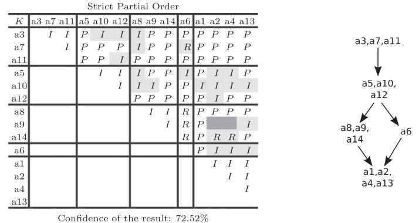
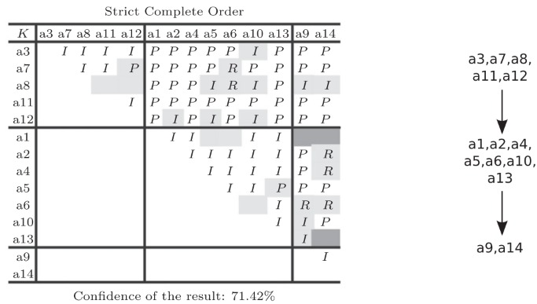
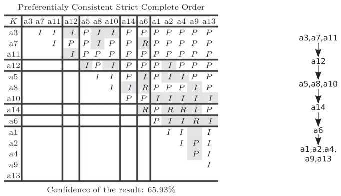

## Auther

Patrick Meyer ${ }^{\text {b,c}}$, Alexandru-Liviu Olteanu ${ }^{\text {a,b,c,*}}$

${ }^{\text {a}}$ CSC/ILIAS, University of Luxembourg, Faculty of Science, Technology and Communications, 6 Rue Coudenhove-Kalergi, L-1359 Luxembourg, Luxembourg

${ }^{\text {b}}$ Institut Télécom, Télécom Bretagne, UMR CNRS 6285 Lab-STICC, Technopôle Brest Iroise, CS 83818, 29238 Brest Cedex 3, France

${ }^{\text {c}}$ Université Européenne de Bretagne, France

# Formalizing and solving the problem of clustering in MCDA

## Article history:

Received 11 May 2012

Accepted 11 January 2013

Available online 23 January 2013

## Keywords:

Clustering

Decision analysis

Metaheuristics

Combinatorial optimization

## ABSTRACT

The topic of clustering has been widely studied in the field of Data Analysis, where it is defined as an unsupervised process of grouping objects together based on notions of similarity. Clustering in the field of Multi-Criteria Decision Aid (MCDA) has seen a few adaptations of methods from Data Analysis, most of them however using concepts native to that field, such as the notions of similarity and distance measures. As in MCDA we model the preferences of a decision maker over a set of decision alternatives, we can find more diverse ways of comparing them than in Data Analysis. As a result, these alternatives may also be arranged into different potential structures. In this paper we wish to formally define the problem of clustering in MCDA using notions that are native to this field alone, and highlight the different structures which we may try to uncover through this process. Following this we propose a method for finding these structures. As in any clustering problem, finding the optimal result in an exact manner is impractical, and so we propose a stochastic heuristic approach, which we validate through tests on a large set of artificially generated benchmarks.

## 1. Introduction

There is no doubt around the fact that we are living in an information age. Data related to almost every aspect of our lives is present and easily accessible in rapidly growing amounts. This data is not only vast in quantity but also very diverse in nature, therefore the need to automatically process and analyse it arises.

The field of Data Analysis emerged from this need and one of its main approaches is to group the existing data meaningfully. The very process of grouping objects together is very natural for us, as the way in which we go about understanding a new concept is to compare it with other known ones through identifying common characteristics [1,10]. Two general approaches to grouping data are classification and clustering.

Classification is a supervised grouping approach that relies on a priori information regarding the groups, which are called classes. In this case we try to fit a certain model over the data and then validate it. Clustering, on the other hand, does not benefit from any knowledge on the structure of the data. The purpose of clustering is to uncover the natural structure of the data using measures of similarity. Hence, objects that are similar should be placed in the same cluster while objects that are not should be placed in different ones.

Clustering has been widely used in many fields, such as artificial intelligence, information technology, image processing, biology, psychology, marketing and others. Due to the large range of applications and different requirements, many clustering algorithms have been developed.

The field of Multi-Criteria Decision Aid, or MCDA, looks closer at the way in which we view objects on which we can express a preference and studies the way in which we reach certain decisions on them. In comparison to Data Analysis, the information available on these objects is richer. The objects become, in this context, decision alternatives from the perspective of one or several persons called decision makers (DMs). Therefore, we are able to distinguish three types of relations between them [26]: indifference, strict preference and incomparability.

Three well known types of decision problems exist in this field [23]: choice, ranking and sorting. The first consists in the construction of a best choice recommendation from a set of decision alternatives (ex: selecting a car to buy). The second type looks to build an order, partial or weak, on a set of decision alternatives (ex: ordering candidates for a job position from best to worst). The last type of problem tries to assign the decision alternatives to a predefined set of classes (ex: placing students into 'good', 'medium' or 'bad' categories).

We may be able to find certain similarities between the problems of classification and clustering from Data Analysis and those of sorting and ranking from MCDA. The problem of clustering, however, has not received a very large interest in the field of

MCDA. Several methods that have been developed use concepts native to the field of Data Analysis, and thus not use the richer information that is available in MCDA, namely the decisionmakers's preferences on the decision alternatives, while others try to construct distance measures to characterise globally how similarly two alternatives compare to the rest.

We would like, in this paper, to formally define the problem of clustering in the field of MCDA and to propose an approach for solving it.

The article is structured in the following way. In Section 2 we present an overview of the more well known methods of clustering, both in the fields of Data Analysis and MCDA. We then define clustering in MCDA based on the relations that can be constructed between the alternatives. We also highlight several different structures that could be uncovered through this process. We continue then by modelling each of these potential structures through several measures, while in Section 5 we propose an algorithm for solving the problem of clustering and uncovering these structures. Finally we validate the approach by testing it on a set of artificially constructed benchmarks, and also compare it to another method.

## 2. Overview of existing methods

### 2.1. Methods in data analysis

Due to the number and diversity of the fields in which clustering can be applied, many approaches have been developed. As clustering in this area is defined using the notion of similarity, proximity measures are generally used. A presentation of such measures has been done by Xu and Wunsch [27].

Two large classes of clustering algorithms are most often distinguished, though they do not cover all existing approaches. These are partitioning and hierarchical clustering. Additionally these two classes are also not disjoint, certain algorithms being found in both.

Partitioning algorithms place each object from the dataset into exactly one cluster, thus forming a partition, while hierarchical approaches build a series of nested partitions. Other classes of clustering algorithms can additionally be identified such as fuzzy clustering, where objects may belong to several clusters at once, density-based clustering, where the notions of neighbourhood and density play an important role, and graph-based approached, where the relations between objects lead to the construction of a graph which is then split in order to build the set of clusters.

The interested reader may follow the work of Jain et al. [16], Everitt et al. [10], and Xu and Wunsch [27], for a more in-depth presentation of these methods. A recent review of graph-based approaches can also be found in [13].

### 2.2. Methods in MCDA

In the field of MCDA, rather few efforts have been made with respect to the problem of clustering.

A taxonomy of existing methods was presented in [7], which groups the clustering approaches in two, based on a property the authors call "criteria-dependency". This property refers to the fact that the clustering approach uses the additional information given by the criteria, which reflects the preferences of the DM, or not. In other words, if a method is not "criteria-dependent", then it is a classical clustering approach that considers the criteria only as attributes. The "criteria-dependent" clustering approaches take into account this additional information and are split further in two: relational and ordered. Relational clustering approaches propose relations between clusters at a local level, without imposing any global property on them, while ordered clustering approaches propose sets of clusters that form a complete or partial order.

Among the classical clustering approaches used in the field of MCDA we mention here the efforts of Bisdorff [3], who actually proceeds to cluster the criteria and not the alternatives. This approach makes use of a similarity based proximity index for comparing the criteria together, and extracts the clusters as kernels in the graph derived from this index, which is cut at a median level.

De Smet and Guzman have extended the classical K-MEANs algorithm in the context of MCDA in [9]. No relations between clusters are proposed in this work, however this issue was addressed later in [8]. In both cases the authors consider that a crisp outranking relation between the alternatives is given.

Figuera et al. also extended the K-MEANS algorithm in a multi-criteria framework [12], and a more recent effort on extending this classical algorithm can be found in [2].

Nemery and De Smet proposed a clustering approach that finds a set of ordered clusters in [20]. A more recent work on this topic was done by Fernandez et al. in [11]. In these approaches, the order between the clusters is complete, however Rocha et al. [21] have worked very recently on a method that is able to find sets of partially ordered clusters.

We mention also additional work around this topic in [25,24].

The work of De Smet and Guzman [9], later extended in [8] is, to our knowledge, the first attempt at clustering in MCDA through the use of the notions native to this field, namely the relations of indifference, preference and incomparability. Furthermore it represents an extension of a well-known and widely used approach from Data Analysis, the K-MEANS approach. For this reason we will present a brief description of it.

We consider the set $X$ of decision alternatives, where for any pair of alternatives one of the following crisp binary relations is given: indifference $(\mathrm{I})$, preference $(\mathrm{P})$, or incomparability $(\mathrm{R})$.

Each alternative $x \in X$ is characterised by how it compares to the rest of the dataset through a profile $Q(x)=\left\{Q_{1}(x), Q_{2}(x), Q_{3}\right.$ $\left.(x), Q_{4}(x)\right\}$. The first set from the profile contains the alternatives that are indifferent to $x$, the second those to which $x$ is preferred, then the set of alternatives that are preferred to $x$, and finally the set of alternatives that are incomparable to $x$.

The algorithm follows the following sequence of steps:

* initialization: an initial partition $C$ is randomly generated;

* generation of centroids: for each cluster $C_{l} \in C$ a centroid is generated through a profile $Q\left(r_{l}\right)$ defined as:

$$
\begin{aligned}
& \forall x \in X: x \in Q_{p}\left(r_{l}\right), \quad \text { where } \\
& \quad p=\underset{q \in 1.4}{\arg \max }\left|\left\{y: x \in Q_{q}(y), \quad \forall y \in C_{l}\right\}\right|
\end{aligned}
$$
  
* generation of a new partition: each alternative $x \in X$ is assigned to the cluster to whose centroid it is closest:

$$
d(x, y)=1-\frac{1}{|X|} \sum_{p \in 1.4}\left|Q_{p}(x) \cap Q_{p}(y)\right|
$$

  
* repeat steps 2 and 3 until the partition $C$ no longer changes, or a certain number of iterations have passed.

In the second step, the centroid of a cluster $C_{l}$ is defined as a fictive alternative $r_{1}$. This centroid is only defined through its profile $Q\left(r_{l}\right)$, which is constructed by placing every alternative in one of the 4 sets of the profile in which it appears with the largest frequency among the alternatives of $C_{l}$.

A relation between any two clusters $C_{l}$ and $C_{m}$ is also proposed through a simple majority rule:

$$
p_{l m}= \begin{cases}\underset{p \in 2.4}{\arg \max } \sum_{x \in C_{l}} \sum_{y \in C_{m}}\left|Q_{p_{l m}}(x) \cap y\right|, & \text { if } l \neq m ; \\ 1, & \text { if } l=m .\end{cases}
$$

As seen above, the algorithm follows in general the K-MEAns algorithm, however, it also suffers from several shortcomings the original algorithm has. We mention here the need to specify beforehand the number of clusters to look for, the sensitivity to the initialization step, which may lead the algorithm to stop in locally optimal solutions, but also in this case some potential limitations of the distance measure used. We would like to address these issues through the approach we propose further in this paper.

## 3. Defining the problem of clustering in MCDA

When clustering in Data Analysis, one is interested in grouping objects that cannot be distinguished from each other, and separating those that can. As we do not have any information regarding the objects, other than their evaluations on a set of attributes, objects that are similar are grouped together, while those that are not similar are placed in different groups.

In the field of MCDA, however, having additional information from a DM, namely a representation of his preferences, we can compare the alternatives in a more meaningful way through which the perspective of the DM on them is reflected. Clustering in this field has not yet been formally defined based on the relations of indifference, strict preference and incomparability, which are native to this field.

Since only one of the relations of indifference, strict preference and incomparability can exist at one time between two alternatives, we can adapt the definition of clustering to the field of MCDA.

**Definition 1.** We define non-relational clustering in MCDA as the process of grouping alternatives that are indifferent and separating those that are not indifferent.

In this case we group the relations between alternatives in two: those that bring them together (indifference), and those that separate them (strict preference and incomparability). In Data Analysis, each of these groups contains only one relation which are complementary (similarity and dissimilarity), however in MCDA the complement of indifference can be better discriminated into a strict preference, in one direction or the other, or an incomparability. Due to the fact that at this point we do not exploit this additional information we call this type of clustering non-relational.

Following the richness of the relations that set the alternatives apart, we are able to find more structured clustering results.

**Definition 2.** We call relational clustering in MCDA the process of grouping alternatives that are indifferent while also separating the groups that are strictly preferred to others or incomparable.

In this case we are not only looking for well-defined groups of alternatives based on the relation of indifference, but also having the relations between these groups supported by one of the relations that are complementary to that of indifference.

In some cases we may discriminate further between the relations of strict preference and incomparability, or the latter may simply not occur. In such cases, two subclasses of relational clustering can be found, based on the structures of the clusters: partial tournament, and complete tournament.

An even more structured result is that where the clusters are ordered from best to worst. In this case the definition of relational clustering is restricted further by extending the perspective on the relations between the groups to a global one.

**Definition 3.** We call ordered clustering in MCDA the process of grouping alternatives that are indifferent while also separating the groups that are strictly preferred to others or incomparable so that an order between them is found.

In this case too we find two subclasses of ordered clustering following the two types of structures that can be found: strict partial order, and strict complete order.

All the potential structures over the clusters of alternatives that were presented above are depicted in Fig. 1.

## 4. Modelling the problem of clustering in MCDA

In this section we present a way of modelling the different objectives of clustering in MCDA. We first present a general way in which alternatives and groups of alternatives can be compared to each other, and then, using this we highlight and model the clustering objectives.

### 4.1. Comparing alternatives and sets of alternatives

Let $X$ denote a set of decision alternatives, which may be evaluated on a set of criteria. Many ways of comparing these alternatives together exist, that take into account preferential information from a DM (weights of criteria, discrimination thresholds, different aggregation operators, etc.). However, from a general point of view, there are three possible outcomes with respect to a DM's preferences: indifference, strict preference and incomparability.

These situations are denoted through the I, P and R binary relations respectively. To these relations we attach a boolean characteristic function $r$ which is defined below:

$$
r(a \circ b)=\left\{\begin{array}{ll}1, & \text { if }(a, b) \in \mathrm{O}, \\ 0, & \text { otherwise. }\end{array}, \quad \forall a, b \in X, \quad \forall \mathrm{O} \in\{\mathrm{I}, \mathrm{P}, \mathrm{R}\}\right.
$$

The indifference relation I is reflexive and symmetric, the incomparability relation $\mathrm{R}$ is irreflexive and symmetric while the strict preference relation $P$ is asymmetric. Together they are mutually exclusive. The underlying method of constructing these relations is not in the scope of this paper and so we will assume from this point on that they are given. For example, a way of constructing them using outranking relations can be found in [26].

Let us define first the following function which counts the number of relations $O \in\{I, P, R\}$ that appear between the alternatives of two sets $A$ and $B$ as:

$$
S_{0}(A, B)=\sum_{a \in A-B, b \in B-A} r(a O b)+\sum_{a, b \in A \cap B, a<b} r(a O b),
$$

The first term of the above equation counts the relations between the disjoint parts of the two sets, while the second counts each relations in the common part only once by taking the alternatives in a lexicographic order ($<$). We scale down $S_{0}(A, B)$ to the interval $[0,1]$ through

$$
\bar{S}_{0}(A, B)=S_{0}(A, B) \cdot\left(\frac{1}{|A-B| \cdot|B-A|}+\frac{2}{|A \cap B| \cdot|| A \cap B \mid-1)}\right).
$$

We extend the preference relations to comparing sets of alternatives through a simple majority rule, and model this using the same characteristic function $r$ :

$$
\begin{aligned}
& r(A O B)= \begin{cases}1, & \text { if } S_{0}(A, B)=\max \left(S_{\mathrm{I}}(A, B), S_{\mathrm{P}}(A, B), S_{\mathrm{P}}(B, A), S_{\mathrm{R}}(A, B)\right), \\
0, & \text { otherwise. }\end{cases} \\
& , \forall A, B \subseteq X, \quad \forall \mathrm{O} \in\{\mathrm{I}, \mathrm{P}, \mathrm{R}\} .
\end{aligned}
$$

The relation that appears with the largest frequency between the alternatives of two sets $A$ and $B$ is said to be the relation between them. In case we have several relations that are predominant, we select at random one of them. The formula above may further be restricted in certain cases to only consider $O \in\{P, R\}$ or even just the $P$ relation.

**Definition 4.** Given two sets of alternatives, $A O B(O \in\{I, P, R\})$ is said to be fully supported if $\bar{S}_{0}(A, B)=1$.

By extension $O \in\{I, P, R\}$ is said to be fully supported if for each pair $(A, B) \in O, A O B$ is fully supported. This means that if the relation $\mathrm{O} \in\{\mathrm{I}, \mathrm{P}, \mathrm{R}\}$ between $A$ and $B$ is fully supported, then $\mathrm{O}$ is the only relation that appears between the alternatives of these two sets.

$\mathrm{I}$ and $\mathrm{R}$ are symmetric, but $\mathrm{P}$ is asymmetric. As a result, if we consider that the relation between two sets $A$ and $B$ is $P$, i.e. $A$ is strictly preferred to $B$, but not fully supported, then finding certain alternatives from $B$ that are strictly preferred to alternatives from $A$ is a contradiction to the fact that $A P B$. To measure this we define the preferential consistency as:

$$
C_{\mathrm{P}}(A, B)=\sum_{a \in A, b \in B}(1-r(b \mathrm{~Pa})).
$$

This measure counts the number of relations between the alternatives of the two sets $A$ and $B$ that are not contradictory to the relation of strict preference of $A$ over $B$. We scale down $C_{\mathrm{P}}(A, B)$, just as $S_{\mathrm{O}}(A, B)$, to the interval $[0,1]$ through $\bar{C}_{\mathrm{P}}(A, B)$.

**Definition 5.** Given two sets of alternatives s.t. the first one is strictly preferred to the second one, $A P B$ is said to be preferentially consistent if $\bar{C}_{\mathrm{P}}(A, B)=1$.

By extension $P$ is said to be preferentially consistent if for each pair $(A, B) \in \mathrm{P}, A \mathrm{~PB}$ is preferentially consistent.


**Fig. 1.** Potential structures of clustering in MCDA.

### 4.2. Clustering objectives

Following the measures defined above, we define an objective for each type of structure for clustering in MCDA and model it using a fitness function.

For each type of structure we look for a partition $K=\left\{K_{l}, K_{m}\right.$, $\left.K_{n}, \ldots\right\}$ of the set of alternatives $X$.

We start with the least restrictive clustering objective, that of non-relational clustering. As the aim is to group alternatives that are indifferent and separate those that are not, an ideal result can be defined by having the I relation as a fully supported identity relation on the set of clusters $K$. This means that we will find only relations of indifference inside each cluster, and none between different ones.

We model the fitness function of non-relational clustering, that needs to be maximized, as:

$$
f_{n r}(K):=\sum_{l} S_{\mathrm{I}}\left(K_{l}, K_{l}\right)+\sum_{l<m}\left(S_{\mathrm{P}}\left(K_{l}, K_{m}\right)+S_{\mathrm{P}}\left(K_{m}, K_{l}\right)+S_{\mathrm{R}}\left(K_{l}, K_{m}\right)\right).
$$

The first term of $f_{n r}$ looks at how well supported the indifference relation is inside each cluster, while the second term looks at how well supported the other relations are between different clusters. Therefore, if $f_{n r}(K)=\frac{|X| \cdot|| X \mid-1)}{2}$ then $K$ is an ideal set of clusters with respect to the objective of non-relational clustering.

In the case of relational clustering, we additionally try to place a relation of strict preference or incomparability between any pair of clusters. As we will only place these relations between clusters, we can also deduce that the $\mathrm{R}$ relation between clusters can be modelled by the absence of a $\mathrm{P}$ relation in both directions between the clusters. Therefore, from this point on, it is sufficient to look for properties of $\mathrm{P}$ on $K$.

An ideal relational clustering result, which forms a partial tournament on the set of clusters $K$, can be defined through I being a fully supported identity relation on $K$, and additionally $P$ being a fully supported relation on $K$.

We model this objective through:

$$
f_{p t}(K):=\sum_{l} S_{\mathrm{I}}\left(K_{l}, K_{l}\right)+\sum_{l<m} \max \left(S_{\mathrm{P}}\left(K_{l}, K_{m}\right), S_{\mathrm{P}}\left(K_{m}, K_{l}\right), S_{\mathrm{R}}\left(K_{l}, K_{m}\right)\right).
$$

Restricting the relation between clusters to only P, yields a complete tournament structure on the set of clusters. An ideal result in this case can be formulated by having the I as a fully supported identity relation on $K$, and the $P$ as a fully supported complete relation on $K$. This objective is modelled using:

$$
f_{c t}(K):=\sum_{l} S_{\mathrm{I}}\left(K_{l}, K_{l}\right)+\sum_{l<m} \max \left(S_{\mathrm{P}}\left(K_{l}, K_{m}\right), S_{\mathrm{P}}\left(K_{m}, K_{l}\right)\right).
$$

In the case of ordered clustering, the $\mathrm{P}$ relation also needs to be transitive on K. According to Vincke [26], and considering the characteristic function $r$ from Eq. (6) for the relations between sets of alternatives, $\mathrm{P}$ is transitive if the following property is fulfilled for any three sets $A, B, C \in K$ :

$$
r(A P C) \geqslant r(A P B)+r(B P C)-1.
$$

We define the boolean function $T$ which gives a value of 1 if the above property if verified by any three sets $A, B, C \in K$ and 0 otherwise. We extend this to the entire set of clusters $K$ through:

$$
T(K):=\min _{A \neq B \neq C \in K} T(A, B, C).
$$

If the property from Eq. (11) is fulfilled by any three sets from $K$, then $T(K)$ will be 1 , otherwise it will be 0.

The fitness functions for the two subclasses of ordered clustering, which look for a strict partial order or a strict complete order, can then be defined as:

$$
f_{\text {spo }}(K):=T(K) \cdot f_{p t}(K);
$$

$$
f_{\text {sco }}(K):=T(K) \cdot f_{c t}(K).
$$

Yet another property of the relation $P$ between clusters is that of preferential consistency, as defined in Definition 5. We can model this property on the set of clusters $K$ through:

$$
C_{\mathrm{P}}(K):=\min _{l \neq m} \max \left(\left(1-r\left(K_{l} \mathrm{P} K_{m}\right)\right), C_{\mathrm{P}}\left(K_{l}, K_{m}\right)\right).
$$

In this equation we consider the property of preferential consistency, given by $C_{\mathrm{P}}\left(K_{l}, K_{m}\right)$, only for the pairs of clusters which are in
a $\mathrm{P}$ relation, which is done through the max operator. The min operator is used to determine if this property is not met for any of the considered pairs.

All the fitness functions for relational and ordered clustering may be extended to look also for a preferentially consistent result by multiplying the corresponding fitness functions with the measure from the equation above. We denote them with $f_{p c p t}, f_{p c c t}$, $f_{\text {pcspo }}$ and $f_{\text {pcsco }}$.

## 5. Solving MCDA clustering problems

In order to find a solution to the problem of non-relational clustering in an exact way we would need to enumerate all the partitions of the set of alternatives and select the one that maximizes the function $f_{n r}$. The complexity for such an approach is clearly exponential, as the number of partitions of a set is given by the Bell number. Even for only 10 alternatives, the total number of partitions is around $10^{5}$. It is true that regularly problems in MCDA are not very large, however even for small problems enumerating all the partitions of the set of alternatives is impractical. Furthermore, solving the problem of clustering by looking for the other, more complex, structures is considerably more difficult.

Due to these considerations we propose an extension of our previous work on clustering in Data Mining [4] to clustering in MCDA. We divide our current approach in two parts: firstly we try to find a partition of the alternatives by considering only at the relations of indifference between them; secondly we refine this result by moving one alternative at a time from one cluster to another in order to get closer to the optimal clustering result.

### 5.1. Grouping on indifferences

This first step is equivalent to the method described in [4] where we replace the similarity measure with the indifference relation. The aim here is to split the alternatives into groups where inside each one of them alternatives are predominantly indifferent to each other, while between these groups there are little or no indifference relations. By doing this we are reducing the complexity of the original problem to that of finding high density regions in the graph constructed on the indifference relations. We denote this graph with $G(X, I)$.

In order to find these high density regions we will look for cluster cores, which are defined as sets of alternatives that are all indifferent to each other and compare to the rest of the alternatives in a consistent way. This means that we would like these cores to either contain alternatives that are mostly indifferent to the same alternatives in the dataset, which will later be added to form a cluster, or that are mostly not indifferent to the same alternatives in the dataset, which will be left out to be placed in different clusters. Also from this definition derives the fact that all cores are cliques in $G(X, I)$.

We ideally want a core $Y$ to have either only indifference relations or none at all to any alternative outside it. We define the fitness of a core as:

$$
f_{C}(Y):=\sum_{x \in X}\left|S_{\mathrm{I}}(x, Y)-S_{\mathrm{P}}(x, Y)-S_{\mathrm{P}}(Y, x)-S_{\mathrm{R}}(x, Y)\right|.
$$

This measure factors in for each alternative $x$ outside of $Y$ the margin by which the indifference relations from $x$ to $Y$ outnumber the other types of relations, or vice versa. A large margin would mean that $Y$ is either mostly indifferent or mostly not indifferent to $x$, which is the property we are looking for in a core.

Based on the definition of a core, we will be looking for all cliques that are the local maxima of $f_{C}$ in $G(X, I)$, in order to determine directly the number of dense regions in this graph, and thus the number of clusters. We denote this number with $k$.

This can be done in an exact way using the algorithm of Bron and Kerbosch [6] which, with the improvement from Koch [18], is an efficient way of enumerating all maximal cliques in a graph. This procedure is still exponential in complexity due to the fact that in a graph there may be an exponential number of maximal cliques [19]. However, problems in MCDA normally are not very large and this exact approach of finding the cores is well suited $(|X|<100)$. In the case where the size of the problem becomes larger we could apply a meta-heuristic approach as the one proposed in our previous work [4]. We will consider at this point that the problem is small enough to be handled by the exact approach. We denote the set of cores with $C$.

Each cluster is then built by first adding the elements of the corresponding core to it, and second by adding the alternatives that were left out to the cluster containing the core to which they belong best:

$$
\begin{align*}
\text{(1)} ~~ & ~~ K_{l}=C_{l}, \quad \forall l \in 1 \dots k, \\
\text{(2)} ~~ & ~~ K_{l}=K_{l} \cup\{x\}: l=\mathrm{argmax}_{m}\left(S_{\mathrm{I}}\left(x, C_{m}\right)\right), \quad \forall x \in X-\bigcup_{n} C_{n}.
\end{align*}
$$

This greedy heuristic is sufficient at this point as the finer changes to the partition will be tackled at the next step. This will also be shown through empirical results in the next section.

### 5.2. Refining on strict preferences and incomparabilities

So far we have built a partition $K$ which, through the heuristic method used before, should be close to the optimal value for $f_{n r}$.

In the case where we are not interested in the relations between each pair of clusters we may further refine this result in order to find the optimal value of $f_{n r}$. We do this by first defining a heuristic for moving an alternative $x$ from cluster $K_{l}$ to cluster $K_{m}$ as:

$$
\begin{aligned}
h_{n r}\left(x, K_{l}, K_{m}\right):= & S_{\mathrm{I}}\left(x, K_{m}\right)+\left|X-K_{m}\right|-S_{\mathrm{I}}\left(x, X-K_{m}\right) \\
& -S_{\mathrm{I}}\left(x, K_{l}\right)-\left|X-K_{l}\right|+S_{\mathrm{I}}\left(x, X-K_{l}\right)
\end{aligned}
$$

The first line measures how well $x$ would belong to the second cluster $K_{m}$ in relation to the alternatives in $X$. This means that $x$ should have mainly indifference relations towards $K_{m}$ and very few towards the alternatives outside. The second line measures in exactly the same way how well $x$ fits as part of the first cluster $K_{l}$. The difference between these terms will be positive if moving $x$ from $K_{l}$ to $K_{m}$ brings an improvement to $f_{n r}$, and negative otherwise.

We also have the possibility of taking $x$ out from the cluster containing it and creating a new singleton cluster by making in the equation above $K_{m}=\{x\}$.

In the case where we are interested in a relational clustering result we may adapt this heuristic according to the considered clustering objective.

We define the following heuristic for partial tournament clustering:

$$
\begin{aligned}
h_{p t}\left(x, K_{l}, K_{m}\right): & \\
= & S_{\mathrm{I}}\left(x, K_{m}\right)+\sum_{n \neq m} \max \left(r\left(K_{m} \mathrm{P} K_{n}\right)\right. \\
& \cdot S_{\mathrm{P}}\left(x, K_{n}\right), r\left(K_{n} \mathrm{P} K_{m}\right) \cdot S_{\mathrm{P}}\left(K_{n}, x\right), r\left(K_{m} \mathrm{R} K_{n}\right) \\
& \left.\cdot S_{\mathrm{R}}\left(x, K_{n}\right)\right)-S_{\mathrm{I}}\left(x, K_{l}\right)-\sum_{n \neq l} \max \left(r\left(K_{l} \mathrm{P} K_{n}\right)\right. \\
& \cdot S_{\mathrm{P}}\left(x, K_{n}\right), r\left(K_{n} \mathrm{P} K_{l}\right) \cdot S_{\mathrm{P}}\left(K_{n}, x\right), r\left(K_{l} \mathrm{R} K_{n}\right) \\
& \left.\cdot S_{\mathrm{R}}\left(x, K_{n}\right)\right) .
\end{aligned}
$$

Again, we measure how well $x$ fits in $K_{l}$, resp. $K_{m}$, but setting this apart from the heuristic defined before is the fact that we also look to have only one type of relation, except I, between any two clusters. This relation is given in Eq. (6), where we restrict $O$ to $\{P, R\}$.

For complete tournament clustering we restrict the relation between two clusters further to only the P relation and define the following heuristic:

$$
\begin{aligned}
h_{c t}\left(x, K_{l}, K_{m}\right): & \\
\qquad & S_{\mathrm{I}}\left(x, K_{m}\right)+\sum_{n \neq m} \max \left(r\left(K_{m} \mathrm{P} K_{n}\right)\right. \\
& \left.\cdot S_{\mathrm{P}}\left(x, K_{n}\right), r\left(K_{n} \mathrm{P} K_{m}\right) \cdot S_{\mathrm{P}}\left(K_{n}, x\right)\right)-S_{\mathrm{I}}\left(x, K_{l}\right) \\
& -\sum_{n \neq l} \max \left(r\left(K_{l} \mathrm{P} K_{n}\right) \cdot S_{\mathrm{P}}\left(x, K_{n}\right), r\left(K_{n} \mathrm{P} K_{l}\right)\right. \\
& \left.\cdot S_{\mathrm{P}}\left(K_{n}, x\right)\right) .
\end{aligned}
$$

Due to the fact that the effect of moving one alternative from one cluster to another on the property of transitivity of the P relation between clusters is rather computationally expensive we propose to use the same heuristics from relational clustering. As a result, a move that would transform an ordered clustering result into one that is not ordered may not have a low heuristic value, but this move will be deemed as a bad move when evaluating the new clustering result.

For all the relational and ordered clustering objectives we can also try to impose the property of preferential consistency. For this property we define the heuristic below:

$$
\begin{aligned}
h_{p c}\left(x, K_{l}, K_{m}\right):= & r\left(K_{l} \mathrm{P} K_{m}\right) \cdot\left(S_{\mathrm{P}}\left(x, K_{l}\right)-S_{\mathrm{P}}\left(K_{m}, x\right)\right) \\
& +r\left(K_{m} \mathrm{P} K_{l}\right) \cdot\left(S_{\mathrm{P}}\left(x, K_{m}\right)-S_{\mathrm{P}}\left(K_{l}, x\right)\right) .
\end{aligned}
$$

For both the cases where the first cluster is strictly preferred to the second or vice versa, we measure if moving $x$ from the first cluster to the second leads to a decrease of the support of the relations that contradict the relation between the clusters. This heuristic can be combined with all the other heuristics using two scaling factors $\alpha$ and $\beta$, where $\alpha+\beta=1$. The first factor is multiplied with this heuristic while the other with the heuristic of the selected clustering objective. In the experiments that follow in Section 6 we have given greater importance to the property of preferential consistency $(\alpha>\beta)$, however the choice of $\alpha$ and $\beta$ and their influence on the solutions, should be investigated at a later point.

Using the operations of moving one alternative from one cluster to another in $K$, characterized by the heuristics above, we can employ any single solution-based meta-heuristic, such as simulated annealing [17] or taboo search [14,15] in order to find the optimal clustering result. In our implementation we have used simulated annealing for this purpose, whose basic structure is presented below.

**Algorithm 1.** Simulated annealing meta-heuristic

```
Require: K
Ensure: best_K
    best_f ← Fitness(K)
    best_K ← K
    N ← Neighbours(K)
    T ← InitializeTemperature(N)
    while T > 0 do
        K ← SelectNeighbour(N, T)
        f ← Fitness(K)
        if f > best_f then
            best_f ← f
            best_K ← K
        N ← Neighbours(K)
        T ← UpdateTemperature(N)
```

<!--  -->

The algorithm starts with the initial partition $K$, which it sets as the best solution so far. Then a first set of neighbours is generated, which correspond to all possible moves of each alternative to another cluster or to a new one. These moves are evaluated using one of the heuristics defined in this paper, depending on the selected clustering objective. An initial temperature is generated. Then we have the main loop, where a neighbour is selected as the new solution, based on mechanisms such as roulette wheel or stochastic universal sampling, for example. Then the solution is evaluated and compared to the best one so far, a new set of neighbours is generated and the temperature is updated. This temperature is used to influence the selection process. At the beginning the temperature is high, which allows non-improving neighbours to be selected. As the temperature cools down over the iterations of the main loop, non-improving neighbours are less likely to be selected. This is translated in an affinity to explore the solution space at early stages followed by a convergence to a final solution towards the end.

### 5.3. Clustering Thierry's potential choices

In what follows, we will illustrate some results of our method on a very well known dataset in MCDA literature, Thierry's car selection problem [5]. It was originally formulated from a Belgian engineer student's report on how he chose a car to buy.

The problem consists in 14 cars that are defined on five criteria, based on what this student thought would be important in making his decision. The criteria are divided into three groups, a cost criterion, two performance and two safety criteria.

We have used an ELECTRE III valued outranking relation [22] in order to compare the alternatives together. As we are using this example only to illustrate several potential clustering structures, we have given equal weights to all criteria and have placed the indifference and preference thresholds at 10 % and 20 % of the value ranges of each criterion. We have also placed veto thresholds for the Cost and Acceleration criteria at 60 % of the value ranges.

We have used a median level for cutting the outranking relation in order to extract the indifference, strict preference and incomparability relations as presented in [26].

In Fig. 2 we show the results for strict partial ordered, strict complete ordered and preferentially consistent strict complete ordered clustering.

On the left side we have tables detailing the relations between the alternatives. The alternatives were grouped here by the clustering results found using the presented method. On the right side of the figure we have the representations of the clusters and the relations between them. In order to simplify the representations, the clusters that are above are considered to be preferred to those below. Clusters that are on the same level are considered to be incomparable. Below each table we present also the confidence of the clustering result which corresponds to either $f_{s p o}$ or $f_{s c o}$, depending on the clustering objective, however, both measures show how much the relations between the alternatives support the proposed clustering results.

Firstly we have the result for strict partial ordered clustering. We notice that we have five clusters that form a partial order. Clusters $\{a 8, a 9, a 14\}$ and $\{a 6\}$ are incomparable to each other but compare with the other clusters in the same way, therefore they are on the same level. In the table to the left we have highlighted the relations that are in discordance with the clustering result. The darker highlights also show the relations that are conflicting with the preferential consistency property of the $\mathrm{P}$ relation, but which we are not trying to enforce for this particular clustering objective.

The second clustering result proposes a strict complete order between three clusters. The confidence with which we propose this result is lower than before, due to the fact that we force the relations between clusters to $\mathrm{P}$.





**Fig. 2.** Clustering results on Thierry's choice problem.

The third result, in addition to the constraints of the second, also enforces that the $\mathrm{P}$ relation is preferentially consistent. This is the most strict clustering objective, and as a result, the overall confidence of proposing this result has decreased when compared to the other results.

The choice on which result to select depends on the operational objectives of the DM. The values of confidence when proposing each result do not imply that one result is better than the other, only the degree with which the result is reflected by the existing preference relations between the alternatives.

## 6. Empirical validation

In order to test our method empirically we have generated a series of datasets.

### 6.1. Generating artificial datasets

Due to the fact that we would like to show how close the results from our method come to the optimal solutions, the datasets are rather small, containing only 10 alternatives. As our method is

**Table 1** Average results (standard deviation in brackets).

| Algorithm | Obj. | Fitness (% to optimum) |  | Transitivity (%) | Pref. consist. (%) | Transitivity and Pref. consist. (%) |
| --- | --- | --- | --- | --- | --- | --- |
| Step 1 of this algorithm | NR | 96.00 |  | 58.60 | 32.39 | 11.25 |
| This algorithm | NR | 99.94 | (0.08) | 44.12 | 26.62 | 17.86 |
| This algorithm | PT | 99.82 | (0.33) | 39.16 | 61.37 | 25.26 |
| This algorithm | CT | 99.80 | (0.29) | 46.85 | 47.50 | 26.74 |
| This algorithm | SPO | 76.00 | (17.38) | 77.09 | 57.04 | 44.00 |
| This algorithm | SCO | 98.51 | (2.10) | 99.80 | 50.01 | 49.95 |
| This algorithm | PCPT | 91.11 | (3.23) | 24.29 | 100.00 | 24.29 |
| This algorithm | PCCT | 84.85 | (4.79) | 44.98 | 100.00 | 44.98 |
| This algorithm | PCSPO | 48.02 | (28.44) | 56.28 | 100.00 | 56.28 |
| This algorithm | PCSPO | 65.30 | (12.29) | 80.69 | 99.99 | 80.69 |
| Algorithm in [8] | PT | 85.13 | (8.17) | 44.15 | 39.82 | 21.61 |

not depending on the underlying aggregation method, we skip the step of generating the preference relation from the evaluations of the alternatives and generate directly the preference relations between them.

We create each dataset by taking into account the following factors, which lead to the construction of 800 benchmarks:

* number of clusters (from 2 to 10 );

* cluster sizes (different combination of small, medium and large);

* percentage of indifference relations towards alternatives in the same cluster (60 % or 80 %);

* percentage of indifference relations towards alternatives in different clusters (5 % or 15 %);

* relation between clusters for each clustering objective (a majority of one type of relation between any two clusters);

* perturbations on the created structure (5 % or 15 %).

### 6.2. Operational results

For all of the 800 benchmarks we have first used the exact approach of enumerating all partitions in order to find the optimal results with respect to each clustering objective.

After finding these results we have deployed our algorithm and run it for 100 times on each dataset and for each clustering objective defined here. Each run was stopped after 1 second. We have also implemented the algorithm from [8] and run it on these datasets. For this second algorithm, as it requires the number of clusters to be given, we have run it with all possible values of this parameter and selected the setting which gave the best results with respect to the clustering objective of finding a partial tournament. The choice of the clustering objective was made due to the fact that this algorithm only proposes relations between pairs of clusters and does not try to find an order on them.

In Table 1 we present the results from these algorithms. In the first column we outline the algorithm used and the clustering objective it searches for. The second column gives the fitness of the result compared to the fitness of the optimal result found using the exact method. The following columns give the percentage of the results for which the properties of transitivity, preferential consistency or both at the same time are met.

Looking at the results in Table 1 we notice, that the algorithm performs rather consistent with respect to the difficulty of the clustering objective. For the simpler objectives we find results very close to the optimal value for that particular objective. The first line highlights the good performance of the first step of our approach, which is able to give a "good enough" partition to refine at the second step.

We also notice that looking for a partial order seems to be more difficult than looking for a complete one, which may be due to the fact that in the second case the relations of incomparability play no role when proposing a relation between two clusters. We may also see, for the preferentially consistent clustering objectives, the effect of placing a larger weight on the preferential consistency heuristic, which causes us to find very consistently clustering results with this property.

Looking at the results of the K-MEANS extension from [8], we confirm that this approach looks for a relational clustering result, as the properties of transitivity on the relations between clusters, and also that of preferential consistency are not often met. Still, this algorithm finds good results based on the objective of building a partial tournament between clusters of indifferent alternatives.

## 7. Conclusion

In this paper we have formally defined the problem of clustering in MCDA and proposed several objectives based on the intuitive expectations one would have from grouping a set of alternatives in such a context. We have also presented an extension of our previous work, which we have adapted in order to look for the optimal result for each of the proposed objectives. Using an empirical approach, we have tested our method on a large set of benchmarks with a wide variety in their structure, thus highlighting the efficiency of the proposed method. We acknowledge also the good results of a related algorithm with respect to the performance measures we have defined in this paper.

We would also like to mention some possible applications for this problem. In addition to exploratory analysis, for which clustering is generally used, we could also imagine using the variations of strict ordered clustering on problems related to the sorting problematic. However, in this case, we would apply this if we are uncertain of the existing structure on the set of alternatives and thus try to uncover it. Using the preferential consistency property we could also remove possible contradictions between the relation between alternatives in different clusters and the relation between these clusters.

The work we have proposed in this paper can be extended further by applying the meta-heuristic from our previous work in the case where the datasets that are exploited contain more than 100 alternatives. In this case the second step of our approach should be further improved in terms of time complexity, since the number of operations of moving one alternative from one cluster to another is potentially quadratic. We will address these issues in the future.

## References

[1] M.R. Anderberg, Cluster Analysis for Applications, Academic Press, 1973.

[2] R. Baroudi, N.B. Safia, Towards multicriteria analysis: a new clustering approach, in: Proceedings of the 2010 International Conference on Machine and Web Intelligence, 2010, pp. 126-131.

[3] R. Bisdorff, Electre-like clustering from a pairwise fuzzy proximity index, European Journal of Operational Research 138 (2) (2002) 320-331.

[4] R. Bisdorff, P. Meyer, A.-L. Olteanu, A clustering approach using weighted similarity majority margins, in: J. Tang, I. King, L. Chen, J. Wang (Eds.), Proceedings of the 7th International Conference on Advanced Data Mining and Applications, Lecture Notes in Computer Science, vol. 7120, Springer, 2011, pp. 15-28.

[5] D. Bouyssou, T. Marchant, M. Pirlot, P. Perny, A. Tsoukiàs, P. Vincke, Evaluation and Decision Models: A Critical Perspective, Kluwer Academic, Dordrecht, 2000.

[6] C. Bron, J. Kerbosch, Algorithm 457: finding all cliques of an undirected graph, Communications of the ACM 16 (9) (1973) 575-577.

[7] O. Cailloux, C. Lamboray, P. Nemery, A taxonomy of clustering procedures, in: Proceedings of the 66th Meeting of the European Working Group on MCDA, 2007.

[8] Y. De Smet, S. Eppe, Relational multicriteria clustering: the case of binary outranking matrices, in: M. Ehrgott (Ed.), Proceedings of the 5th International Conference on Evolutionary Multi-Criterion Optimization, Lecture Notes in Computer Science, vol. 5467, Springer, Berlin, 2009, pp. 380-392.

[9] Y. De Smet, L. Guzman, Towards multicriteria clustering: an extension of the $k$ means algorithm, European Journal of Operational Research 158 (2) (2004) 390-398.

[10] B.S. Everitt, S. Landau, M. Leese, Cluster Analysis, Hodder Arnold, 2001.

[11] E. Fernandez, J. Navarro, S. Bernal, Handling multicriteria preferences in cluster analysis, European Journal of Operational Research 202 (3) (2010) 819-827.

[12] J.R. Figueira, Y. De Smet, J.-P. Brans, MCDA Methods for Sorting and Clustering Problems: PROMETHEE TRI and PROMETHEE CLUSTER, Technical Report TR/ SMG/2004-002, SMG, Université Libre de Bruxelles, 2004.

[13] S. Fortunato, Community detection in graphs, Physics Reports 486 (3-5) (2010) 75-174.
[14] F. Glover, Tabu search - Part I, INFORMS Journal on Computing 1 (3) (1989) 190-206.

[15] F. Glover, Tabu search - Part II, INFORMS Journal on Computing 2 (1) (1990) 432.

[16] A. Jain, M. Murty, P. Flynn, Data clustering: a review, ACM Computing Survey 31 (3) (1999) 264-323.

[17] S. Kirkpatrick, C.D. Gelatt, M.P. Vecchi, Optimization by simulated annealing, Science 220 (4598) (1983) 671-680.

[18] I. Koch, Enumerating all connected maximal common subgraphs in two graphs, Theoretical Computer Science 250 (1-2) (2001) 1-30.

[19] J. Moon, L. Moser, On cliques in graphs, Israel Journal of Mathematics 3 (1) (1965) 23-28.

[20] P. Nemery, Y. De Smet, Multicriteria ordered clustering, Technical Report TR/ SMG/2005-003, Université Libre de Bruxelles/SMG, 2005.

[21] C. Rocha, L.C. Dias, I. Dimas, Multicriteria classification with unknown categories: a clustering-sorting approach and an application to conflict management, Journal of Multi-Criteria Decision Analysis (2012).

[22] B. Roy, ELECTRE III: Un algorithme de classement fondé sur une représentation floue des préférences en présence de critères multiples, Cahiers du CERO 20 (1) (1978) 3-24.

[23] B. Roy, D. Bouyssou, Aide Multicritère à la Décision: Méthodes et Cas, Economica, Paris, 1993.

[24] A. Valls, M. Batet, E.M. López, Using expert's rules as background knowledge in the ClusDM methodology, European Journal of Operational Research 195 (3) (2009) 864-875.

[25] A. Valls, V. Torra, Using classification as an aggregation tool in MCDM, Fuzzy Sets Systems 115 (1) (2000) 159-168.

[26] P. Vincke, Multicriteria Decision-Aid, J. Wiley, New York, 1992.

[27] R. Xu, D. Wunsch, Survey of clustering algorithms, IEEE Transactions on Neural Networks 16 (3) (2005) 645-678.
