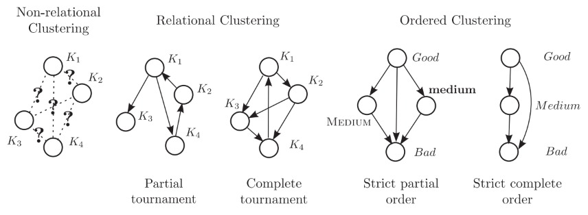
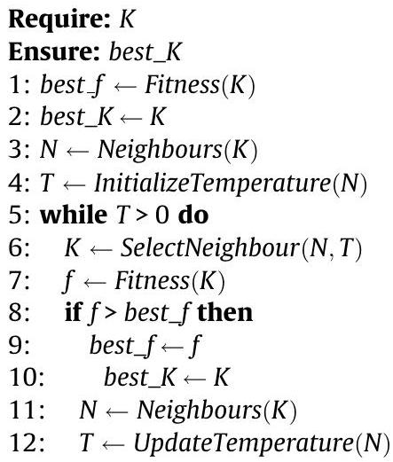

## 著者

Patrick Meyer ${ }^{\text {b,c}}$, Alexandru-Liviu Olteanu ${ }^{\text {a,b,c,*}}$

${ }^{\text {a}}$ CSC/ILIAS, University of Luxembourg, Faculty of Science, Technology and Communications, 6 Rue Coudenhove-Kalergi, L-1359 Luxembourg, Luxembourg

${ }^{\text {b}}$ Institut Télécom, Télécom Bretagne, UMR CNRS 6285 Lab-STICC, Technopôle Brest Iroise, CS 83818, 29238 Brest Cedex 3, France

${ }^{\text {c}}$ Université Européenne de Bretagne, France

# 多基準意思決定支援におけるクラスタリングの問題の定式化と解決

## 論文の経緯:

2012年5月11日 受領

2013年1月11日 採用

2013年1月23日 オンラインで利用可能

## キーワード:

クラスタリング

決定分析

メタヒューリスティクス

組み合わせ最適化

## 概要

クラスタリングのトピックは、データ分析の領域で広く研究されている。データ分析では、類似性の概念に基づいてオブジェクトをグループ化する無指導プロセスとして定義されている。多基準意思決定支援（MCDA）の領域では、データ分析の手法をいくつか適応したものもあるが、そのほとんどは類似性や距離尺度など、そのフィールド固有の概念を使用している。MCDAでは、意思決定者の好みを一連の決定代替案にモデル化するため、データ分析よりも多様な比較方法が存在する可能性がある。その結果、これらの代替案は異なる潜在的な構造にも配置される可能性がある。本稿では、MCDAにおけるクラスタリングの問題を、このフィールド固有の概念を用いて形式的に定義し、このプロセスを通じて明らかにしようとする異なる構造を強調する。その後、これらの構造を見つけるための手法を提案する。クラスタリングの問題はどの場合でも、正確な方法で最適な結果を見つけることは実用的ではないため、我々は大規模な人工的に生成されたベンチマークのテストを通じて検証された、確率的なヒューリスティックアプローチを提案する。

## 1. 序論

情報化時代に生きていることは間違いありません。私たちの生活のほとんどすべての側面に関連するデータが、急速に増大する量で存在し、容易にアクセスできるようになっています。このデータは量だけでなく、性質も非常に多様です。そのため、自動的に処理し、分析する必要が生じます。

このニーズから発展したのがデータ分析の分野であり、その主なアプローチの1つは、既存のデータを意味のあるグループにまとめることです。オブジェクトをグループ化するプロセス自体は私たちにとって非常に自然です。新しい概念を理解する方法として、共通の特徴を特定することによって既知の概念と比較します[1,10]。データのグループ化には分類とクラスタリングという2つの一般的なアプローチがあります。

分類は、クラスと呼ばれるグループに関する事前情報に依存する監督的なグループ化アプローチです。この場合、データに特定のモデルを適合させ、それを検証しようとします。一方、クラスタリングはデータの構造についてのいかなる知識も利用しません。クラスタリングの目的は、類似性の尺度を使用してデータの自然な構造を明らかにすることです。したがって、類似しているオブジェクトは同じクラスタに配置され、そうでないものは異なるクラスタに配置されるべきです。

クラスタリングは人工知能、情報技術、画像処理、生物学、心理学、マーケティングなど、さまざまな分野で広く使用されています。さまざまな要件があり、さまざまなクラスタリングアルゴリズムが開発されてきました。

多基準意思決定支援（MCDA）の分野では、好みを表明できるオブジェクトを見る方法や、それらに対してどのように意思決定を下すかをより詳しく検討しています。データ分析と比較して、これらのオブジェクトに関する利用可能な情報は豊かです。この文脈では、これらのオブジェクトは意思決定者（DM）と呼ばれる1人または複数の人物の観点からの決定代替となります。したがって、それらの間には次の3つの関係を区別できます[26]：無関心、厳密な優先順位、非比較可能性。

この分野には、3つのよく知られたタイプの意思決定問題が存在します[23]：選択、ランキング、ソートです。最初のタイプは、決定代替の集合からの最適な選択推奨の構築（例：車の選択）を含みます。2番目のタイプは、決定代替の集合に対して順序（部分的または弱い）を構築しようとします（例：求人ポジションの候補者を最良から最悪への順に並べる）。最後のタイプの問題は、決定代替を事前に定義されたクラスのセットに割り当てることを試みます（例：学生を「優秀」「中程度」「低い」のカテゴリに配置する）。

データ分析の分類やクラスタリングの問題と、MCDAのソートやランキングの問題との間には、一部の類似点を見つけることができるかもしれません。しかし、クラスタリングの問題は、データ分析のフィールドでは非常に大きな関心を持っていません。

MCDA. データ分析の領域において利用されるいくつかの手法は、MCDAで利用可能なより豊富な情報を活用しておらず、意思決定者の意思決定の代替案に対する好みを反映することができません。一方、他の手法は、比較対象として他の代替案との類似性を特徴づける距離尺度を構築しようとします。

本論文では、MCDAの領域におけるクラスタリングの問題を形式的に定義し、それを解決するためのアプローチを提案します。

本論文は以下のような構成となっています。セクション2では、データ分析とMCDAの両方の領域でよく知られているクラスタリング手法の概要を示します。その後、代替案間の関係に基づいてMCDAにおけるクラスタリングを定義します。また、このプロセスを通じて明らかにされるいくつかの異なる構造も強調します。次に、これらの潜在的な構造をいくつかの尺度を用いてモデリングし、セクション5ではクラスタリングの問題を解決し、これらの構造を明らかにするためのアルゴリズムを提案します。最後に、人工的に構築されたベンチマークセットでそのアプローチを検証し、別の手法と比較します。

## 2. 既存手法の概要

### 2.1. データ分析の手法

クラスタリングは適用可能な領域が多様であるため、多くのアプローチが開発されています。この領域では、クラスタリングが類似性の概念を用いて定義されるため、類似性尺度が一般的に使用されます。このような尺度のプレゼンテーションは、XuとWunschによって行われました[27]。

クラスタリングアルゴリズムは、最も一般的にはパーティショニングと階層的クラスタリングの2つの大きなクラスに分けられますが、これらだけがすべての既存手法を網羅しているわけではありません。パーティショニングアルゴリズムでは、データセットの各オブジェクトをちょうど1つのクラスタに配置してパーティションを形成します。一方、階層的アプローチでは、ネストされた一連のパーティションが構築されます。他にも、オブジェクトが同時に複数のクラスタに所属するぼんやりとしたクラスタリング、近隣性と密度の概念が重要な役割を果たす密度ベースのクラスタリング、オブジェクト間の関係がグラフの構築につながり、その後、クラスタの集合を構築するために分割されるグラフベースのアプローチなど、その他のクラスのクラスタリングアルゴリズムが特定されることもあります。

詳細なプレゼンテーションについては、Jainら[16]、Everittら[10]、XuとWunsch[27]の研究を参照してください。最近のグラフベースアプローチのレビューは[13]で見つけることができます。

### 2.2. MCDAの手法

MCDAの領域では、クラスタリングの問題に関してはあまり多くの努力がされていません。

既存手法の分類法が[7]で紹介され、著者らは「基準依存性」という特性に基づいてクラスタリング手法を2つに分類しています。この特性は、クラスタリング手法が基準によって与えられる追加情報を使用するかどうかを指します。言い換えれば、「基準に依存しない」方法では、基準は属性としてのみ考慮される一般的なクラスタリング手法です。一方、「基準に依存する」クラスタリング手法は、この追加情報を考慮し、2つにさらに分類されます。関係性を提案する関係性クラスタリング手法は、クラスタ間の関係性を局所的レベルで提案しますが、それらに対して特定のグローバル特性を要求しません。一方、順序付けられたクラスタリング手法は、完全または部分的な順序を形成するクラスタの集合を提案します。

MCDAの領域で使用されるクラスタリング手法の中でも、Bisdorff[3]の取り組み、彼らは代替案ではなく基準をクラスタリングすることを行っています。この手法では、基準を比較するための類似性ベースの近接指標を使用し、この指標から得られるグラフ内のカーネルとしてクラスタを抽出します。

De SmetとGuzmanは、クラシカルなK-MEANsアルゴリズムをMCDAの文脈で拡張しました[9]。この研究ではクラスタ間の関係は提案されていませんが、この問題は後の研究[8]で取り組まれました。いずれの場合も、著者らは代替案間のcrispなoutranking relationが与えられていると考えています。

Figueraらもmulti-criteriaのフレームワークでK-MEANSアルゴリズムを拡張しました[12]。このクラシカルなアルゴリズムの拡張については、[2]でも最近の取り組みが行われています。

NemeryとDe Smetは、順序付けられたクラスタの集合を見つけるクラスタリング手法を提案しました[20]。このトピックに関するより最近の研究は、Fernandezらによって[11]で行われました。これらの手法では、クラスタ間の順序は完全ですが、Rochaら[21]は最近、部分的に順序付けられたクラスタの集合を見つけることができる手法に取り組んでいます。

このトピックに関する追加の研究も[25,24]で行われています。

後に [8] で拡張されたDe SmetとGuzmanの仕事 [9] は、我々の知る限りでは、無関心、好み、および比較困難というこの分野固有の概念を使用してMCDAでのクラスタリングを試みた最初の試みです。さらに、これはデータ分析からのよく知られて広く使用されている手法であるK-MEANS手法の拡張を表しています。このため、それの簡単な説明を行います。

私たちは、意思決定の代替案の集合$X$を考えます。任意の2つの代替案に対して、以下のいずれかのクリスプな2値関係が与えられます：無関心$(\mathrm{I})$、好み$(\mathrm{P})$、または比較困難$(\mathrm{R})$。

各代替案$x \in X$は、プロファイル$Q(x)=\left\{Q_{1}(x), Q_{2}(x), Q_{3}\right.$ $\left.(x), Q_{4}(x)\right\}$を介してデータセットの残りと比較される方法で特徴づけられます。プロファイルの最初のセットには$x$に無関心な代替案が含まれ、2番目に$x$が好まれる代替案が含まれ、その後、$x$よりも好まれる代替案のセットが含まれ、最後に$x$と比較困難な代替案のセットが含まれます。

アルゴリズムは以下の手順のシーケンスに従います：

* 初期化：初期分割$C$がランダムに生成されます。

* 重心の生成：クラスタ$C_{l} \in C$ごとに、プロファイル$Q\left(r_{l}\right)$を使用して重心が生成されます。

$$
\begin{aligned}
& \forall x \in X: x \in Q_{p}\left(r_{l}\right), \quad \text { where } \\
& \quad p=\underset{q \in 1.4}{\arg \max }\left|\left\{y: x \in Q_{q}(y), \quad \forall y \in C_{l}\right\}\right|
\end{aligned}
$$

* 新しいパーティションの生成：各代替案 $x \in X$ は、その重心に最も近いクラスタに割り当てられます。

$$
d(x, y)=1-\frac{1}{|X|} \sum_{p \in 1.4}\left|Q_{p}(x) \cap Q_{p}(y)\right|
$$

* 2つ目と3つ目の手順を繰り返し実行し、分割 $C$ が変更されなくなるか、一定回数の反復が経過するまで行います。

2つ目の手順では、クラスタ $C_{l}$ の重心を架空の代替案 $r_{1}$ として定義します。この重心は、そのプロファイル $Q\left(r_{l}\right)$ を通じてのみ定義されます。この重心は、$C_{l}$ の代替案の中で最も頻度が大きい4つのプロファイルの1つに、各代替案を配置して構築されます。

また、どの2つのクラスタ $C_{l}$ と $C_{m}$ の間にも、単純な多数決ルールを通じて関係が提案されています：

$$
p_{l m}= \begin{cases}\underset{p \in 2.4}{\arg \max } \sum_{x \in C_{l}} \sum_{y \in C_{m}}\left|Q_{p_{l m}}(x) \cap y\right|, & \text { if } l \neq m ; \\ 1, & \text { if } l=m .\end{cases}
$$

先ほど見たように、このアルゴリズムは一般的にK-MEANsアルゴリズムに従いますが、オリジナルのアルゴリズムにはいくつかの欠点があります。以下に述べるように、これらの問題について私たちが提案するアプローチで取り組みたいと思います。

## 3. MCDAにおけるクラスタリングの問題の定義

データ分析においてクラスタリングを行う場合、区別できないオブジェクトをグループ化し、そうでないものを分離することが求められます。オブジェクトに関する情報は、属性のセットにおける評価以外にはありませんので、類似しているオブジェクトが一緒にグループ化され、それに類似していないオブジェクトは異なるグループに配置されます。

一方、MCDAのフィールドでは、DM（意思決定者）からの追加の情報、つまり彼の好みの表現を持つことで、代替案をより意味のある方法で比較することができます。このフィールドでは、MCDA固有の無関心、絶対的な優先順位、非可比性の関係に基づいてクラスタリングが形式的に定義されていません。

無関心、絶対的な優先順位、非可比性の関係のうち、2つの代替案間には1つの関係しか存在しないため、クラスタリングの定義をMCDAのフィールドに合わせることができます。

**定義1**. 判断が内在的である代替案をグループ化し、内在的でないものを分離するプロセスを、MCDAにおけるnon-relationalクラスタリングと定義します。

この場合、代替案間の関係を2つのグループに分けます：代替案をまとめる関係（indifference）と代替案を分ける関係（strict preferenceとincomparability）。データ分析では、これらのグループのそれぞれが相補的な関係であり（similarityとdissimilarity）、MCDAではindifferenceの補完がより明確に分類されることがあります。現時点ではこの追加情報を活用していないため、このタイプのクラスタリングをnon-relationalクラスタリングと呼びます。

代替案間の関係によって代替案を分ける豊かな関係に沿って、より構造化されたクラスタリング結果を得ることができます。

**定義2**. MCDAにおける関係クラスタリングを、内在的である代替案をグループ化し、同時に内在的でないものとグループを分離するプロセスと定義します。

この場合、無関心の関係に基づいて代替案の明確なグループを探すだけでなく、このグループ間の関係が無関心に補完的な関係の1つによってサポートされることも求めます。

一部の場合では、絶対的な優先順位と非可比性の関係を更に分類することができるかもしれません。また、非可比性の関係が存在しない場合もあります。このような場合、2つの関係クラスタリングのサブクラスが見つかります：部分トーナメント、完全トーナメント。

さらに構造化された結果は、クラスタを最良から最悪の順に並べることです。この場合、関係クラスタリングの定義は、グループ間の関係に対するグローバルな見方によってさらに制約されます。

**定義3**. 内在的である代替案をグループ化し、同時に内在的でないものとグループを分離してそれらの順序を見つけるプロセスを、MCDAにおける順序クラスタリングと定義します。

この場合も、見つかる2つの順序クラスタリングのサブクラスがあります：厳密な部分順序、完全な順序。

上記で紹介された代替案のクラスタに関する潜在的な構造は、図1に示されています。

## 4. MCDAにおけるクラスタリングの問題のモデリング

このセクションでは、MCDAにおける異なるクラスタリングの目的をモデリングする方法を示します。まず、代替案と代替案のグループをお互いに比較する一般的な方法を紹介し、それを使用してクラスタリングの目的を強調してモデリングします。

### 4.1. 代替案と代替案の集合の比較

$X$を意思決定代替案の集合とし、これらの代替案が一連の基準で評価される可能性があります。これらの代替案を比較するためのさまざまな方法が存在しますが、DMからの好みの情報（基準の重み、判別閾値、異なる集計演算子など）を考慮に入れています。しかし、一般的な観点からは、DMの好みに関して3つの可能な結果が考えられます：無関心、絶対的な優先順位、非可比性。

これらの状況はそれぞれ、I、P、Rのバイナリ関係によって示されます。これらの関係には以下で定義されるブール特性関数$r$が関連付けられています：

$$
r(a \circ b)=\left\{\begin{array}{ll}1, & \text { if }(a, b) \in \mathrm{O}, \\ 0, & \text { otherwise. }\end{array}, \quad \forall a, b \in X, \quad \forall \mathrm{O} \in\{\mathrm{I}, \mathrm{P}, \mathrm{R}\}\right.
$$

無関心関係Iは反射的で対称的であり、比較不可能関係Rは反反射的で対称的であり、厳格な優位関係Pは非対称的です。それらは相互に排他的です。これらの関係を構築する基本的な方法は、この論文の範囲外ですので、この時点からそれらが与えられたものとします。たとえば、アウトランキング関係を使用してそれらを構築する方法については、[26]に記載されています。

まず、集合AとBの代替案の間に現れる関係O（O ∈ {I, P, R}）の数を数える以下の関数を定義しましょう。

$$
S_{0}(A, B)=\sum_{a \in A-B, b \in B-A} r(a O b)+\sum_{a, b \in A \cap B, a<b} r(a O b),
$$

上記の式の第一項は、二つの集合の非交差部分の関係を数え、第二項は共通部分の関係を辞書順（$<$）に基づいて一度だけ数えます。$S_{0}(A, B)$を区間$[0,1]$にスケールダウンします。

$$
\bar{S}_{0}(A, B)=S_{0}(A, B) \cdot\left(\frac{1}{|A-B| \cdot|B-A|}+\frac{2}{|A \cap B| \cdot|| A \cap B \mid-1)}\right).
$$

私たちは、単純な過半数ルールを通じて代替案の集合を比較するために、好み関係を拡張し、同じ特性関数$r$を使用してこれをモデル化します。

$$
\begin{aligned}
& r(A O B)= \begin{cases}1, & \text { if } S_{0}(A, B)=\max \left(S_{\mathrm{I}}(A, B), S_{\mathrm{P}}(A, B), S_{\mathrm{P}}(B, A), S_{\mathrm{R}}(A, B)\right), \\
0, & \text { otherwise. }\end{cases} \\
& , \forall A, B \subseteq X, \quad \forall \mathrm{O} \in\{\mathrm{I}, \mathrm{P}, \mathrm{R}\} .
\end{aligned}
$$

二つの集合 $A$ と $B$ の代替案の間に最も頻度の高い関係が現れる場合、それらの間の関係と言われます。複数の優勢な関係がある場合は、その中からランダムに1つを選択します。上記の式は特定の場合において $O \in\{P, R\}$ または単に $P$ 関係のみを考慮するようにさらに制限することができます。

**定義4.** 二つの代替案の集合に対して、$A O B(O \in\{I, P, R\})$ が完全にサポートされていると言われます。すなわち、$\bar{S}_{0}(A, B)=1$ です。

拡張により、$O \in\{I, P, R\}$ は、$(A, B) \in O$ の各ペアに対して $A O B$ が完全にサポートされている場合に完全にサポートされていると言われます。これは、$A$ と $B$ の間の関係 $\mathrm{O} \in\{\mathrm{I}, \mathrm{P}, \mathrm{R}\}$ が完全にサポートされている場合、$\mathrm{O}$ がこれらの二つの集合の代替案の間に現れる唯一の関係であることを意味します。

$\mathrm{I}$ と $\mathrm{R}$ は対称的ですが、$\mathrm{P}$ は非対称的です。その結果、集合 $A$ と $B$ の間の関係が $P$ であると考えると（つまり、$A$ が $B$ よりも厳密に優れているが、完全にサポートされていない場合）、$A P B$ という事実に矛盾する形で、$A$ の代替案よりも $B$ から特定の代替案が優れていることが見つかることになります。これを測定するために、優先整合性を次のように定義します：

$$
C_{\mathrm{P}}(A, B)=\sum_{a \in A, b \in B}(1-r(b \mathrm{~Pa})).
$$

この尺度は、集合$A$と$B$の代替案間の関係の数を数えます。これらの関係が$A$が$B$よりも厳密な優位性を持つ関係と相いれないものである場合にカウントされます。$C_{\mathrm{P}}(A, B)$を$S_{\mathrm{O}}(A, B)$と同様に$\bar{C}_{\mathrm{P}}(A, B)$を介して区間$[0,1]$にスケーリングダウンします。

**Definition 5.** 上記の条件を満たす二つの代替案の集合が与えられた場合、$A P B$は優先的に整合していると言われます。この場合、$\bar{C}_{\mathrm{P}}(A, B)=1$です。

拡張されると、$P$は各ペア$(A, B) \in \mathrm{P}, A \mathrm{~PB}$が優先的に整合している場合、優先的に整合していると言われます。



**図1.** 多基準意思決定におけるクラスタリングの潜在的な構造。

### 4.2. クラスタリングの目的

上記で定義された尺度に従い、MCDAにおける各種のクラスタリングの目的を定義し、フィットネス関数を用いてモデル化します。

各種のクラスタリングの目的において、代替案の集合$X$の分割$K=\left\{K_{l}, K_{m}\right.$, $\left.K_{n}, \ldots\right\}$を探します。

まず最も制約の緩いクラスタリングの目的である非関係性クラスタリングから始めます。目的は、無関心な代替案をグループ化し、異なるものを分けることです。理想的な結果は、集合$K$上のI関係を完全にサポートする恒等関係として定義されます。つまり、各クラスタ内部での無関心の関係のみを見つけ、異なるクラスタ間には関係が存在しないことを意味します。

最大化する必要がある非関係性クラスタリングのフィットネス関数のモデル化は以下のようになります：

$$
f_{n r}(K):=\sum_{l} S_{\mathrm{I}}\left(K_{l}, K_{l}\right)+\sum_{l<m}\left(S_{\mathrm{P}}\left(K_{l}, K_{m}\right)+S_{\mathrm{P}}\left(K_{m}, K_{l}\right)+S_{\mathrm{R}}\left(K_{l}, K_{m}\right)\right).
$$

$f_{r}(K)=\frac{|K| \cdot(|K|-1)}{2}$.


To obtain an ideal result, we aim to maximize $f_{r}(K)$.

To achieve this, we use a metaheuristic approach based on the k-means algorithm. The k-means algorithm is a popular clustering algorithm that aims to partition a given set of data points into k clusters. It assigns each data point to the cluster with the nearest mean, resulting in a crisp partition.

In our approach, we first apply the k-means algorithm to obtain an initial partition of the data into clusters. We then iteratively refine this partition to maximize $f_{r}(K)$ by considering different alternative partitions.

To evaluate the quality of a partition, we calculate the value of $f_{r}(K)$. We also take into account the consistency of the partition with the given set of preferences. A partition is considered consistent if it satisfies the given preferences.

By applying our approach, we can find an optimal relational clustering result that maximizes $f_{r}(K)$ while satisfying the given preferences. This result can provide valuable insights for decision-making and data analysis tasks.

In conclusion, our approach combines the power of metaheuristics and decision analysis to solve the problem of relational clustering. By considering the preferences and maximizing the objective function, we can obtain an ideal set of clusters that accurately represent the relationships between data points.

$$
f_{p t}(K):=\sum_{l} S_{\mathrm{I}}\left(K_{l}, K_{l}\right)+\sum_{l<m} \max \left(S_{\mathrm{P}}\left(K_{l}, K_{m}\right), S_{\mathrm{P}}\left(K_{m}, K_{l}\right), S_{\mathrm{R}}\left(K_{l}, K_{m}\right)\right).
$$

クラスタ間の関係をPに制限すると、クラスタの集合に完全なトーナメント構造が得られます。この場合、理想的な結果は、IがK上で完全にサポートされた同一関係であり、PがK上で完全にサポートされた完全関係であることが要求されます。この目的は、以下のようにモデル化されます:

$$
f_{c t}(K):=\sum_{l} S_{\mathrm{I}}\left(K_{l}, K_{l}\right)+\sum_{l<m} \max \left(S_{\mathrm{P}}\left(K_{l}, K_{m}\right), S_{\mathrm{P}}\left(K_{m}, K_{l}\right)\right).
$$

順序付けられたクラスタリングの場合、$\mathrm{P}$の関係はK上でも推移的である必要があります。Vincke [26]によれば、代替案の集合の関係に関する特性関数$r$（式(6)参照）を考慮すると、$\mathrm{P}$は以下の性質が任意の3つの集合$A, B, C \in K$に対して成立する場合に推移的であるとされます。

$$
r(A P C) \geqslant r(A P B)+r(B P C)-1.
$$

上記の条件がクラスタ $A, B, C \in K$ のいずれかによって満たされる場合、真理値関数 $T$ を定義し、その値を1とします。それ以外の場合は、値を0とします。これをクラスタ全体の集合 $K$ に拡張します。

$$
T(K):=\min _{A \neq B \neq C \in K} T(A, B, C).
$$

もし$K$からのいずれかの3つの集合が式(11)の性質を満たす場合、$T(K)$は1になります。そうでなければ、0になります。

厳密な部分順序または厳密な完全順序を探す2つの順序クラスタリングのサブクラスに対するフィットネス関数は、次のように定義されます。

$$
f_{\text {spo }}(K):=T(K) \cdot f_{p t}(K);
$$

$$
f_{\text {sco }}(K):=T(K) \cdot f_{c t}(K).
$$

クラスタ間の関係「P」のもう一つの性質は、定義5で定義されている優先整合性です。これは、クラスタのセット「K」上でこの性質をモデル化することができます。

$$
C_{\mathrm{P}}(K):=\min _{l \neq m} \max \left(\left(1-r\left(K_{l} \mathrm{P} K_{m}\right)\right), C_{\mathrm{P}}\left(K_{l}, K_{m}\right)\right).
$$

この方程式では、$\mathrm{P}$の関係にあるクラスタのペアに対してのみ、$C_{\mathrm{P}}(K_{l}, K_{m})$という優先整合性の性質を考慮します。これは、max演算子を通じて行われます。この性質が考慮されたペアのいずれかで満たされないことを判定するために、min演算子が使用されます。

関連クラスタリングおよび順序クラスタリングのすべてのフィットネス関数は、上記の式からの尺度を使用して優先的に整合する結果を探すために拡張することができます。それらは$f_{p c p t}, f_{p c c t}$, $f_{\text {pcspo }}$および$f_{\text {pcsco }}$で示されます。

## 5. MCDAクラスタリング問題の解決

非関連クラスタリングの問題を正確に解決するためには、代替案の集合のすべての分割を列挙し、関数$f_{n r}$を最大化するものを選択する必要があります。このアプローチの計算量は指数的に増大するため、集合の分割の数はベル数で与えられます。たとえば、代替案が10個だけの場合でも、分割の総数は約$10^{5}$です。MCDAの問題は通常非常に大きなものではないとはいえ、代替案の集合のすべての分割を列挙することは実用的ではありません。さらに、より複雑な構造を探すことでクラスタリングの問題を解決することは、かなり困難です。

これらの考慮事項に基づいて、我々はデータマイニングにおけるクラスタリングの先行研究[4]をMCDAのクラスタリングに拡張する提案を行います。現在のアプローチを2つのパートに分けています。まず、代替案間の無関心関係のみを考慮して代替案の分割を見つけようとします。その後、最適なクラスタリング結果に近づくために、1つずつ代替案をクラスタから別のクラスタに移動させることでこの結果を洗練します。

### 5.1. 無関心によるグループ化

この最初のステップは、類似性の尺度を無関心関係に置き換えるという[4]で説明された方法と同等です。目的は、各グループ内で代替案が主に無関心である一方、これらのグループ間には無関心の関係がほとんどまたはまったく存在しないように代替案を分割することです。これにより、元の問題の複雑さを無関心関係で構築されたグラフ上の高密度領域の検出問題に簡約することができます。私たちはこのグラフを$G(X, I)$と呼びます。

これらの高密度領域を見つけるために、私たちはクラスタコアを探します。クラスタコアは、お互いに無関心であり一貫した方法で残りの代替案と比較される代替案の集合として定義されます。つまり、これらのコアがデータセット内の同じ代替案に対して主に無関心である代替案を含んでクラスタを形成するために後で追加されるか、データセット内の同じ代替案に対して主に無関心ではない代替案を含んでいない場合、それらは異なるクラスタに配置されます。また、この定義から、すべてのコアが$G(X, I)$のクリークであることもわかります。

理想的には、コア$Y$は、コアの外のどの代替案に対しても無関心の関係が存在しないか、またはまったく存在しないことを望みます。私たちはコアのフィットネスを次のように定義します：

$$
f_{C}(Y):=\sum_{x \in X}\left|S_{\mathrm{I}}(x, Y)-S_{\mathrm{P}}(x, Y)-S_{\mathrm{P}}(Y, x)-S_{\mathrm{R}}(x, Y)\right|.
$$

この尺度は、代替案$ x $が$ Y $への無関心関係を他の種類の関係と比較してどれだけ多く持っているかを考慮しています。大きな差は、$ Y $が$ x $に対してほとんど無関心であるかほとんど無関心でないかを意味し、これがコアに求める特性です。

コアの定義に基づいて、$ G（X，I）$で$ f_{C} $のローカル最大値であるすべてのクリークを探し、このグラフの密集領域の数、つまりクラスタの数を直接決定するために探します。数は$ k $で示します。

これは、グラフ内のすべての極大クリークを列挙するのに効率的な方法であるBron and Kerboschのアルゴリズム[6]を使用して厳密に行うことができます。この手順は、実際には依然として指数的な計算量を持っています。なぜなら、グラフ内には指数的な数の極大クリークが存在する可能性があるからです[19]。ただし、MCDAの問題は通常非常に大きくないため、この厳密なアプローチによるコアの検出は適しています（$ | X | <100 $）。問題のサイズが大きくなった場合は、以前の研究[4]で提案されたメタヒューリスティクスのアプローチを適用することができます。この時点では、問題のサイズが十分に小さいため、厳密なアプローチで処理できると見なします。コアの集合を$ C $で示します。

各クラスタは、まず対応するコアの要素を追加し、その後、適切なコアに属するクラスタに、除外された代替案を追加することで構築されます。

$$
\begin{align*}
\text{(1)} ~~ & ~~ K_{l}=C_{l}, \quad \forall l \in 1 \dots k, \\
\text{(2)} ~~ & ~~ K_{l}=K_{l} \cup\{x\}: l=\mathrm{argmax}_{m}\left(S_{\mathrm{I}}\left(x, C_{m}\right)\right), \quad \forall x \in X-\bigcup_{n} C_{n}.
\end{align*}
$$

この貪欲なヒューリスティックは、次のステップでパーティションへの細かな変更が取り組まれるため、この時点で十分です。次のセクションでは、経験的な結果を通じてそれが示されます。

### 5.2. 厳密な優先順位と非比較性の改善

これまでに、我々は$K$というパーティションを構築しましたが、以前に使用されたヒューリスティックな手法を通じて、$f_{n r}$の最適値に近いはずです。

各クラスタの間の関係に興味がない場合、$f_{n r}$の最適値を見つけるためにこの結果をさらに改善することができます。これを実現するために、まず、代替案$x$をクラスタ$K_{l}$からクラスタ$K_{m}$に移動させるためのヒューリスティックを定義します。

$$
\begin{aligned}
h_{n r}\left(x, K_{l}, K_{m}\right):= & S_{\mathrm{I}}\left(x, K_{m}\right)+\left|X-K_{m}\right|-S_{\mathrm{I}}\left(x, X-K_{m}\right) \\
& -S_{\mathrm{I}}\left(x, K_{l}\right)-\left|X-K_{l}\right|+S_{\mathrm{I}}\left(x, X-K_{l}\right)
\end{aligned}
$$

最初の行は、$x$が第二のクラスター$K_{m}$にどの程度所属しているかを測定します。これは、$x$は主に$K_{m}$に対して無関心の関係を持ち、外部の代替案に対しては非常に少ない関係を持つ必要があることを意味します。2行目は、全く同じ方法で、$x$が最初のクラスター$K_{l}$の一部としてどの程度適合しているかを測定します。これらの項目の違いは、$x$を$K_{l}$から$K_{m}$に移動させることが$f_{n r}$への改善をもたらす場合は正であり、そうでない場合は負になります。

私たちはまた、$x$を含むクラスターから取り出し、上記の式で新しいシングルトンクラスターを作成する可能性もあります。この場合、$K_{m}=\{x\}$とします。

関連クラスタリングの結果に興味がある場合、考慮されるクラスタリングの目的に応じてこのヒューリスティクを適応することができます。

我々は偏ったトーナメントクラスタリングのために以下のヒューリスティクを定義します：

$$
\begin{aligned}
h_{p t}\left(x, K_{l}, K_{m}\right): & \\
= & S_{\mathrm{I}}\left(x, K_{m}\right)+\sum_{n \neq m} \max \left(r\left(K_{m} \mathrm{P} K_{n}\right)\right. \\
& \cdot S_{\mathrm{P}}\left(x, K_{n}\right), r\left(K_{n} \mathrm{P} K_{m}\right) \cdot S_{\mathrm{P}}\left(K_{n}, x\right), r\left(K_{m} \mathrm{R} K_{n}\right) \\
& \left.\cdot S_{\mathrm{R}}\left(x, K_{n}\right)\right)-S_{\mathrm{I}}\left(x, K_{l}\right)-\sum_{n \neq l} \max \left(r\left(K_{l} \mathrm{P} K_{n}\right)\right. \\
& \cdot S_{\mathrm{P}}\left(x, K_{n}\right), r\left(K_{n} \mathrm{P} K_{l}\right) \cdot S_{\mathrm{P}}\left(K_{n}, x\right), r\left(K_{l} \mathrm{R} K_{n}\right) \\
& \left.\cdot S_{\mathrm{R}}\left(x, K_{n}\right)\right) .
\end{aligned}
$$

また、$x$が$K_l$、または$K_m$にどれだけ適合するかを測定しますが、前述のヒューリスティクスとは異なり、2つのクラスタ間にI以外の1つの関係のみを持つようにもしようとします。この関係は式(6)で与えられ、$O$を$\{P, R\}$に制限します。

完全なトーナメントクラスタリングでは、2つのクラスタ間の関係をさらにP関係のみに制限し、次のヒューリスティクスを定義します:


$$
\begin{aligned}
h_{c t}\left(x, K_{l}, K_{m}\right): & \\
\qquad & S_{\mathrm{I}}\left(x, K_{m}\right)+\sum_{n \neq m} \max \left(r\left(K_{m} \mathrm{P} K_{n}\right)\right. \\
& \left.\cdot S_{\mathrm{P}}\left(x, K_{n}\right), r\left(K_{n} \mathrm{P} K_{m}\right) \cdot S_{\mathrm{P}}\left(K_{n}, x\right)\right)-S_{\mathrm{I}}\left(x, K_{l}\right) \\
& -\sum_{n \neq l} \max \left(r\left(K_{l} \mathrm{P} K_{n}\right) \cdot S_{\mathrm{P}}\left(x, K_{n}\right), r\left(K_{n} \mathrm{P} K_{l}\right)\right. \\
& \left.\cdot S_{\mathrm{P}}\left(K_{n}, x\right)\right) .
\end{aligned}
$$

別のクラスタから1つの代替案を移動させることが、クラスタ間のP関係の推移性に与える影響が計算コストが非常に高いため、関係クラスタリングから同じヒューリスティックスを使用することを提案します。その結果、順序付けられたクラスタリング結果を順不同の結果に変換する移動は、ヒューリスティックスの値が低くても、新しいクラスタリング結果を評価する際には悪い移動と見なされます。

関係と順序付けられたクラスタリング目標に対して、選好的整合性の性質を課すことも試みることができます。この性質のために、以下のヒューリスティックスを定義します：

$$
\begin{aligned}
h_{p c}\left(x, K_{l}, K_{m}\right):= & r\left(K_{l} \mathrm{P} K_{m}\right) \cdot\left(S_{\mathrm{P}}\left(x, K_{l}\right)-S_{\mathrm{P}}\left(K_{m}, x\right)\right) \\
& +r\left(K_{m} \mathrm{P} K_{l}\right) \cdot\left(S_{\mathrm{P}}\left(x, K_{m}\right)-S_{\mathrm{P}}\left(K_{l}, x\right)\right) .
\end{aligned}
$$

第1のクラスタが第2のクラスタよりも明確に好まれる場合とその逆の場合の両方について、第一クラスタから第二クラスタへのxの移動が、クラスタ間の関係に矛盾する関係のサポートの減少につながるかどうかを測定します。このヒューリスティックは、αとβという2つのスケーリングファクターを使用して、他のヒューリスティックと組み合わせることができます。ここで、α+β=1です。第一の因子はこのヒューリスティックと乗算され、他の因子は選択されたクラスタリング目的のヒューリスティックと乗算されます。以下のセクション6の実験では、好ましい整合性の性質に大きな重要度を付けました（α>β）。ただし、αとβの選択とそれらが解決策に与える影響については、後で調査する必要があります。

上記のヒューリスティックによる、一つの代替案を別のクラスタに移動する操作（K内）を使用して、シミュレーテッドアニーリング[17]やタブーサーチ[14,15]などの単一のソリューションベースのメタヒューリスティックを使用して、最適なクラスタリング結果を見つけることができます。私たちの実装では、基本構造が以下に示されているシミュレーテッドアニーリングを使用しました。

**アルゴリズム1.** シミュレーテッドアニーリングメタヒューリスティック

```
要求: K
保証: best_K
    best_f ← Fitness(K)
    best_K ← K
    N ← Neighbours(K)
    T ← InitializeTemperature(N)
    while T > 0 do
        K ← SelectNeighbour(N, T)
        f ← Fitness(K)
        if f > best_f then
            best_f ← f
            best_K ← K
        N ← Neighbours(K)
        T ← UpdateTemperature(N)
```

<!--  -->

アルゴリズムは、初期分割Kで開始し、それを現在までの最良の解に設定します。次に、一連の最初の近傍が生成されます。これは、各代替案を他のクラスタに移動するすべての可能な移動に対応します。これらの移動は、本稿で定義されたヒューリスティックのいずれかを使用して評価されます。初期温度が生成されます。その後、主ループがあり、新しい解として近隣が選択されます。選択は、ルーレットホイールや確率的ユニバーサルサンプリングなどのメカニズムに基づいて行われます。その後、解が評価され、現在までの最良の解と比較され、新しい近傍のセットが生成され、温度が更新されます。この温度は、選択プロセスに影響を与えるために使用されます。最初は温度が高く、改善しない近傍も選択されます。メインループの反復回数に応じて温度が下がるにつれて、改善しない近傍は選択される可能性が低くなります。これは、解空間の探索に対する親和性が初期段階で高く、終了時には最終解に収束することを意味します。

### 5.3. ティエリーの潜在的な選択のクラスタリング

以下では、MCDA文献で非常によく知られているデータセットであるティエリーの車の選択問題[5]に関して、当社の方法のいくつかの結果を説明します。これは、車を購入する際にベルギーのエンジニア学生がどのように車を選んだかについてのレポートから元々作成されました。

この問題は、5つの基準で定義された14台の車で構成されており、この学生が彼の意思決定に重要だと思ったものに基づいています。基準は3つのグループに分かれており、コスト基準、2つの性能基準、2つの安全基準が含まれています。

私たちは、代替案を比較するためにELECTRE III valued outranking relation [22]を使用しました。この例では、複数のポテンシャルなクラスタリング構造を示すためだけに使用しているため、すべての基準に等しい重みを与え、各基準の値範囲の10%と20%の間に中立と好ましい閾値を設定しました。また、コスト基準と加速度基準の拒否閾値を値範囲の60%に設定しました。

私たちは、中央値レベルを使用して、中立、厳格好ましい、および比較不可能な関係を抽出するためにアウトランキング関係をカットしました（[26]を参照）。

図2では、厳密な部分順序、厳密な完全順序、好ましい整合性のある厳密な完全順序クラスタリングの結果を示しています。

左側には、代替案間の関係を詳細に説明したテーブルがあります。ここでは、提案されたメソッドを使用して見つかったクラスタリング結果に基づいて代替案がグループ化されました。図の右側には、クラスタとそれらの間の関係の表現があります。表現を簡単にするために、上位のクラスタは下位のクラスタよりも好ましいと見なされます。同じレベルのクラスタは比較不可能と見なされます。各テーブルの下には、クラスタリング結果の確信度も報告されており、これはクラスタリング目的に応じた、$f_{s p o}$または$f_{s c o}$に対応します。ただし、両方の指標は、代替案間の関係が提案されたクラスタリング結果をサポートしている程度を示しています。

まず、厳密な部分順序クラスタリングの結果が得られました。私たちは、部分順序を形成する5つのクラスタを持っていることに気付きました。クラスタ $\{a 8、a 9、a 14\}$ と $\{a 6\}$ は互いに比較することはできませんが、同じ方法で他のクラスタと比較するため、同じレベルにあります。左の表では、クラスタリングの結果と不一致している関係をハイライト表示しています。濃いハイライトは、$\mathrm{P}$ 関係の好ましい整合性の条件と一致しない関係を示していますが、それらを特定のクラスタリング目的に対して強制することはありません。

2番目のクラスタリング結果は、3つのクラスタ間で厳密な完全順序を提案しています。前よりもこの結果を提案する確信度は低くなっていますが、クラスタ間の関係を $\mathrm{P}$ に強制するためです。

第3の結果は、第2の結果の制約に加えて、$\mathrm{P}$ 関係が優先的に整合していることも強制します。これは最も厳格なクラスタリング目的ですが、結果を提案する全体的な信頼性は、他の結果と比較して低下しています。

どの結果を選択するかは、DMの運用目標に依存します。各結果を提案する際の信頼性の値は、一方の結果が他方よりも優れていることを意味するものではありません。それは、結果が既存の代替案間の好ましい関係によってどれだけ反映されているかの程度を示しているだけです。

## 6. 実証検証

私たちの手法を実証的にテストするために、いくつかのデータセットを生成しました。

### 6.1. 人工データセットの生成

私たちの手法の結果が最適解にどれだけ近づいているかを示したいため、データセットは比較的小さく、代替案が10個しか含まれていません。私たちの手法は

**Table 1** 平均結果（標準偏差は括弧内）。

| Algorithm | Obj. | Fitness (% to optimum) |  | Transitivity (%) | Pref. consist. (%) | Transitivity and Pref. consist. (%) |
| --- | --- | --- | --- | --- | --- | --- |
| Step 1 of this algorithm | NR | 96.00 |  | 58.60 | 32.39 | 11.25 |
| This algorithm | NR | 99.94 | (0.08) | 44.12 | 26.62 | 17.86 |
| This algorithm | PT | 99.82 | (0.33) | 39.16 | 61.37 | 25.26 |
| This algorithm | CT | 99.80 | (0.29) | 46.85 | 47.50 | 26.74 |
| This algorithm | SPO | 76.00 | (17.38) | 77.09 | 57.04 | 44.00 |
| This algorithm | SCO | 98.51 | (2.10) | 99.80 | 50.01 | 49.95 |
| This algorithm | PCPT | 91.11 | (3.23) | 24.29 | 100.00 | 24.29 |
| This algorithm | PCCT | 84.85 | (4.79) | 44.98 | 100.00 | 44.98 |
| This algorithm | PCSPO | 48.02 | (28.44) | 56.28 | 100.00 | 56.28 |
| This algorithm | PCSPO | 65.30 | (12.29) | 80.69 | 99.99 | 80.69 |
| Algorithm in [8] | PT | 85.13 | (8.17) | 44.15 | 39.82 | 21.61 |

与えられたドキュメントを日本語に翻訳します。

## 単語対応リスト
"""

Clustering: クラスタリング
Decision analysis: 決定分析
Metaheuristics: メタヒューリスティクス
Combinatorial optimization: 組み合わせ最適化
Data analysis: データ分析
Multi criteria decision aid: 多基準意思決定支援
Classification: 分類
criteria: 基準
K-MEANs algorithm: K-MEANs アルゴリズム
alternatives: 代替案
crisp: crisp
consistent: 整合している

"""

## ドキュメント
"""


基盤となる集計方法には依存せず、代替案の評価から好み関係を生成するステップをスキップし、直接代替案間の好み関係を生成します。

次の要素を考慮して各データセットを作成し、これにより800のベンチマークが構築されます。

* クラスタ数（2から10まで）；

* クラスタサイズ（小、中、大の異なる組み合わせ）；

* 同じクラスタ内の代替案に対する無関心関係の割合（60 %または80 %）；

* 異なるクラスタ内の代替案に対する無関心関係の割合（5 %または15 %）；

* 各クラスタリング目的のクラスタ間の関係（2つのクラスタ間の1つのタイプの関係の大部分）；

* 作成された構造への摂動（5 %または15 %）。

### 6.2. 運用結果

800のベンチマークすべてについて、最適な結果を求めるためにすべての分割を列挙するという正確な手法をまず使用しました。

これらの結果を見つけた後、各データセットおよびここで定義された各クラスタリング目的のために、アルゴリズムを展開して実行しました。各実行は1秒後に停止しました。また、[8]からのアルゴリズムも実装し、これらのデータセットで実行しました。この2番目のアルゴリズムでは、クラスタ数を指定する必要があるため、このパラメータのすべての可能な値で実行し、クラスタリング目的で最良の結果を与える設定を選択しました。クラスタリング目的の選択は、このアルゴリズムがただクラスタ間の関係を提案するだけで、それらを順序付けしようとはしませんから、に基づいて行われました。

表1には、これらのアルゴリズムの結果を示しています。1列目には使用されたアルゴリズムとそれが検索するクラスタリング目的が概要されています。2列目は、正確な方法を使用して見つけた最適な結果の適合度を示しています。以下の列では、推移性、選好的一貫性、または両方の特性が満たされている結果の割合を示しています。

表1の結果を見ると、アルゴリズムはクラスタリング目的の難易度に対してかなり一貫して動作していることがわかります。より単純な目的では、その特定の目的に対する最適値に非常に近い結果が得られます。最初の行は、我々のアプローチの第一ステップの優れた性能を強調しています。この第一ステップは、第二ステップで研ぎ澄ますための「十分に良い」分割を提供することができます。

また、部分的な順序を探索することは、完全な順序を探索するよりも困難であるように見えることにも注目します。これは、後者の場合、非比較性の関係は2つのクラスタ間の関係を提案する際には重要ではないためです。また、選好的に矛盾しないクラスタリング目的の場合、選好的一貫性ヒューリスティックにより、この特性を持つクラスタリング結果を非常に一貫して見つけることができることがわかります。

[8]からのK-MEANS拡張の結果を見ると、このアプローチがインドファーポリンガ・クラスタリング結果を探索しており、クラスタ間の関係の推移性や選好的一貫性の特性があまり満たされていないということが確認されます。それにもかかわらず、このアルゴリズムは無関心な代替案のクラスタ間での部分的なトーナメントの構築を目的とした良好な結果を見つけます。

## 7. 結論

本稿では、MCDAにおけるクラスタリングの問題を形式的に定義し、このような文脈での代替案のグループ化に期待される直感的な目的をいくつか提案しました。また、以前の研究の拡張を紹介しましたが、提案された目的の各々について最適な結果を探索するために適応させました。実証的なアプローチを用いて、構造に幅広いバリエーションを持つ大規模なベンチマークセットで提案された手法の効率性を示しました。また、本稿で定義したパフォーマンス指標に関する関連アルゴリズムの良好な結果にも言及します。

この問題に対するいくつかの可能な応用にも言及したいと思います。クラスタリングは一般的に探索的分析に使用されるが、厳密な順序化されたクラスタリングのバリエーションをソート問題に関連する問題に適用することも考えられます。しかし、この場合は、代替案の集合に存在する構造に確信が持てない場合にのみ適用し、それを明らかにしようとします。選好的一貫性の特性を使用すると、異なるクラスタ内の代替案とこれらのクラスタ間の関係の間の可能な矛盾を取り除くこともできます。


"""

この論文で提案された作業は、より100個以上の代替案が含まれるデータセットが利用されている場合に、以前の研究からのメタヒューリスティックを適用することでさらに拡張することができます。この場合、私たちの手法の第2ステップは、1つの代替案を別のクラスタに移動させる操作の数が二次的になる可能性があるため、時間の複雑さの観点からさらに改善する必要があります。これらの問題には、将来取り組んでいきます。

## References

[1] M.R. Anderberg, Cluster Analysis for Applications, Academic Press, 1973.

[2] R. Baroudi, N.B. Safia, Towards multicriteria analysis: a new clustering approach, in: Proceedings of the 2010 International Conference on Machine and Web Intelligence, 2010, pp. 126-131.

[3] R. Bisdorff, Electre-like clustering from a pairwise fuzzy proximity index, European Journal of Operational Research 138 (2) (2002) 320-331.

[4] R. Bisdorff, P. Meyer, A.-L. Olteanu, A clustering approach using weighted similarity majority margins, in: J. Tang, I. King, L. Chen, J. Wang (Eds.), Proceedings of the 7th International Conference on Advanced Data Mining and Applications, Lecture Notes in Computer Science, vol. 7120, Springer, 2011, pp. 15-28.

[5] D. Bouyssou, T. Marchant, M. Pirlot, P. Perny, A. Tsoukiàs, P. Vincke, Evaluation and Decision Models: A Critical Perspective, Kluwer Academic, Dordrecht, 2000.

[6] C. Bron, J. Kerbosch, Algorithm 457: finding all cliques of an undirected graph, Communications of the ACM 16 (9) (1973) 575-577.

[7] O. Cailloux, C. Lamboray, P. Nemery, A taxonomy of clustering procedures, in: Proceedings of the 66th Meeting of the European Working Group on MCDA, 2007.

[8] Y. De Smet, S. Eppe, Relational multicriteria clustering: the case of binary outranking matrices, in: M. Ehrgott (Ed.), Proceedings of the 5th International Conference on Evolutionary Multi-Criterion Optimization, Lecture Notes in Computer Science, vol. 5467, Springer, Berlin, 2009, pp. 380-392.

[9] Y. De Smet, L. Guzman, Towards multicriteria clustering: an extension of the $k$ means algorithm, European Journal of Operational Research 158 (2) (2004) 390-398.

[10] B.S. Everitt, S. Landau, M. Leese, Cluster Analysis, Hodder Arnold, 2001.

[11] E. Fernandez, J. Navarro, S. Bernal, Handling multicriteria preferences in cluster analysis, European Journal of Operational Research 202 (3) (2010) 819-827.

[12] J.R. Figueira, Y. De Smet, J.-P. Brans, MCDA Methods for Sorting and Clustering Problems: PROMETHEE TRI and PROMETHEE CLUSTER, Technical Report TR/ SMG/2004-002, SMG, Université Libre de Bruxelles, 2004.

[13] S. Fortunato, Community detection in graphs, Physics Reports 486 (3-5) (2010) 75-174.
[14] F. Glover, Tabu search - Part I, INFORMS Journal on Computing 1 (3) (1989) 190-206.

[15] F. Glover, Tabu search - Part II, INFORMS Journal on Computing 2 (1) (1990) 432.

[16] A. Jain, M. Murty, P. Flynn, Data clustering: a review, ACM Computing Survey 31 (3) (1999) 264-323.

[17] S. Kirkpatrick, C.D. Gelatt, M.P. Vecchi, Optimization by simulated annealing, Science 220 (4598) (1983) 671-680.

[18] I. Koch, Enumerating all connected maximal common subgraphs in two graphs, Theoretical Computer Science 250 (1-2) (2001) 1-30.

[19] J. Moon, L. Moser, On cliques in graphs, Israel Journal of Mathematics 3 (1) (1965) 23-28.

[20] P. Nemery, Y. De Smet, Multicriteria ordered clustering, Technical Report TR/ SMG/2005-003, Université Libre de Bruxelles/SMG, 2005.

[21] C. Rocha, L.C. Dias, I. Dimas, Multicriteria classification with unknown categories: a clustering-sorting approach and an application to conflict management, Journal of Multi-Criteria Decision Analysis (2012).

[22] B. Roy, ELECTRE III: Un algorithme de classement fondé sur une représentation floue des préférences en présence de critères multiples, Cahiers du CERO 20 (1) (1978) 3-24.

[23] B. Roy, D. Bouyssou, Aide Multicritère à la Décision: Méthodes et Cas, Economica, Paris, 1993.

[24] A. Valls, M. Batet, E.M. López, Using expert's rules as background knowledge in the ClusDM methodology, European Journal of Operational Research 195 (3) (2009) 864-875.

[25] A. Valls, V. Torra, Using classification as an aggregation tool in MCDM, Fuzzy Sets Systems 115 (1) (2000) 159-168.

[26] P. Vincke, Multicriteria Decision-Aid, J. Wiley, New York, 1992.

[27] R. Xu, D. Wunsch, Survey of clustering algorithms, IEEE Transactions on Neural Networks 16 (3) (2005) 645-678.
